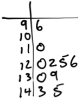

# Categorical Data

  -  Pie Charts

 

  -  Bar Graphs

 

  -  Comparative Bar
 Graphs

 

  -  Relative Frequency Bar
 Graphs

 

# Numerical Data (Discrete)

  -  Dot Plots

 

  -  Stem (and leaf) plots

 

# Numerical Data (Continuous)

  -  Histogram

 

# Numerical Data (Cumulative Frequency Plots)

  -  Frequency Polygon

 

  -  Ogive Plot

 

# Stem Plots to Compare Two Groups of Data

 

  -  Compare the distribution pulse rate before and after administering
     a new drug
    
      -  After

 

  -  Skewed right

  -  An outlier at 146

  -  Centered around 95

  -  Spread between 86 and 146

  -  Range of 60

<!-- end list -->

  -  Before

 

  -  Skew right

  -  No outliers

  -  Lower center at around 70

  -  Spread between 68 to 110

  -  Smaller range of 42

# Describe the Distribution

  -  Shape (only for numerical data)

 
 
 

# Examples

  -  Make a stem plot of the ages in a college classroom 18, 18, 17,
     21, 26, 40,
 23

 

  -  Use your calculator to make a histogram of ages in a college
     classroom 18, 18, 17, 21, 26, 40, 23, 27, 22, 19, 20, 21, 18, 35,
     32
    
      -  STAT ➡️ EDIT ➡️ Enter & Type in the data

 

  -  STAT PLOT (2ND + Y=) Turn on & Select the type

 

  -  Zoom + 9

 

  -  TRACE

 

  -  Describe the distribution of the graph above
    
      -  skew right

  -  Students took a statistic quiz. The score for the quiz are below.
     Describe the distribution of the quiz scores

 

  -  Slightly skewed left

  -  No outliers

  -  Centered around 42

  -  Spread of 8 to 50

<!-- end list -->

  -  Here are the IQ test scores of a few students. Make a stem plot of
     these scores.

 145 139 126 122 125 130 96 110 120
 143
 
 

  -  You are interested in how students in your class get to school in
     the morning. You take a survey and collect the following data:

 Car 15, Bus 3, Walk 5, Bicycle 8, Skateboard 1

  -  Construct a bar graph of your
 data

 

  -  Construct a relative frequency bar
 graph

 
