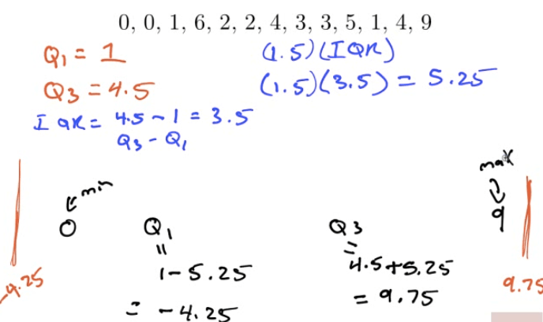
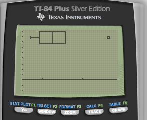

# Measuring Center

  -  Median
    
      -  The middle number
    
      -  The median is **resistant to outliers**

  -  Mean
    
      -  The average
 number

 

  -  Calculation
    
      -  STAT + CALC + 1

 

  -  2ND + 1 (L1)

 

  -  Enter

 

# Measuring Position

  -  Percentiles
    
      -  Percentage of observations your value is above
    
      -  30th percentile is the value **below which** 30 percent of the
         observations may be found
    
      -  Take the average if there are two values

  -  Quartiles
    
      -  Q1 = first quartile = 25th percentile
    
      -  Q2 = median = 50 th percentile
    
      -  Q3 = third quartile = 75th percentile

# Measuring Spread

  -  Range
    
      -  Highest - Lowest

  -  IQR (Interquartile Range)
    
      -  Q3 - Q1

  -  Variance / Standard Deviation

 
 
 

  -  Use Sx in the TI-84
 calculator

 

# Outliers 

  -  1.5 \* IQR rule
    
      -  Q1 - 1.5 \* IQR = Bottom fence
    
      -  Q3 + 1.5 \* IQR = Upper fence
    
      -  Outside the "fence" = Outlier

  -  Example

# Boxplots

  -  Graph of the "5-number Summary"

  -  Min Q1 Median Q3 Max

  -  Example
    
      -  18, 18, 17, 27, 22, 19, 20, 21, 18, 35, 32, 40
    
      -  Min: 17
    
      -  Q1: 18
    
      -  Median: 20.5
    
      -  Q3: 29.5
    
      -  Max: 40

 

  -  Calculator
    
      -  Boxplot

 
 
 

  -  Modified Boxplot

 
 
 

# SOCS

  -  Shape
    
      -  Skewed left/right

  -  Outlier
    
      -  Q1 - 1.5 \* IQR
    
      -  Q3 + 1.5 \* IQR

  -  Center
    
      -  Mean or Median

  -  Spread
    
      -  SD or IQR

  -  Example
    
      -  18, 18, 17, 21, 26, 40, 23, 27, 22, 19, 20, 21, 18, 35, 32
    
      -  Skewed right
    
      -  No outliers
    
      -  Centered at a median of 20.5
    
      -  A spread of IQR = 11.5

# The Effect of Changing Units on Summary Measures

  -  Linear Transformations
    
      -  Xnew = A + B \* Xold
    
      -  A: only affect mean and median
    
      -  B: affect all

# Examples

  -  Construct a modified boxplot for this data set
    
      -  Min = 56
    
      -  Q1 = 66
    
      -  Med = 72
    
      -  Q3 = 77
    
      -  Max = 100
    
      -  IQR = Q3 - Q1 = 11
    
      -  IQR \* 1.5= 16.5
    
      -  Bottom fence = Q1 - IQR \* 1.5 = 49.5
    
      -  Upper fence = Q3 + IQR \* 1.5 = 93.5

  -  Describe the distribution of test scores
    
      -  Symmetric
    
      -  One outlier at 110
    
      -  Centered at a median of 72
    
      -  With a spread of IQR of 11
