1.1 - Constructing & Interpreting Graphs

Friday, February 10, 2017

9:58 AM

 

# Categorical Data

  - > Pie Charts

> 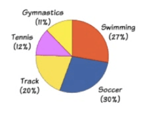

  - > Bar Graphs

> 

  - > Comparative Bar
> Graphs

> 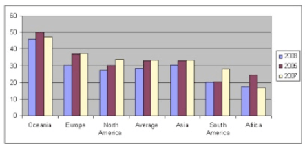

  - > Relative Frequency Bar
> Graphs

> 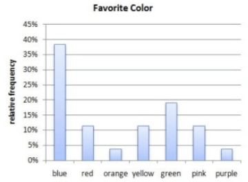

# Numerical Data (Discrete)

  - > Dot Plots

> 

  - > Stem (and leaf) plots

> 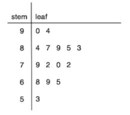

# Numerical Data (Continuous)

  - > Histogram

> 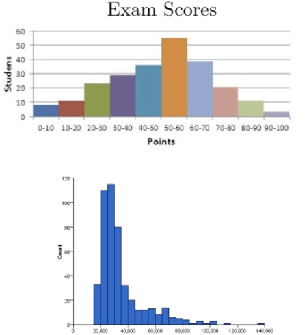

# Numerical Data (Cumulative Frequency Plots)

  - > Frequency Polygon

> 

  - > Ogive Plot

> 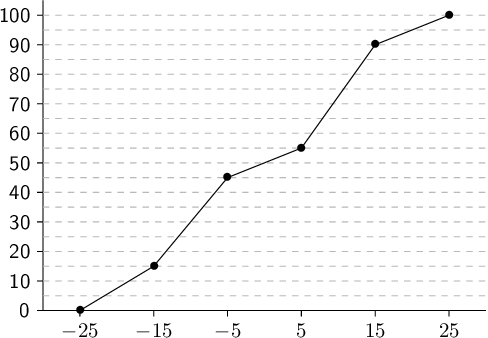

# Stem Plots to Compare Two Groups of Data

> 

  - > Compare the distribution pulse rate before and after administering
    > a new drug
    
      - > After

> 

  - > Skewed right

  - > An outlier at 146

  - > Centered around 95

  - > Spread between 86 and 146

  - > Range of 60

<!-- end list -->

  - > Before

> 

  - > Skew right

  - > No outliers

  - > Lower center at around 70

  - > Spread between 68 to 110

  - > Smaller range of 42

# Describe the Distribution

  - > Shape (only for numerical data)

> 
> 
> 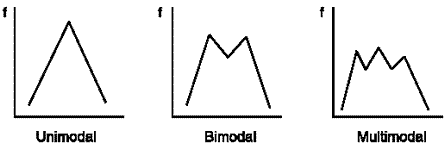

# Examples

  - > Make a stem plot of the ages in a college classroom 18, 18, 17,
    > 21, 26, 40,
> 23

> 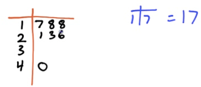

  - > Use your calculator to make a histogram of ages in a college
    > classroom 18, 18, 17, 21, 26, 40, 23, 27, 22, 19, 20, 21, 18, 35,
    > 32
    
      - > STAT --\> EDIT --\> Enter & Type in the data

> 

  - > STAT PLOT (2ND + Y=) Turn on & Select the type

> 

  - > Zoom + 9

> 

  - > TRACE

> 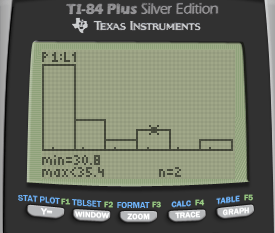

  - > Describe the distribution of the graph above
    
      - > skew right

  - > Students took a statistic quiz. The score for the quiz are below.
    > Describe the distribution of the quiz scores

> 

  - > Slightly skewed left

  - > No outliers

  - > Centered around 42

  - > Spread of 8 to 50

<!-- end list -->

  - > Here are the IQ test scores of a few students. Make a stem plot of
    > these scores.

> 145 139 126 122 125 130 96 110 120
> 143
> 
> 

  - > You are interested in how students in your class get to school in
    > the morning. You take a survey and collect the following data:

> Car 15, Bus 3, Walk 5, Bicycle 8, Skateboard 1

  - > Construct a bar graph of your
> data

> 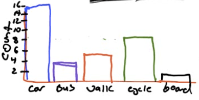

  - > Construct a relative frequency bar
> graph

> 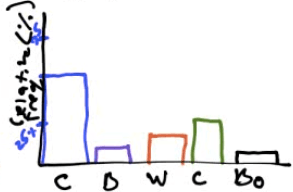

 

 

1.2 - Summarizing Distributions of Univariate Data

Friday, February 10, 2017

10:38 AM

 

# Measuring Center

  - > Median
    
      - > The middle number
    
      - > The median is **resistant to outliers**

  - > Mean
    
      - > The average
> number

> 

  - > Calculation
    
      - > STAT + CALC + 1

> 

  - > 2ND + 1 (L1)

> 

  - > Enter

> 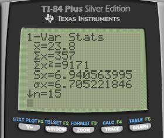

# Measuring Position

  - > Percentiles
    
      - > Percentage of observations your value is above
    
      - > 30th percentile is the value **below which** 30 percent of the
        > observations may be found
    
      - > Take the average if there are two values

  - > Quartiles
    
      - > Q1 = first quartile = 25th percentile
    
      - > Q2 = median = 50 th percentile
    
      - > Q3 = third quartile = 75th percentile

# Measuring Spread

  - > Range
    
      - > Highest - Lowest

  - > IQR (Interquartile Range)
    
      - > Q3 - Q1

  - > Variance / Standard Deviation

> 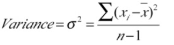
> 
> 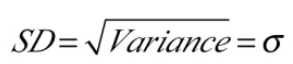

  - > Use Sx in the TI-84
> calculator

> 

# Outliers 

  - > 1.5 \* IQR rule
    
      - > Q1 - 1.5 \* IQR = Bottom fence
    
      - > Q3 + 1.5 \* IQR = Upper fence
    
      - > Outside the "fence" = Outlier

  - > Example

# Boxplots

  - > Graph of the "5-number Summary"

  - > Min Q1 Median Q3 Max

  - > Example
    
      - > 18, 18, 17, 27, 22, 19, 20, 21, 18, 35, 32, 40
    
      - > Min: 17
    
      - > Q1: 18
    
      - > Median: 20.5
    
      - > Q3: 29.5
    
      - > Max: 40

> 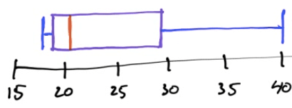

  - > Calculator
    
      - > Boxplot

> 
> 
> 

  - > Modified Boxplot

> 
> 
> 

# SOCS

  - > Shape
    
      - > Skewed left/right

  - > Outlier
    
      - > Q1 - 1.5 \* IQR
    
      - > Q3 + 1.5 \* IQR

  - > Center
    
      - > Mean or Median

  - > Spread
    
      - > SD or IQR

  - > Example
    
      - > 18, 18, 17, 21, 26, 40, 23, 27, 22, 19, 20, 21, 18, 35, 32
    
      - > Skewed right
    
      - > No outliers
    
      - > Centered at a median of 20.5
    
      - > A spread of IQR = 11.5

# The Effect of Changing Units on Summary Measures

  - > Linear Transformations
    
      - > Xnew = A + B \* Xold
    
      - > A: only affect mean and median
    
      - > B: affect all

# Examples

  - > Construct a modified boxplot for this data set
    
      - > Min = 56
    
      - > Q1 = 66
    
      - > Med = 72
    
      - > Q3 = 77
    
      - > Max = 100
    
      - > IQR = Q3 - Q1 = 11
    
      - > IQR \* 1.5= 16.5
    
      - > Bottom fence = Q1 - IQR \* 1.5 = 49.5
    
      - > Upper fence = Q3 + IQR \* 1.5 = 93.5

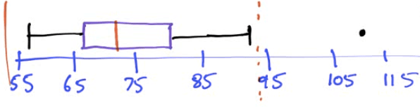

  - > Describe the distribution of test scores
    
      - > Symmetric
    
      - > One outlier at 110
    
      - > Centered at a median of 72
    
      - > With a spread of IQR of 11

 

 

2.1 - Correlation & Regression

Friday, February 10, 2017

2:11 PM

 

# Scatterplots

> 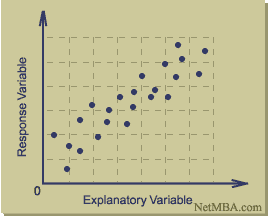
> 
> 

# Interpreting Scatterplots

  - > Direction: Positive or Negative

> 

  - > Form: Linear or Non-linear

> 

  - > Strength: Weak, Moderate or Strong

> 

  - > Example

> 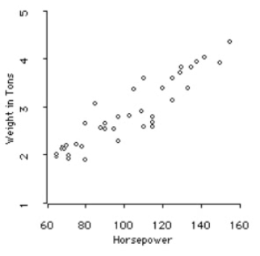

  - > Positive, linear, strong relationship between horsepower and
    > weight in tons.

# Correlation Coefficient (r)

> 

# Least Squares Regression Line

> 

  - > A regression line is a line that describes **how y changes as x
    > changes**

  - > Can be used to **predict** the value of y for a given value of x

  - > Called the **Least Squares** regression line because it make the
    > **smallest sum of squares**

  - > LSRL will always run through the point (mean of x, mean of y)

  - > Formulas (hat =
> predicted)

> 
> 
> 
> 
> 
> 
> 
> 
> 

  - > **Remember to note what x and y are**

  - > Calculation
    
      - > Input data

> 

  - > STAT--\>CALC--\> 4:LinReg(ax+b)

  - > LinReg(ax+b) L1, L2

> 

  - > Catalog (2ND + 0) --\> DiagnosticOn

> 

  - > Do LinReg again to display r

> 

# Coefficient of Determination

  - > R^2=r^2

  - > Coefficient of Determination = (Correlation Coefficient)^2

  - > **Percent** of the **change in y** that is explained by the change
    > by the **change in x** / **least squares regression line**

  - > From the previous example, 41.9% of the change in y can be
    > explained by the change in x

# Residuals (≈error)

  - > Residuals = observed/actual y - predicted y

  - > Resid = y - y hat

  - > Resid \< 0: Overpredicted

  - > Resid \> 0:
> Underpredicted

> 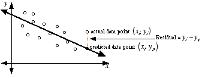

  - > Residual Plot

  - > no pattern = good fit

<!-- end list -->

  - > Example

| X         | 3     | 1      | 1.5  | 6      | 2      |
| --------- | ----- | ------ | ---- | ------ | ------ |
| Y         | 10    | 3      | 14   | 15     | 6      |
| Y hat     | 10.1  | 6.76   | 7.60 | 15.11  | 8.43   |
| Residuals | \-0.1 | \-3.76 | 6.4  | \-0.11 | \-2.43 |

  - > Calculator
    
      - > Type the regression equation in L3 (y hat)

> 

  - > L4 = L2 - L3

> 

  - > Graph L1, L4 (Residuals)

> 

# Examples

  - > At the summer school, one of Sarah's teachers told her that you
    > can determine air temperature from the number of cricket chirps

<!-- end list -->

1.  > What is the explanatory variable, and what it the response
    > variable
    
      - > Explanatory/independent variable: cricket chirps
    
      - > Response/dependent variable: air temperature

2.  > To determine a formula, Sarah collected data on temperature and
    > number of chirps per minute on 14 occasions. She entered the data
    > into her calculator and did 2-Var Stats. Here are some results.
    > Use this information to find the equation of the least-squares
    > regression line

| Xbar | 165.8 |
| ---- | ----- |
| Sx   | 32.0  |
| Ybar | 76.83 |
| Sy   | 9.23  |
| r    | 0.361 |

  - > b= r \* Sy / Sx = 0.104

  - > Ybar = a + b\*Xbar

  - > a = Ybar - b\*Xbar = 59.57

  - > Yhat = 59.57 + 0.14 \* x

  - > Where y = air temperature, and x = cricket chirps

<!-- end list -->

1.  > One of Sarah's data points was recorded on a particularly hot day
    > (95F). She counted 2432 cricket chirps in one minute. What is the
    > residual for this data point?
    
      - > Residual = Y - Yhat = 95 - (59.57 + 0.104 \* 2432) = -217.498

 

 

2.2 - Regression, Part II

Friday, February 10, 2017

4:49 PM

# Outliers and Influential Points

  - > An **outlier** is an observation that lies outside the overall
    > pattern
    
      - > Outliers in the Y direction will lead to large residuals

  - > **Influential observations** are points that would greatly change
    > the result if removed

  - > Points with high **leverage** have values far from the mean (of X
    > or Y)

# Transformations to Achieve Linearity 

> 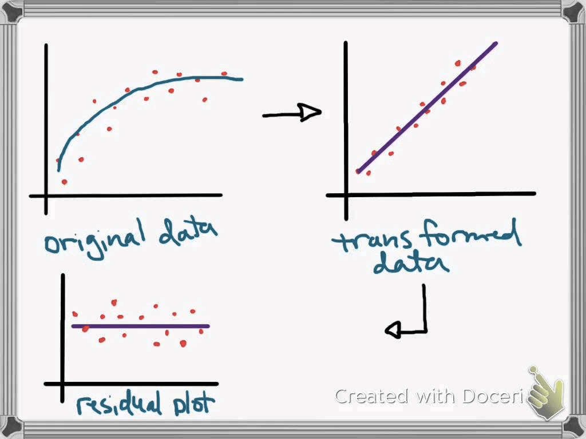
> 
> 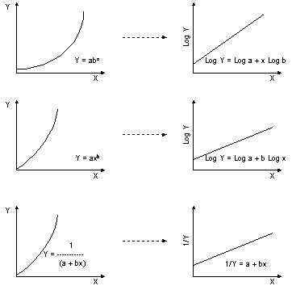

  - > Example

> 

# Confounding

  - > Correlation does not prove causation

  - > A **Lurking Variables** is one that is not the explanatory (x) or
    > response (y) variable in the study, but can influence how we
    > interpret the relationship between them

  - > What looks like an association between x and y but is a **Common
    > Response**

> 

  - > Confounding
    
      - > The response is at least partially due to a third
> factor

> 

  - > Comparison

> 

  - > Example
    
      - > There is a positive association between the number of drowning
        > and hot dog sales. Is the association between two variables
        > most likely due to causation, cofounding, or common response?
        > Justify your answer.
        
          - > Answer: Common Response

> 

  - > According to the 19990 census, those states with an above-average
    > number X of people who fail to complete high school tend to have
    > an above average number Y of infant deaths. In other words, there
    > is a positive association between X and Y. The most plausible
    > explanation for this is?
    
      - > Answer: Common
> Response

> 

  - > A drug company is testing a new cream to relieve skin rashes. They
    > try it on 20 people and a placebo on 20 people and find that it
    > works better. Later someone realizes that the new cream was tested
    > on mostly all men and the placebo was tested on mostly all women.
    > Is it possible the difference seen could have been due to
    > confounding? What about common
> response?

> 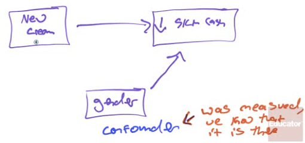

 

 

3.1 - Planning & Conducting Surveys

2017年2月10日 星期五

下午 5:54

 

# Census vs. Survey

  - > A **parameter** is a numerical description of a **population**
    > characteristic

  - > A **statistic** is a numerical description of a **sample**
    > characteristic

> 

| Census | Population | Parameter |
| ------ | ---------- | --------- |
| Survey | Sample     | Statistic |

# Characteristics of a Well-Designed and Well-Conducted Survey

  - > Representative sample
    
      - > Must represent the population that you want to **draw
        > inference** about

  - > Random sample

  - > Does not introduce bias

# Bias

  - > What is
> it?

> 

  - > How might it occur?
    
      - > Wording of the question
    
      - > Sample technique
        
          - > Under-coverage: miss a certain group of people
        
          - > Non-response: someone in your sample choose not to respond

# Random Sampling

  - > Simple Random Sample (SRS)
    
      - > Random digit table
    
      - > Calculator
        
          - > MATH --\> PRB --\> randInt(lower, upper, number of
            > numbers)

> 
> 
>  

  - > Stratified Random Sampling

  - > Cluster Sample

> 

  - > Systematic Random Sample

  - > Comparison

> 

  - > Example
    
    1.  > If you wanted to select a sample of school children and you
        > did this by selecting an SRS of **classrooms** this would be
        > an example of what type of sampling?
        
          - > Cluster
    
    2.  > If you wanted to select a sample of school children and you
        > did this by randomly selecting 5 children from each **grade**
        > this would be an example of what type of sampling?
        
          - > Stratified

# Non-Random Sampling

  - > Convenience Sample
    
      - > Selecting those that are easy of convenient

  - > Voluntary Response Sample

 

 

3.2 - Planning & Conducting Experiments

Saturday, February 11, 2017

12:11 AM

 

# Experiments vs. Observational Studies

  - > Ovservational Study
    
      - > Observe individuals
    
      - > Measure variables
    
      - > **Do NOT influence the response**
        
          - > Has global warming effected penguin mating behavior

  - > Experiment
    
      - > **Do something** to your individuals
    
      - > Observe/measure response
        
          - > Does housing penguins in warmer environments effect mating
            > behavior?

# Placebo Effect

  - > The phenomenon where **patients get better** because they
    > **expect** the treatment to work.

  - > Many statistical studies involve testing the effectiveness of
    > drugs. A placebo looks identical to the actual drug but contains
    > no active ingredient and so has no real physical effect.

  - > Humans want to be helped by the medication that is administered to
    > them. If they think they are receiving a drug to help their
    > condition, they tend to improve even if it turns out that the drug
    > is a placebo.

# Characteristics of a Well-Designed and Well-Conducted Experiment

  - > Control
    
      - > The effect of **lurking variables**, most often by comparing
        > treatments
    
      - > Example: a "Control group" in a drug study to eliminate the
        > "confounding effects" of environment or the placebo effect

  - > Replicate
    
      - > Each treatment on many units to **reduce chance variation**
    
      - > Example: do the mouse study many times

  - > Randomize
    
      - > Use probability (chance) to assign experimental units to
        > treatments
    
      - > May be the most **important**\!\!
    
      - > Because it allows us to say the different treatment groups
        > **start out similar**

# Completely Randomized Design

  - > If all the experimental units (subjects of the experiment) are
    > **randomly** assigned to either the **control group** or to the
    > **treatment group**, then the experiment has a completely
    > randomized design.

> 

  - > Randomize by assigning each subject a number and then generating
    > it to choose treatment groups

# Block Randomization

  - > Placing subjects into **groups of similar individuals**. The
    > random assignments into treatment groups is carried out separately
    > within each block (think stratified random sample)

> 

# Matched Pairs Design

  - > Subjects are **matched into pairs** and get **different
    > treatments**

  - > Matched pairs are **more similar** than random **unmatched
    > subjects**

  - > Randomizing the **rest of the experiment** is still
    > important\!\!\!

> 

# Experimental Set Up

  - > Treatment Imposed = Independent Variable = Factors

  - > Experimental Units = Subjects

  - > Response Variable Observed = Dependent Variable

> 

# Double-Blind Experiment

> 
> 
> 

  - > In a double-blind experiment, neither the subjects nor the
    > researchers know to which group, treatment, or control, subjects
    > have been assigned. If a researcher knows that a subject is in the
    > control group, they do not expect a treatment effect, and their
    > measurement of a response might be understated. If a researcher
    > knows that a subject is in the treatment group, they might
    > overstate a response simply because they expect it.

  - > An experiment might also be single-blind. In this case, only one
    > of the participants, either the subjects or the researchers, knows
    > to which group the subjects have been assigned.

  - > **Avoids unconscious bias**

# Generalizability of Results

  - > To determine if our data is "statically significant"
    
      - > i.e. is an observed effect so large that it would rarely occur
        > by chance

  - > If we designed and conducted our experiment well, we can
    > generalize these results to the population\!

# Practice Questions

  - > Control groups are used in experiments in order to
    
    1.  > Control the effects of outside variables on the outcome
    
    2.  > Control the subjects of a study to ensure that all participate
        > equally
    
    3.  > Guarantee that someone other than the investigators, who have
        > a vested interest in the outcome, controls how the experiment
        > is conducted
    
    4.  > Achieve a proper and uniform level of randomization

> Answer: a

  - > Angiotensin-converting enzyme (ACE) inhibitors are used to treat
    > high blood pressure. We want to conduct an experiment to see if a
    > new blood pressure drug works even better than ACE inhibitors.
    > Design a completely randomized experiment to test this.

> 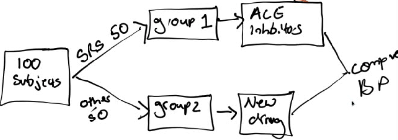

  - > In conducting an experiment to see if a new blood pressure drug
    > works even better than ACE inhibitors. We learn that men and women
    > may react differently to common cardiovascular drug treatments.
    > Design a randomized experiment to test this with your new
    > information on gender.
    
      - > We will conduct a randomized blocked experiment, blocking on
        > gender.

> 

  - > The Community Intervention Trial for Smoking Cessation (COMMIT)
    > asked whether a community-wide advertising campaign would reduce
    > smoking. The researchers located 11 **pairs** of communities that
    > were **similar** in location, size, economic status, and so on.
    > One community in each pair participated in the advertising
    > campaign and the other did not. This is
    
    1.  > an observational study
    
    2.  > a matched pairs experiment
    
    3.  > a completely randomized experiment
    
    4.  > a block design

> Answer: b

  - > A study of cell phones and the risk of brain cancer looked at a
    > group of 469 people who have brain cancer. The investigators
    > matched each cancer patient with a person of the same sex, age,
    > and race who did not have brain cancer, then asked about the use
    > of cell phones. This is
    
    1.  > an observational study
    
    2.  > an uncontrolled experiment
    
    3.  > a randomized comparative experiment
    
    4.  > a matched pairs experiment
    
    5.  > a survey

> Answer: a

  - > A fitness instructor wants to test the effectiveness of a
    > performance-enhancing herbal supplement. Design an experiment to
    > test this supplement
    
      - > Double blind, (placebo controlled), matched pairs experiment:
    
      - > Match subjects based on performance in a fitness test and
        > gender
    
      - > Randomize who in the pair gets the new supplement and who gets
        > the old supplement / placebo.
    
      - > Give both in the same packaging, making sure the subject
        > doesn't know the group and person measuring fitness doesn't
        > know the group either.

  - > A researcher believes that students may do better on a test when
    > taken in the same classroom where the material was learned. To
    > test this theory she plans to present a lecture and then give
    > students a multiple choice quiz on the material. She knows there
    > is a lot of variability in the students' academic ability. Design
    > a study to test her hypothesis.
    
      - > Block on academic
> ability

> 

 

 

4.1 - Probability Overview

Monday, February 13, 2017

3:39 PM

 

# Probability Model

  - > A mathematical description of a random phenomenon.

  - > The Probability Model consists of
    
      - > **Sample Space** (S) = the set of all possible outcomes
    
      - > **Event** within the sample space = an outcome or set of
        > outcomes in S
    
      - > **Probabilities** associated with each
> event

> 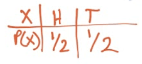

# Disjoint Events (aka Mutually Exclusive)

  - > Disjoint / mutually exclusive
> example

> 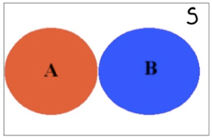

  - > Not disjoint / not mutually exclusive example

> 
> 
> 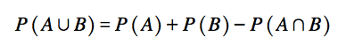

# Independence vs. Dependence

  - > A conditional probability is the probability of some event
    > occurring, given that some other event has already occurred. The
    > conditional probability of event X occurring, given that some
    > other event Y has already occurred, is written as P(X|Y).

  - > For example, P(M|N) would be the probability of the occurrence of
    > event M given that event N has already occurred. It would be read
    > as “the probability of M, given N.”

  - > As stated earlier, two events are considered independent if the
    > occurrence of one of the events does not change the probability of
    > the other event from what it would have been had the first event
    > not occurred. Thus, two events, X and Y, are independent if P(X|Y)
    > = P(X) or P(Y|X) = P(Y)

  - > Actually, these two conditional relationships are related. If one
    > is true, the other must be true. If one is false, the other must
    > be false.

  - > If **P(X|Y) = P(X)**, then **P(Y|X) = P(Y)**, and the events are
    > **independent**.

  - > If **P(X|Y) ≠ P(X),** then **P(Y|X) ≠ P(Y)**, and the events are
    > **dependent**.

# Probability Rules

  - > Notation

> 

  - > Rules

> 

 

# Overview

# Bayes Rule

> 
> 
> 
> 
> 

# Simulations

  - > Imitating a real world process

  - > Follow a few steps
    
    1.  > **Describe** the possible outcomes
    
    2.  > **Determine** the **probability** of each outcome
    
    3.  > **Link** each outcome to one or more **random numbers**
    
    4.  > **Choose** a random number for each "trial"
    
    5.  > Based on the random number, note the "simulated" outcome
    
    6.  > Repeat step 4 and 5 for each "simulation"

# Practice Questions

  - > A basketball player shoots 8 free throws during a game. We are
    > interested in the probability that she makes 4.
    
      - > Describe the probability model in this
> case

> 

  - > Let A be the event that a victim of violent death was a woman and
    > B the event that the death was a suicide. The proportion of
    > suicides among violent deaths of woman is expressed in probability
    > notation as
    
    1.  > 0.5
    
    2.  > 0.126
    
    3.  > P(A and B)
    
    4.  > P(A|B)
    
    5.  > P(B|A)

> Answer: e

  - > Suppose that for a group of consumers, the probability of eating
    > pretzels is 0.65 and that the probability of drinking Coke is
    > 0.75. The probability of eating pretzels and drinking Coke is
    > 0.45. Determine if those two events are independent.
    
      - > P(P)=0.65
    
      - > P(C)=0.75
    
      - > P(P and C)=0.45
    
      - > P(P and C)≠P(P)\*P(C)
    
      - > So P and C are not independent

  - > What is the probability that the students is either a female of at
    > least 35 years old?

> 

  - > Generally speaking, 1% of college football players use steroids,
    > but your friend on the football team has tested positive for
    > steroid use. The blood test the league uses correctly comes up
    > positive for 95% of steroid users, but mistakenly comes up
    > positive for 1% of non-users. Given that your friend tested
    > positive, how likely is it that he has been using steroids?

> 

  - > Of all the soda drinkers in a particular district, 40% prefer
    > brand A and 60% prefer brand B. Of those drinkers who prefer brand
    > A, 30% are females, and of those who prefer brand B, 40% are
    > female. What is the probability that a randomly selected soda
    > drinker prefers brand A, given that the person selected is a
    > female

> 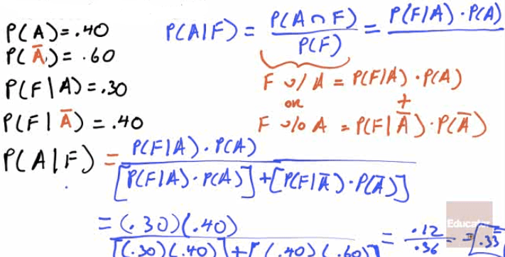

 

 

4.2 - Intro to Probability for Discrete Random Variables

Monday, February 13, 2017

5:09 PM

 

# Discrete vs. Continuous RVs (Random Variables)

  - > A discrete RV has a countable number of possible outcomes
    
      - > number of students present
    
      - > number of red marbles in a jar
    
      - > number of heads when flipping three coins
    
      - > students' grade level

  - > A continuous RV can take any values in an interval of numbers
    
      - > height of students in class
    
      - > weight of students in class
    
      - > time it takes to get to school
    
      - > distance traveled between classes

> 

# Probability Distribution

  - > The probability distribution of a discrete RV(X) list all the
    > values possible and their probabilities

> 

  - > The probabilities must:
    
      - > All be a number between 0 and 1
    
      - > Together add up to 1

# Mean = Expected Value

  - > Formula

> 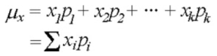

  - > Calculator
    
      - > Type in X in L1 and P in L2

> 

  - > 1-Var Stats L1, L2

> 

# Variance = Standard Deviation

  - > Formula

> 

  - > Calculator

> 

# Practice Questions

  - > A bin contains ten $1 bills, five $2 bills, three $5 bills, one
    > $10 bill, and one $100 bill. A person is charged $10 to select one
    > bill. Let the random variable (X) be the amount someone wins by
    > playing.
    
      - > Construct a probability distribution for these data.

> 

  - > What is the mean and standard deviation of the amount of money
    > someone can expect to
> win?

> 

  - > You work for a company and are tasked with evaluating a proposed
    > venture. The venture stands to make a profit of $10,000 with
    > probability 4/20, to make a profit of $5200 with probability 8/20,
    > to break even with probability 1/4, and to lose $5000 with
    > probability 3/20. The expected profit in dollars is? Would you
    > recommend this venture?

> 
> 
> 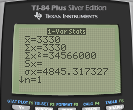

  - > Answer: The expected profit is $3330. Recommend, because the
    > standard deviation is not so large

 

 

4.3 - Discrete Random Variables

Monday, February 13, 2017

10:24 PM

 

# Binomial Distribution

  - > BINP
    
      - > B = Binary process = 2 process
    
      - > I = Independent event
    
      - > N = Number of trials
    
      - > P = Probability of success

  - > Binomial Probability
    
      - > binompdf(n, p, x)
    
      - > n=trials
    
      - > p=probability
    
      - > x=value

> 

  - > Calculator
    
      - > 2ND + VARS (DISTR)

> 

  - > A: binompdf / B: binomcdf

> 

  - > binompdf vs binomcdf

> 
> 
> 

# Practice Questions for Binomial Distribution

  - > A manufacturer produces a large number of toasters. From past
    > experience, the manufacturer knows that approximately 4% are
    > defective. In a quality control procedure, we randomly select 40
    > toasters for testing.
    
      - > Determine the probability that exactly one of the toasters is
        > defective

> 

  - > Find the probability that at most two of the toasters are
    > defective

> 

  - > Find the probability that more than three toasters are defective

> 

# Geometric Distribution

  - > BI~~N~~P
    
      - > Not given the number of trials

  - > Question Format
    
      - > How many trials until a success

  - > Geometric Probability
    
      - > geometpdf(p,x)
    
      - > geometcdf(p,x)
    
      - > p=probability of success
    
      - > x=number of trials until 1 success

> 

# Practice Questions for Geometric Distribution

  - > There is a probability of 0.09 that a vaccine will cause a certain
    > side effect. Suppose that a number of patients are inoculated with
    > the vaccine. We are interested in the number of patients
    > vaccinated until the first side effect is observed
    
      - > Find the probability that exactly 4 patients must be
        > vaccinated in order to observe the first side effect.

> 
> 
> 

  - > What is the probability that the number of patients vaccinated
    > until the first side effect is observed at most
> 5?

> 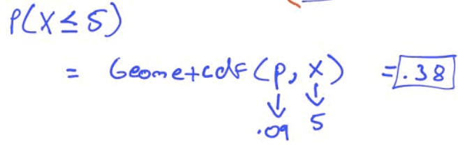

# Mean and Standard Deviation

> 

 

 

4.4 - Combining Independent Random Variables

Tuesday, February 14, 2017

2:11 PM

 

# Mean and SD of Two Random Variables

  - > Mean

> 

  - > Variance

> 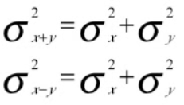

# Transforming Random Variables (Linear Transformations)

  - > Mean

> 

  - > Variance

> 

# Practice Questions

  - > You have a sample of male/female couples. The mean height of all
    > the woman is 65 inches, with a standard deviation of 4 inches. The
    > mean height of all the men is 70 inches, with a standard deviation
    > of 6 inches.
    
      - > What is the average combined height of the couples? What is
        > the standard deviation of the combined height?

> 

  - > What is the average difference in the height of the couples? What
    > is the standard deviation of the difference

> 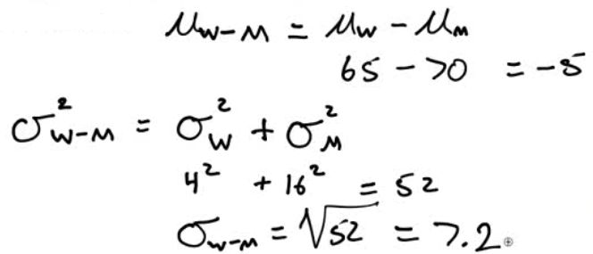

  - > A report of the National Center for Health Statistics says that
    > the height of 20-year-old men have mean 176.8 cm and standard
    > deviation 7.2 cm. There are 2.54 cm in an inch. What are the mean
    > and standard deviation in
> inches?

> 
> 
> 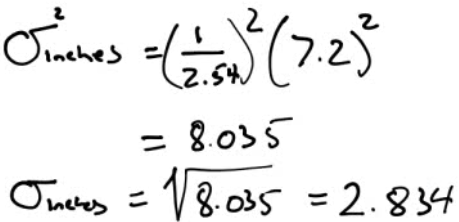

  - > The number of calories in a one-ounce serving of a breakfast
    > cereal is a random variable with mean 110. The number of calories
    > in a full cup of whole milk is a random variable with mean 140.
    > For breakfast you eat one ounce of the cereal with 1/2 cup of
    > whole milk. Let Z be the random variable that represents the total
    > number of calories in this breakfast. What is the mean and SD of
    > Z?

> 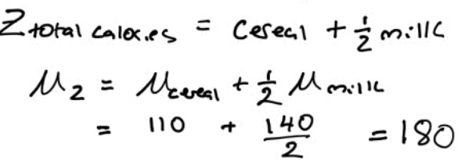
> 
> 

  - > Your school has the best men's swimming team in the region. The
    > 400-meter freestyle relay team is undefeated this year. In the
    > 400-meter relay, each swimmer swims 100 meters. The times, in
    > seconds, for the four swimmers this season are approximately
    > Normally distributed with means and standard deviations as shown

|       | Mean | SD  |
| ----- | ---- | --- |
| John  | 55.2 | 2.8 |
| Jerry | 58   | 3   |
| Jim   | 56.3 | 2.6 |
| Joe   | 54.7 | 2.7 |

  - > Find the mean and standard deviation for the total team time in
    > the 400-meter freestyle relay.
    
      - > Mean = 55.2+58+56.3+54.7 = 224.2
    
      - > Variance = 2.8^2+3^2+2.6^2+2.7^2 = 30.89
    
      - > SD = 5.6

  - > Find the mean and standard deviation for the average time of a
    > single swimmer
    
      - > Mean = 224.2/4 = 56.05
    
      - > Variance = 30.89/4^2 = 1.9306
    
      - > SD = 1.39

 

 

4.5 - Normal Random Variables

Tuesday, February 14, 2017

2:12 PM

 

# The Empirical Rule

> 

# Z Scores (Standardized Score)

  - > How many standard deviations away from the mean your value x is

> 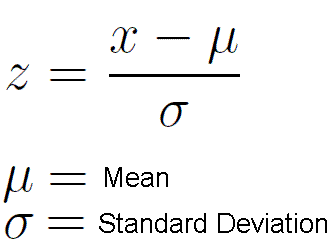

# Using the Normal Table

![Probability Table entry for z is the probability lying below z. T able
A Standard normal probabilities -3.4 -3.3 -3.2 -3.1 -3.0 -2.9 -2.8 -2.7
-2.6 -2.5 -2.4 -2.3 -2.2 -2.1 -2.0 -1.9 -1.8 -1.7 —1.6 -1.5 -1.4 -1.3
-1.2 -1.1 -1.0 -0.9 -0.8 -0.7 —0.6 -0.5 -0.4 -0.3 -0.2 -0.1 -0.0 .00
0010 .0013 .0019 .0035 .0047 .0062 .0082 .0107 .0139 .0179 .0228 .0287
.0359 .0548 .0808 .1151 .1357 .1587 .1841 .2119 .2420 .2743 .3085 .3821
.4207 .4602 .01 .0003 .0005 .0013 .0018 .0025 .0045 .0104 .0136 .0174
.0222 .0281 .0351 .0436 .0537 .0655 .0793 .0951 .1131 .1335 .1562 .1814
.2090 .2389 .2709 .3050 .3409 .3783 .4168 .4562 .496() .02 .0003 .0005
.0013 .0018 .0024 .0033 .0059 .0078 .0102 .0132 .0170 .0217 .0274 .0427
.0526 .0643 .0778 .0934 .1112 .1314 .1539 .1788 .2061 .2358 .2676 .3015
.3372 .3745 .4129 .4522 .4920 .03 0003 0006 0009 0012 0017 0032 0057
0075 0099 .0129 .0166 0212 0336 0418 .0516 0630 .0764 0918 .1093 .1292
.1515 .1762 .2033 .2327 .2981 .3336 .3707 .4090 .4483 .4880 .04 .0012
.0016 .0023 .0031 .0041 .0055 .0073 .0125 .0162 .0207 .0262 .0329 .0505
.0618 .0749 .0901 .1075 .1271 .1492 .1736 .2005 .2296 .2611 .2946 .3300
.3669 .4052 .4443 .4840 .05 .0011 .0016 .0030 .0054 .0071 .0122 .0158
.0202 .0256 .0322 0401 .0495 .0606 .0735 .0885 .1056 .1251 .1469 .1711
.1977 .2266 .2578 .2912 .3264 .3632 .4013 .4801 .06 .0003 .00(M .0006
.0008 .0011 .0015 .0021 .0029 .0039 .0052 .0069 .0091 .0119 .0154 .0197
.0250 .0314 .0392 .0485 .0594 .0721 .0869 .1038 .1230 .1446 .1685 .1949
.2236 .2877 .3228 .3594 .3974 .4364 .4761 .07 .0003 .0005 .0008 .00\]1
.0015 .0021 .0028 .0038 .0051 .0068 .0089 .0116 .0150 .0192 .0244 .0307
.0384 .0475 .0582 .0708 .0853 .1020 .1210 .1423 .1660 .1922 .2514 .2843
.3192 .3557 .3936 .4325 .4721 .08 .0003 .0004 .0005 .0007 .0010 0014
0020 0027 0037 0049 .0066 .0087 .0113 .0146 .0188 0239 0301 0375 0465
0571 .0694 .0838 .1003 .1 190 .1401 .1635 .1894 .2177 .2483 .2810 .3156
.3520 .3897 .4286 .4681 .09 .0002 .0003 .0005 .0007 .0010 .0014 .0019
.0026 .0036 .0048 .0064 .0084 .0110 .0143 .0183 .0233 .0294 .0367 .0455
.0559 .0681 .0823 .0985 .1170 .1379 .1611 .1867 .2148 .2451 .2776 .3121
.3483 .3859 .4247 .4641 ](./media/image141.png)

![Table entry for z is the probability lying below z. T able A
(Continued) 0.0 0.1 0.2 0.3 0.4 0.5 0.7 0.8 0.9 1.0 1.1 1.2 1.3 1.4 1.5
1.6 1.7 1.8 1.9 2.0 2.1 2.2 2.3 2.4 2.5 2.6 2.7 2.8 2.9 3.0 3.1 3.2 3.3
3.4 .00 .5000 .5398 .5793 .6179 .6554 .6915 .7580 .7881 .8159 .8413
.8643 .8849 .9032 .9192 .9332 .9452 .9554 .9641 .9713 .9772 .9821 .9861
.9893 .9918 .9938 .9953 .9965 .9974 .9981 .9987 .9990 .9993 .9995 .9997
.01 .5040 .5438 .5832 .6217 .6591 .6950 .7291 .7611 .7910 .8186 .8438
.8665 .8869 .9049 .9207 .9345 .9564 .9649 9719 .9778 .9826 .9864 .9896
.9920 .9955 .9966 .9975 .9982 .9987 .9991 .9993 .9995 .9997 .02 .5080
.5478 .5871 .6255 .6628 .6985 .7324 .7642 .7939 .8212 .8461 -8686 .8888
.9066 .9222 .9357 .9474 .9573 .9656 .9726 .9783 .9830 .9868 .9898 .9922
.9941 .9956 .9967 .9976 .9982 .9987 .9991 .9994 .9995 .9997 .03 .5120
.5517 .5910 .6293 .7019 .7357 .7673 .7967 .8238 .8485 .8708 .8907 .9082
.9236 .9370 .9484 .9582 .9664 .9732 .9788 .9834 .9871 .9901 .9925 .9943
.9957 .9968 .9983 .9988 .9991 .9996 Probability .04 .5160 .5557 .5948
.6331 .6700 .7054 .7389 .7704 .7995 .8508 .8729 .8925 .9099 .9251 .9382
.9495 .9591 .9671 .9738 .9793 .9838 .9875 .9927 .9945 .9959 .9969 .9977
.9984 .9988 .9992 .9994 .9996 .9997 .05 .5199 .5596 .5987 .6368 .6736
.7088 .7422 .7734 .8023 .8289 .8531 .8749 .8944 .9115 .9265 .9394 .9505
.9599 .9678 .9744 .9798 .9842 .9878 .9929 .9970 .9978 .9984 .9989 .9997
.06 .5239 .5636 .6026 .6772 .7123 .7454 .7764 .8051 .8315 .8554 .8770
.8962 .9131 .9406 .9515 .9608 .9686 .9750 .9846 .9881 .9909 .9931 .9948
.9961 .9971 .9979 .9985 .9989 .9992 .9994 .9996 .9997 .07 .5279 .5675
6443 .6808 .7157 .7486 .7794 .8078 .8340 .8577 .8790 .8980 .9147 .9292
.9418 .9525 .9616 .9693 .9756 .9808 .9850 .9884 .9911 .9932 .9949 .9962
.9972 .9979 .9985 .9989 .9992 .9995 .9996 .9997 .08 .5319 .5714 .6103
.6480 .6844 .7190 .7517 .7823 .8106 .8365 .8599 .8810 .8997 .9162 .9306
.9429 .9535 .9625 .9699 .9761 .9812 .9854 .9887 .9913 .9934 .9951 .9963
.9973 .9980 .9986 .9990 .9993 .9995 g 996 g 997 .09 .5359 .5753 .6141
.6517 .6879 .7224 .7549 .7852 .8133 .8389 .8621 .8830 .9015 .9177 .9319
.9441 .9545 .9633 .9706 .9767 .9817 .9857 .9890 .9916 .9936 .9952 .9964
.9974 .9981 .9986 .9990 .9993 .9995 g 997 .9998 ](./media/image142.png)

# Practice Questions

1.  > A study of college freshmen's study habits found that the time (in
    > hours) that college freshmen use to study each week follows a
    > normal distribution with a mean of 7.2 hours and a standard
    > deviation of 5.3 hours

<!-- end list -->

  - > How many hours do the students who study in the top 15% spend
    > studying?

  - > The middle 68%?
    
      - > Top 15%: 12.5 hours
    
      - > Middle 68%: 1.9 hours to 12.5 hours

> 

1.  > Suppose that the weight of navel oranges is normally distributed
    > with mean of 8 ounces, and standard deviation of 1.3 ounces. And
    > the weights of Valencia oranges is normally distributed with mean
    > of 9 ounces, and standard deviation of 1.6 ounces

<!-- end list -->

  - > You grow a navel orange that weighs 9.5 ounces and a Valencia
    > orange that weight 10.5 ounces, which should you enter in the
    > giant fruit
> contest?

> 

  - > Z score for navel orange = (9.5-8)/1.3 = 1.1538

  - > Z score for Valencia orange = (10.5-9)/1.6 = 0.9375

<!-- end list -->

  - > The weights of newborn children in the United States vary
    > according to the Normal Distribution with mean 7.5 pounds and
    > standard deviation 1.25 pounds.

  - > What is the probability that a baby chosen at random weighs less
    > than 5.5 pounds at birth?
    
    1.  > Draw a
> sketch

> 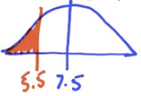

1.  > Calculate Z score

> 

1.  > Look up probability on the normal table

> 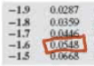

1.  > The composite score of students on the ACT college entrance
    > examination in a recent year had a Normal distribution with mean
    > of 20.4 and standard deviation of 5.8

<!-- end list -->

  - > What is the probability that a randomly chosen students scored 24
    > or higher on the
> ACT?
    
    1.  > Sketch

> 

1.  > 2ND + VARS (DISTR) --\> 2: normalcdf

> 

1.  > Normalcdf(lower, upper, mean, standard deviation)

> 

  - > What is the probability that a randomly chosen student scored
    > between a 19 and a 24 on the ACT?

> 

  - > What score would someone in the 15th percentile have
> scored?
    
    1.  > Sketch

> 

1.  > Find the z value on the normal table

> ![3.4 3.3 3.2 3.1 3.0 2.9 2.8 2.7 2.6 2.5 2.4 2.3 2.2 2.1 2.0 1.9 1.8
> 1.7 1.6 1.5 1.3 1.2 -1.0 -0.8 .00 .0003 .0005 .0007 .0010 .0013 .0019
> .0026 .0035 .0047 .0062 .0082 .0107 .0139 .0179 .0228 .0287 .0359
> .0446 .0548 .0668 .0808 .0968 .1151 .1357 .1587 .1841 .2119 .01 .0013
> .0018 .0025 .0034 .0060 .0080 .0104 .0136 .0174 .0222 .0281 .0351
> .0436 .0537 .0655 .0793 .0951 .1131 .1335 .1562 .1814 .2090 .02 .0003
> .0005 .0013 .0018 .0033 .0059 .0078 .0102 .0132 .0170 .0217 .0274
> .0344 .0427 .0526 .0643 .0778 .0934 .11 12 .1314 .1539 .1788 .2061 .03
> .0004 .0006 .0009 .0012 .0017 .0023 .0032 .0057 .0075 .0099 .0129
> .0166 .0212 .0268 .0336 .0418 .0516 .0630 .0764 .0918 .1093 .1515
> .2033 .04 .0004 .0006 .0008 .0012 .0016 .0023 .0031 .0041 .0055 .0073
> .0096 .0125 .0162 .0207 .0262 .0329 .0409 .0505 .0618 .0749 .0901
> .1075 .1492 .2005 .05 .0003 .0008 .0011 .0016 .0022 .0030 .0071 .0122
> .0158 .0256 .0322 .0401 .0495 .0606 .0735 .0885 .1056 .1251 .1469
> .1711 .1977 ](./media/image153.png)
> 
> Z≈-1.035

1.  > Solve for
> x

> 
> 
> 

1.  > Calculator: invNorm(area, mean, standard deviation)

> 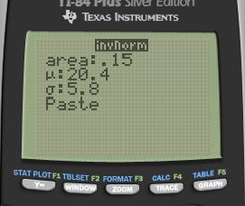
> 
> 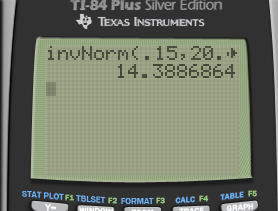

1.  > Suppose that the mean height of men is 70 inches with a standard
    > deviation of 3 inches. And suppose that the mean height for women
    > is 65 inches with a standard deviation of 2.5 inches

<!-- end list -->

  - > If the heights of men and women are Normally distributed, find the
    > probability that a randomly selected woman is taller than a
    > randomly selected
> man.
    
    1.  > Sketch

> 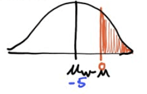

1.  > Find the necessary information

|       | Mean       | SD                    |
| ----- | ---------- | --------------------- |
| Men   | 70         | 3                     |
| Women | 65         | 2.5                   |
| W-M   | 65-70 = -5 | Sqrt(3^2+2.5^2) = 3.9 |

1.  > Calculate Z score

> 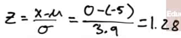

1.  > Find the probability on the table and subtract that from 1

> 1-0.9015 = 0.0985 = 9.85%

  - > Suppose that the height (X) in inches, of adult men is a normal
    > random variable with mean of 70 inches. If P (X\>79) = 0.025

  - > What is the standard deviation of this random normal
> variable?
    
    1.  > Sketch

> 

1.  > Find the z score on the calculator: invNorm(area)

> 

1.  > Solve for
> SD

> 
> 
> 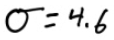

 

 

5.1 - Sampling Distributions

Tuesday, February 14, 2017

2:12 PM

# Parameter vs. Statistic

> 

# Sampling Distribution

  - > The "sampling distribution" is the values taken by the statistic
    > in all possible samples of the same size from that population

  - > The "sampling distribution" is always referring to the
    > distribution of the sample

> 

# Central Limit Theorem

  - > The sampling distribution of the sample mean is normally
    > distributed

> 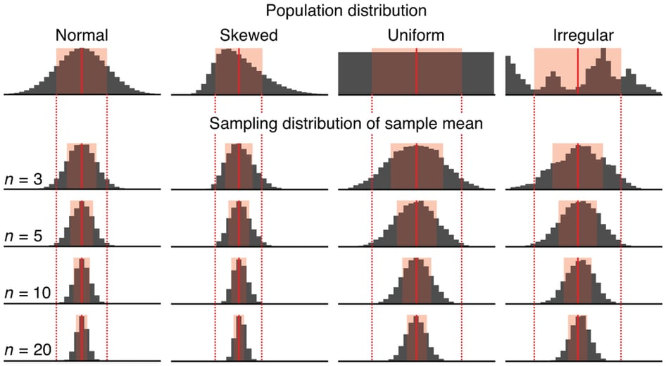

# Conditions (RIN)

  - > Random
    
      - > How the sample is selected

  - > Independent
    
      - > N≥10n
    
      - > N: population size
    
      - > n: sample size

  - > Normal
    
      - > For
            > means
        
          - > 
        
          - > If the population is normally distributed, n can \< 30
    
      - > For proportions:
        
          - > 

# Sampling Distribution of a Sample Mean

  - > 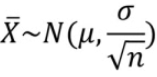

  - > 

# Sampling Distribution of a Sample Proportion

  - > 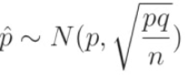

# Review

# Practice Questions

1.  > Assume graph X represents the actual distribution select which
    > graph the sampling distribution of the sample mean look like, for
    > a sample size of n =
> 50?

> 

  - > Answer: E

<!-- end list -->

1.  > The weight of the eggs produced by a certain species of chicken is
    > Normally distributed with mean 65 g and standard deviation 5 g.

<!-- end list -->

  - > If a farmer selects a random sample of 10 every morning to check
    > the health of his laying hens, what is the mean and SD of the
    > sampling distribution of the weight of the eggs?

> 

  - > Calculate the probability that a randomly selected egg weighs
    > between 61g and 69g

> 

  - > Calculate the probability that the mean weight of the farmers 10
    > eggs falls between 61g and
> 69g.

> 
> 
>  
> 
> 

1.  > A survey asks a random sample of 500 adults in California if they
    > support an increase in the state sales tax of 1%. Suppose that 40%
    > of all adults in California support the increase.

<!-- end list -->

  - > If p hat is the proportion of the sample who are in favor of the
    > increase, what is the mean of the sampling distribution of p hat?
    > The
> SD?

> 
> 
> 

  - > How large a sample would be needed to guarantee that the standard
    > deviation of it is no more than
> 0.02?

> 
> 
> 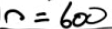

  - > Find the probability that p hat is between 0.36 and 0.42

> 

 

 

6.1 - Confidence Intervals

Tuesday, February 14, 2017

2:12 PM

# What is a CI?

  - > Using a Statistic to estimate a Parameter

  - > It is NOT a probability

  - > It is an interval that will cover the true parameter X% of the
    > time

> 

  - > So we can interpret a CI as
    
      - > "We are X% confident that the true population parameter lies
        > within A and B"

# General Math Behind a CI

  - > Formula
    
      - > Point Estimate ± Margin of Error
    
      - > Point Estimate ± Critical Value \* Standard Error

> 

  - > Point Estimate

> 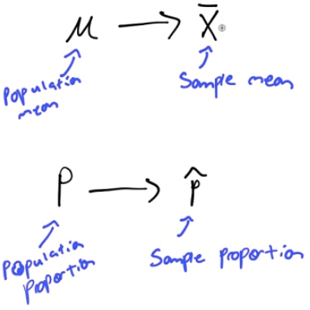

  - > Critical Value

> 
> 
> 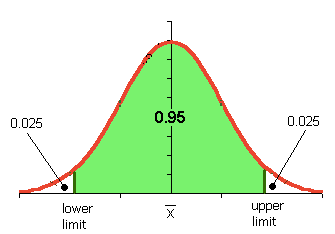

  - > Standard Error

> 
> 
> 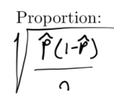

  - > Confidence Interval

> 

# Steps to Calculating a CI

  - > Read the problem and outline the STASTICS

  - > Check your CONDITIONS
    
      - > Random
    
      - > Independent: N≥10n
    
      - > Normal: n\>30

  - > CALCULATE
    
      - > Point Estimate ± Critical Value \* Standard Error

  - > INTERPRET

  - > **S**ome **C**an **C**alculate **I**ntervals

# Practice Questions

1.  > The effect of drugs and alcohol on the nervous system have been
    > the subject of considerable research. Suppose a neurologist is
    > testing the effect of a drug on response time by injecting 50 rats
    > with a dose, subjecting each to a stimulus, and recording the
    > response time. The average response time for the 50 injected rats
    > was 1.26s. Assuming the mean response time for a rat that has not
    > been injected with the drug is 1.4s with standard deviation of
    > 0.45, construct a 90% confidence interval to determine if the drug
    > has an effect on response time.
    
      - > Statistics
        
          - > Mean = 1.26
        
          - > Population SD = 0.45
        
          - > n = 50
        
          - > CL = 90%
    
      - > Conditions
        
          - > Random: Assume rats are a random sample
        
          - > Independent: N \> 10n
        
          - > Normal: n \>
> 50
    
      - > Calculate

> 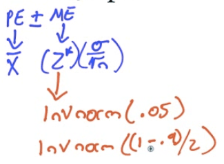
> 
> 

  - > Calculate by calculator

> 
> 
> 
> 
> 

  - > Calculated using Z test

<!-- end list -->

  - > Interpret
    
      - > We are 90% confident that the true mean response time for rats
        > given the new drug is between 1.16s and 1.36s.
    
      - > 1.4s is not in the interval, so we have evidence the new drug
        > make rats faster

<!-- end list -->

1.  > There are two fire stations in a town, one in the northern half
    > and one the southern half. The one in the northern part is known
    > to respond to calls within 4 min. The council members in the town
    > are worried that the southern fire station isn’t as good so they
    > hire a statistician. The statistician collects a random sample of
    > 50 call/responses from the southern fire station. The mean
    > response time is 5.3 min with a standard deviation of 3.1.
    > Construct a 95% confidence interval to determine if the council
    > members have cause to worry about the southern station
    
      - > Statistics
        
          - > Mean = 3.5
        
          - > Sample SD = 3.1
        
          - > n = 50
        
          - > CL = 95%
    
      - > Conditions
        
          - > Random: Yes
        
          - > Independent: N \> 10n = 500
        
          - > Normal: n \> 30
    
      - > Calculate

> 
> 
> 

  - > Calculate by calculator

> 
> 
> 
> 
> 

  - > Interoperate
    
      - > We are 95% confident that the true population mean response
        > time for the southern fire station is between 4.42 and 6.18
        > mins
    
      - > 4 is not in the interval, so we do have reason to be
        > concerned.

<!-- end list -->

1.  > The US Department of Transportation reported that 75% of all
    > fatally injured automobile drivers were intoxicated. A random
    > sample of 32 records in Carson County, Colorado, showed that 16
    > involved a drunk driver. Use a 99% confidence interval to
    > determine whether or not there is evidence that indicates the
    > population proportion of driver fatalities related to alcohol is
    > different than 75%
    
      - > Statistics
        
          - > P hat = x / n = 16/32 = 0.5
        
          - > n = 32
        
          - > CL = 99%
    
      - > Conditions
        
          - > Random: Yes
        
          - > Independent: N \> 10n = 320
        
          - > Normal: n \* p hat \> 10 and n \* (1-p hat)
> \>10
    
      - > Calculate

> 
> 
> 

  - > Calculate by calculator

> 
> 
> 
> 
> 

  - > Interperate
    
      - > We are 99% confident that the true population proportion of
        > driver fatalties in Carson County is between 27.2% and 72.8%
    
      - > 75% is not in our interval, so it appears that Carson County
        > is lower in the US

 

 

6.2 - Hypothesis Testing

Wednesday, February 15, 2017

1:42 PM

 

# Hypothesis Test

  - > Using a Statistic to test a claim about a Parameter

  - > Steps (**W**hy **C**an't **C**at **P**lay **I**nstruments)
    
      - > **W**rite the hypothesis
        
          - > Null hypothesis (H0): Parameter = \_\_\_\_
        
          - > Alternative hypothesis (H1/Ha):
            > Parameter \> or \< or ≠ \_\_\_\_\_\_
    
      - > **C**keck conditions (RIN)
        
          - > Random Sample
        
          - > Independent: N \>10n
        
          - > Normal:
            
              - > μ:
                > n≥30
            
              - > 
    
      - > **C**alculate the test statistic

> 

  - > Mean

> 

  - > Proportion

> 

  - > Look up the **P**-value (from Z table)
    
      - > Probability that the null hypothesis (H0) is true,
        > given the sample data you collected

> 

  - > **I**nterpret

| p \< α | Reject the null hypothesis         | do have evidence to support the claim     |
| ------ | ---------------------------------- | ----------------------------------------- |
| p \> α | Fail to reject the null hypothesis | do not have evidence to support the claim |

> 

# Confidence Interval vs α

> 

# Practice Question 1

> DDT is an insectcide. It is believed that DDT causes birds' eggshells
> to be thinner and weaker than normal and makes the eggs more prone to
> breakage.
> 
> An experiment was conducted where 21 hawks were fed a food mixture 14
> ppm DDT. The first egg laid by each bird was measured. The mean shell
> thickness was found to be 0.17 mm. The standard deviation of birdshell
> eggs is known to be 0.14 mm. A "normal" eggshell has a mean thickness
> of 0.2 mm.
> 
> Are the eggs with DDT the same as normal eggs?

  - > Data
    
      - > n = 21
    
      - > Mean = 0.17
    
      - > Population SD = 0.14
    
      - > Normal μ= 0.2

  - > Write the hypothesis
    
      - > Null hypothesis (H0): μ = 0.2
    
      - > Alternative hypothesis (H1/Ha): μ ≠ 0.2

  - > Check conditions
    
      - > Random: Assume random sampling
    
      - > Independent: N \> 10n = 210
    
      - > Normal: sample size is not larger than 30. So, proceed with
        > caution for interpreting results

  - > Calculate the test
> statistic

> 
> 
> 
> 
> 
> 
> 

  - > Look up the P-value

> 

  - > Interpret

> 

  - > Because our p-value = 0.327 is larger than α = 0.05, we fail to
    > reject H0, which means we do not have evidence to support the
    > alternative/claim that the egg shells are different than normal

# Practice Question 2

> An opinion poll asks a simple random sample of 100 college seniors how
> they view their job prospects. In all, 56 say "good."
> 
> Does the pool give reason to conclude that more than half of all
> seniors think their job prospects are good.

  - > Hypothesis
    
      - > H0: p = 0.5
    
      - > H1: p \> 0.5

  - > Conditions
    
      - > Random: given, SRS
    
      - > Independent: N \> 10n = 1000
    
      - > Normal:
        
          - > N\*p0 = 100 \* 0.5 = 50 \> 10
        
          - > N\*(1-p0) = 100 \* 0.5 = 50 \> 10

  - > Calculate

> 
> 
> 
> 
> 
> 
> 

  - > Look up the P-value

> 

  - > Interpret
    
      - > Because p-value =0.1151 \> α = 0.05, we fail to reject
        > H0.
    
      - > This means that we do not have evidence the claim that the
        > true population proportion of college seniors with "good"
        > prospect is above
> 0.5

> 

# Practice Question 3

> When the manufacturing process is working properly, the light bulbs
> have lifetimes that follow a right-skewed distribution with µ = 10
> hours and SD = 1 hours.
> 
> A quality control statistician selects a simple random sample of n=100
> light bulbs every hour and measures the lifetime of all light bulbs
> produced that hour is less than 10 hours at the 5% significance level,
> then all those light bulbs are discarded.
> 
> The current sample of 100 has a mean of 8.5, should this batch be
> discarded?

  - > Write the hypothesis
    
      - > H0: µ = 10
    
      - > H1: µ \< 10

  - > Check conditions
    
      - > Random: given, random sample
    
      - > Independent: N \> 10n = 1000
    
      - > Normal: n = 100 \> 30

  - > Calculate

> 
> 
> 
> 
> 

  - > P-value
    
      - > P \< 0.0002

  - > Interpret
    
      - > P \< 0.0002 \< α = 0.05
    
      - > We reject the null hypothesis test.
    
      - > We do have evidence to support the claim that the mean life of
        > light bulbs is less than 10 hours, so we should discard this
        > batch

# Practice Question 4

> The US Department of Transportation reported that 75% of all fatally
> injured automobile drivers were intoxicated. A random sample of 32
> records in Carson County, Colorado, showed that 16 involved a drunk
> driver. Use a 99% confidence interval to determine whether or not
> there is evidence that indicates the population proportion of driver
> fatalities related to alcohol is different than 75%.

  - > Write the hypothesis
    
      - > H0: p = 0.75
    
      - > H1: p ≠ 0.75

  - > Conditions
    
      - > Random: given
    
      - > Independent: N \> 10n = 320
    
      - > Normal:
        
          - > n\*p = 32 \* 0.75 = 24 \> 10
        
          - > n\*(1-p) = 32 \* 0.25 = 8 \< 10
        
          - > May not be normal, proceed with interpret with caution

  - > Calculate

> 

  - > P-value

> 
> 
> 

  - > Interpret
    
      - > Because p = 0.001 \< α, we reject H0 and do have
        > evidence to support the claim that the population proportion
        > of driver fatalities related to alcohol is different than 75%

 

 

6.3 - The T Distribution

Wednesday, February 15, 2017

1:43 PM

# T Distribution

  - > When do we use the T distribution
    
      - > Know the mean
    
      - > Do not know the population SD

> 

  - > Formula

> 

  - > Degrees of freedom (df)
    
      - > df = n-1

# Confidence Interval Example

> The super Corporation manufactures a device they claim "may increase
> gas mileage by 23%"
> 
> Here are the percent changes in gas mileage for 17 identical vehicles,
> as presented in one of the company's advertisements

| 48.3 | 46.9 | 46.8 | 44.6 | 40.2 | 38.5 |
| ---- | ---- | ---- | ---- | ---- | ---- |
| 34.6 | 33.7 | 28.7 | 28.7 | 24.8 | 10.8 |
| 6.9  | 12.4 | 21.2 | 25.2 |      |      |

> Construct and interpret a 90% confidence interval to estimate the mean
> fuel savings in the population of all such vehicles.

  - > Type in the data

> 

  - > 1-Var Stats for the sample

> 

  - > Looking for t

> 
> 
> 
> 
> 

  - > Calculate

> 

  - > Calculate by calculator

> 

  - > Interpret
    
      - > We are 90% confident that the mean percent change in gas
        > mileage is between 24.68% and 38.16%
    
      - > Since 23% is in the interval, it appears that the machine does
        > even better than 23% savings

# Hypothesis Test Example

When the manufacturing process is working properly, the batteries have
lifetimes that follow a right-skewed distribution with µ = 10 hours. A
quality control statistician selects a simple random sample of n = 20
batteries every hour and measures the lifetime of each.

If she is convinced that the mean lifetime of all batteries produced
that hour is less than 10 hours at the 5% significance level, then all
those batteries are discarded.

The current sample of 20 has a mean of 8.5 and a SD of 3, should this
batch be discarded?

  - > Hypothesis
    
      - > H0: µ = 10
    
      - > H1: µ \< 10

  - > Conditions
    
      - > Random: given
    
      - > Independent: N \> 10n = 200
    
      - > Normal: not larger than 30, but still ok since we are using a
        > T distribution

  - > Calculate

> 
> 
> 

  - > Calculate by calculator

> 
> 
> 

  - > P-value

> 

  - > df = n - 1 = 19

<!-- end list -->

  - > Interpret
    
      - > Because p \< α, we reject the null hypothesis. Thus, we do
        > have evidence to support the claim that the mean battery life
        > in this whole batch is less than 10 hours and so should be
        > discarded

# Matched Pairs T-Test

The average weekly loss of study hours due to consuming too much alcohol
on the weekend is studied on 10 students before and after a certain
alcohol aware ness program is put into operation. Do the data provide
evidence that the program was effective?

> 

  - > Formula

> 

  - > Data
    
      - > N=10
    
      - > Difference of mean = 0.52
    
      - > Difference of SD = 0.407

  - > Hypothesis (d = before - after)
    
      - > H0: µd = 0
    
      - > H1: µd \> 0

  - > Conditions
    
      - > Random: assume random selection
    
      - > Independence: N \> 10n = 100
    
      - > Normal: t-distribution

  - > Calculate

> 

  - > Calculate by calculator

> 
> 
> 

  - > P-value
    
      - > df = 10-1 =
> 9

> 

  - > Interpret
    
      - > P \< α, Reject, do have evidence

 

 

6.4 - Two Samples

Wednesday, February 15, 2017

1:43 PM

 

# Two Samples

  - > Hypothesis

> 

# Practice Question 1

> In a test of the reliability of products produced by two machines,
> machine A produced 15 defective parts in a run of 280, while machine B
> produced 10 defective parts in a run of 200.
> 
> Do results imply a difference in the reliability of these two
> machines?

  - > Data
    
      - > P1 = 15/280 = 0.0536
    
      - > P2 = 10/200 = 0.05
    
      - > 1: Machine A
    
      - > 2: Machine B

  - > Hypothesis
    
      - > H0: P1 = P2
    
      - > H1: P1 ≠ P2

  - > Conditions
    
      - > Random: assumed
    
      - > Independent: Each part produced is independent
    
      - > Normal: n1\*p1 \> 10, n1\*(1-p1) \> 10, n2\*p2 \> 10,
        > n2\*(1-p2) \> 10

  - > Calculate

> 

  - > Calculate by calculator

> 
> 
> 

  - > Interpret
    
      - > P \> α, so we fail to reject the null hypothesis. We do not
        > have evidence to support the claim that two machines have
        > different reliabilities

# Practice Question 2

> The use of helmets among recreational alpine skiers and snowboarders
> are generally low. A study wanted to examine if helmet use reduces the
> risk of head injury.
> 
> In the study, they compared the ski/board related injury costs for
> those who wore helmets and those who did not wear helmets. The helmet
> wearers had a mean injury cost of $10,200 per person (SD = $25,000)
> and the non-helmet wearers had a mean injury cost of $45,500 (SD =
> $10,000).
> 
> Are ski/board injuries less severe among those who wear helmets?

  - > Hypothesis
    
      - > H0: µ1 = µ2
    
      - > H1: µ1 \< µ2

  - > Conditions
    
      - > Random: assume SRS
    
      - > Independent: assume each person independent
    
      - > Normal: n1 \> 30, n2 \> 30

  - > Calculate

> 
> 
> 

  - > df = smaller n - 1

<!-- end list -->

  - > Calculate by calculator

> 
> 
> 
> 
> 

  - > Interpret
    
      - > P \< α
    
      - > So we reject the null hypothesis and have evidence to support
        > the claim that the injury cost of group 1 (helmet wearers) is
        > less than group 2 (non-helmet wearers)

# Practice Question 3

> A pharmaceutical company claims its new drug will relieve headaches
> faster than any other drug on the market. To determine whether this
> claim is valid, the new drug is given to each of the 30 randomly
> selected persons and a standard drug is given to another 30 randomly
> selected persons.
> 
> The number of minutes required for each to recover from the headache
> is recorded. The sample results are:
> 
> 

  - > Hypothesis
    
      - > H0: µ1 = µ2
    
      - > H1: µ1 \< µ2

  - > Conditions
    
      - > Random: given
    
      - > Independent: assumed
    
      - > Normal: n =
> 30

  - > Calculate

> 
> 
> 

  - > Interpret
    
      - > P \> α
    
      - > We fail to reject H0, so we do not have evidence to support
        > the claim that the new drug works better

# Practice Question 4

> In a large university in the year 2000 an SRS of 100 entering freshmen
> found that 20 finished in the bottom third of their high school class.
> Admission standards at the university have become more stringent and
> in 2015 and a new SRS of 100 entering freshmen found that 12 finished
> in the bottom third of their high school class.
> 
> Does it appear that t he admission standards have actually become more
> stringent?

  - > Data
    
      - > P1 = x1 / n1 = 20/100 = 0.2
    
      - > P2 = x2 / n2 = 12/100 = 0.12

  - > Hypothesis
    
      - > H0: P1 = P2
    
      - > H1: P1 \> P2

  - > Conditions
    
      - > Random: given, SRS
    
      - > Independent: assumed
    
      - > Normal: n1\*p1 \> 10, n2\*p2 \> 10, n1\*(1-p1) \> 10,
        > n2\*(1-p2) \> 10

  - > Calculate

> 
> 
> 
> 
> 

  - > Interpret
    
      - > P \> α
    
      - > So we fail to reject the null hypothesis and do not have
        > evidence to support the claim that acceptance is more
        > stringent

# "Pick Your Test" Map

> 
> 
> ![Test For Population mean (V) Population mean (V) Population
> proportion (p) Difference of two means (VI — "2) Difference of two
> means (VI — "2) Mean difference (paired data) Difference of two
> proportions Null Hypothesis P P Test Statistic (f—go) po (I—po ) n 2
> 01 02 2 2 (DI -D2 )-O p(l—p) Distribution z z z tdistribution with the
> smaller of n—l and z Use When Normal distribution or n \> 30; o known
> n \< 30, and/or o unknown nD, 2 10 Both normal distributions, or 171,
> 30; q, known 171, \< 30; and/or q, g unknown n \< 30 pairs of data
> and/or o d unknown nD, 10 for each group ](./media/image268.png)

# Confidence Interval Practice Question

> In a test of the reliability of products produced by two machines,
> machine A produced 15 defective parts in a run of 280, while machine B
> produced 10 defective parts in a run of 200.
> 
> Do results imply a difference in the reliability of these two
> machines?
> 
> 
> 
> 
> 
> 

  - > 0 is in the interval so there does not appear to be difference

 

 

6.5 - Hypothesis Testing of Least-Squares Regression Line

Wednesday, February 15, 2017

1:43 PM

 

# Tests for the Regression Line

  - > Is there a correlation?

| H0 | r=0 | b=0 |
| -- | --- | --- |
| H1 | r≠0 | b≠0 |

  - > Is the y intercept = 0
    
      - > H0: a = 0
    
      - > H1: a ≠ 0

# Conditions for Hypothesis Testing

  - > Linearity
    
      - > Linear relationship between x and y

  - > Constant Variability (homoscedasticity)

  - > Normality
    
      - > The residuals should be normally distributed (from Histogram
        > and QQ plot)

> 

  - > Independence
    
      - > All the Y are independent

# Hypothesis Testing

> 

# Practice Question 1

> A teacher asked her students to record the total amount Of time they
> spent studying for a particular test.
> 
> The amounts of study time x (in hours) and the resulting test grades y
> are given below

| x | 2  | 1  | 1.5 | 0.5 | 1  | 3  |
| - | -- | -- | --- | --- | -- | -- |
| y | 92 | 81 | 84  | 68  | 85 | 96 |

1.  > Obtain the equation of the least-squares regression line and the
    > correlation.

> 
> 
> 

  - > y = 69.7 + 9.75x

  - > r = 0.896 (strong correlation)

  - > r2 = 0.803 (80.3% of the change in grade can be
    > explained by the study time)

<!-- end list -->

1.  > Explain in words what the slope b of the least-squares line says
    > about hours studied a nd grade awarded.
    
      - > For every 1 hour increase in study time, the grade is expected
        > to go up by 9.75 points

2.  > Test the hypothesis that the amount of study time is correlated to
    > the test grade
    
      - > Data

| L1 | L2 | L3    | L4       |
| -- | -- | ----- | -------- |
| x  | y  | y hat | Residual |

  - > Hypothesis

> 

  - > Conditions
    
      - > Linearity

> 
> 
> 

  - > Constant Variance

> 
> 
> 

  - > Normal Residuals

> 
> 
> 

  - > Independence: each observation is
> independent

<!-- end list -->

  - > Calculate

> 

  - > Interpret
    
      - > So we reject the null hypothesis and have evidence to support
        > the claim that the slope is not equal to zero. There is a
        > correlation between study time and test grades

<!-- end list -->

1.  > What is the 95% confidence interval of the slope?
    
      - > Equation

> 

  - > Calculate

> 
> 
> 
> 
> 

  - > Interpret
    
      - > We are 95% confident that on average, for every 1 hour
        > increase in study time, the final grade will go up between
        > 3.05 and 16.45 points

# Interpreting Computer Output

> 
> 
> 

# Practice Question 2

> An economics professor wishes to analyze whether a person's income can
> predict the cost of their car
> 
> 

  - > What's the least-squares regression equation
    
      - > y hat = 438.535 + 0.511 \* x
    
      - > y = cost of car
    
      - > x = income

  - > What is the standard error about the line (aka the standard
    > deviation of the regression model)? Interpret this value in
    > context
    
      - > On average, we expect our prediction of cost is off by 12.22.

  - > Interpret the slope of the least-squares regression line in the
    > context of this problem
    
      - > For every $1 increase in income, car cost increases, on
        > average, $0.51

  - > What are the null and alternative hypotheses to test if there is
    > an association between income and car cost?
    
      - > 

  - > What is the value of the test statistic for testing the
        > hypotheses
    
      - > 

  - > What is the P-value for the test
    
      - > P \< 0.001

  - > Is income useful for predicting the cost of a person's car? Use a
    > significance level of 0.01. Explain briefly
    
      - > 

# Practice Question 3

> Test if the number of beers is associated with the BAC
> 
> 
> 
> 

 

 

6.6 - Hypothesis Tests for Categorical Data (Chi-Squared Tests)

Wednesday, February 15, 2017

1:43 PM

# Chi-Squared Goodness of Fit Test

  - > One categorical variable with counts (or proportion) in each
    > category

  - > We have seen: products are produced by two machines, machine A
    > produced 15 defective parts in a run of 280, while machine B
    > produced 10 defective parts in a run of 200. Is there a difference
    > in the reliability of these two machines?

  - > New question type: products are produced by three machines,
    > machine A produced 15 defective parts in a run of 280, while
    > machine B produced 10 defective parts in a run of 200. Is there a
    > difference in the reliability of these machines?

# Practice Question 1

> In the past, for a large introductory statistics course, the
> proportions of students that received grades of A, B, C, D, or F have
> been, respectively, 0.15, 0.35, 0.30, 0.10, and 0.10
> 
> This year, there were 200 students in the class, and following grades
> were given:

| Grade  | A  | B  | C  | D | F |
| ------ | -- | -- | -- | - | - |
| Number | 51 | 79 | 61 | 8 | 1 |

> Test to see whether the distribution of grades this year was different
> from the distribution in the past?

  - > Hypothesis
    
      - > H0: PA = 0.15, PB = 0.35, PC = 0.30, PD = 0.10, PF = 0.10
    
      - > H1: at least one p does not fit the distribution

  - > Calculate expected values

| Grade    | A  | B  | C  | D  | F  |
| -------- | -- | -- | -- | -- | -- |
| Observed | 51 | 79 | 61 | 8  | 1  |
| Expected | 30 | 70 | 60 | 20 | 20 |

  - > Conditions
    
      - > Random
    
      - > Independent
    
      - > Count: At least 80% of the expected counts are greater than 5
        > and none are less than
> 1

  - > Calculate

> 
> 
> 
> 
> 

  - > Calculate by calculator

> 
> 
> 

  - > P-value

> df = k - 1 (k: number of categories)
> 
> 

  - > Interpret
    
      - > P \< α
    
      - > So we reject the null hypothesis and have evidence to support
        > the claim that at least one grade proportion does not fit the
        > expected distribution

# Chi-Squared Test of Homogeneity or Independence/Association

  - > Two categorical variables

  - > Homogeneity
    
      - > Do two or more sub-groups of a population share the same
        > distribution of a categorical variable (each group has its own
        > sample)
    
      - > Do people of different races have the same proportion of
        > smokers to non-smokers.
    
      - > Do different education levels have different proportions of
        > Democrats, Republicans, and Independent

  - > Independence/Association
    
      - > Determining whether two categorical variables are associated
        > (variables from a single SRS)
    
      - > Is there an association between race and smoking status
    
      - > Is there an association between education and voting
        > preference

# Practice Question 2

> Girls and boys at an elementary school were sampled and asked about
> their favorite subject

1.  > Does favorite subject differ by gender?

| Favorite subject | Boys | Girls | Total |
| ---------------- | ---- | ----- | ----- |
| Math             | 96   | 295   | 391   |
| English          | 32   | 45    | 77    |
| Social Studies   | 94   | 40    | 134   |
| Total            | 222  | 380   | 602   |

  - > Hypothesis
    
      - > H0: favorite subject does not differ by gender
    
      - > H1: favorite subject does differ by gender

  - > Expected
    
      - > Row Total \* Colum Total / Total

  - > Conditions
    
      - > For each sub group, the sample is a SRS
    
      - > NO expected cell counts are \<
> 5

  - > Calculate

> 

  - > Calculate by calculator

> 
> 
> 
> 
> 

  - > P-value
    
      - > df = (r-1)\*(c-1)

  - > Interpret
    
      - > P \< α
    
      - > So we reject the null hypothesis and have evidence to support
        > the claim that favourite subject is different between boys and
        > girls

<!-- end list -->

1.  > Is favourite subject associated with gender?

<!-- end list -->

  - > H0: There is no association between favorite subject and gender

  - > H1: There is an association between favorite subject and gender

# Practice Question 3

> You are playing a dice game with a friend. They brought a 6 sided die
> that you think may not be fair. You conduct an experiment to determine
> if it is fair. You roll the die 100 times and get following:

| Side      | 1  | 2  | 3  | 4  | 5  | 6  |
| --------- | -- | -- | -- | -- | -- | -- |
| Frequency | 17 | 24 | 15 | 22 | 12 | 10 |

  - > Hypothesis
    
      - > H0: P1 = P2 = P3 = P4 = P5 = P6
    
      - > H1: at least one is not equal

  - > Expected
    
      - > 1/6 = 0.1667

  - > Conditions
    
      - > Random
    
      - > Independent
    
      - > Expected counts are greater than
> 5

  - > Calculate

> 

  - > Calculate by calculator

> 

  - > Interpret
    
      - > P \> α
    
      - > So we fail to reject the null hypothesis and do not have
        > evidence to support the claim that the die is unfair

 

 

Sample Questions

Wednesday, April 5, 2017

11:28 AM

 

# Question 2

  - > Simple Random Sampling

> 

  - > Stratified
> Sampling

> 

  - > Systematic Sampling

> 

  - > Cluster Sampling

> 

# Question 6

> ![Two-tail Two-Tailed P-value = P (Z \< —IzolorZ \> Izol) = 2P(Z \>
> Izol) P-VaIue Approach Assume that the null hypothesis is true. The
> P-Value is the probability of observing a sample mean that is as or
> more extreme than the observed. How to compute the P-Value for each
> type of test: x—go Step 1: Compute the test statistic zo I Zol Right
> Tail Right-Tailed P-value = \> zo) The area right of zo is the P-value
> The sum of the area in the tails is the P-value l: 01 The sum of the
> area in the tails is the P-value Left Tail Left-Tailed P-value = \<
> zo) The area left of is the P-value ](./media/image311.png)

# Question 14

  - > \-1 \< r \< 1

> 

# Question 15

  - > The power of a test is affected by sample size (bigger sample,
    > more power) and alpha level (larger alpha, i.e. .05 compared to
    > .01, more power)

> ![SIGNIF CANCE LEVEL There is a trade-off between the significance
> level and power: the more stringent (lower) the significance level,
> the lower the power. Figure 3 shows that power is lower for the 0.01
> level than it is for the 0.05 level. Naturally, the stronger the
> evidence needed to reject the null hypothesis, the lower the chance
> that the null hypothesis will be rejected. 1.00 0.80 0.60 0 40 0.20
> 0.00 a = 0.05 a = 0.01 Figure 3. The relationship between significance
> level and power with one-tailed tests: u = 75, real u = 80, and o =
> 10. ](./media/image313.png)

# Question 18

> ![the width of a confidence interval is dependent on the z (or t)\*
> and the standard deviation of the statistic. Assuming the z\* is
> unchanged, the question is which is the smaller standard deviation
> sqrt(.7\* .3/50) is approximately 00648 while
> sqrt(\[37/60\*23/60\]/60) is approximately 0.0628 so the confidence
> interval based on 37 out of 60 will be slightly narrower than the
> confidence Interval based on 35 out of 50 ](./media/image314.png)

 

 

2002 Multiple Choice

Tuesday, February 21, 2017

3:19 PM

 

# Question 10

> 

# Question 15

> 

# Question 16

> ![Jason wants to determine how age and gender are rel\&d to political
> party preference in his town. Voter regis- tration lists are
> stratified by gender and age-group. Jason selects a simple random
> sample of 50 men from the 20 to 29 age-group and records their age,
> and pany registration (Democratic, Republican, neittrr). He also
> selects an simple random sample of women fmm the 40 to 49 age-group
> and the sanE Of the following, wtüch is the most important observation
> about Jason' s plan? (A) plan is well conceived and should serve the
> intended purpose. (B) His samples are too small. (C) He should have
> used equal sample sizes. should have randomly selected the two age
> groups instead of choosing them nonrandomly. ) will be unable to tell
> wlwttrr a difference in party affiliation is related to differences in
> age to the difference in gender. VO..QvvU-LD ](./media/image317.png)

# Question 17

  - > Residuals = observed/actual y - predicted y

  - > See Chi-square test statistic formula

# Question 18

> 

# Question 19

> 
> 
> 
> 
> 

# Question 23

> ![Events are mutually exclusive if the occurrence of one event
> excludes the occurrence of the other(s). Mutually exclusive events
> cannot happen at the same time. For example: when tossing a coin, the
> result can either be heads or tails but cannot be both. mutually
> exclusive A, B P(A) 1 - P(B) Events are independent if the occurrence
> of one event does not influence (and is not influenced by) the
> occurrence of the other(s). For example: when tossing two coins, the
> result of one flip does not affect the result of the other. U B) =
> P(A) + P(B) - independent A, B This of course means mutually exclusive
> events are not independent, and independent events cannot be mutually
> exclusive. (Events of measure zero excepted.) ](./media/image322.png)
> 
> 

# Question 24

> ![Important. Pr (observation I hypothesis) Pr (hypothesis I
> observation) The probability of observing a result given that some
> hypothesis is true IS not equivalent to the probability that a
> hypothesis is true given that some result has been observed. Using the
> p-value as a "score" is committing an egregious logical error: the
> transposed conditional fallacy. More likely observation Very un-likely
> observations p-val ue Very un-likely observations Observed data point
> Setof possible results A "-value (shaded green area) is the
> probability of an observed (or more extreme) result assuming that the
> null hypothesis is true. ](./media/image324.png)

# Question 34

> 

# Question 35

> 

# Question 37

> ![A simple random sample produces a sample mean, i, of 15. A 95
> percent confidence interval for the corresp«ding population mean is 15
> ± 3. Which of the following statements must be true? (A)
> Ninety-fivepercentofthepop onmeasurements fall between 12and 18. (B)
> Ninety-five percent of the sam measure11Ents fall between 12 and 18.
> (C) If 100 samples were taken, 9 of bk\&n 12 and 18. (D) P(12 18) = is
> (E) f g = 19. this of 15 would be unlikely to occur. If tee -fl. c x,)
> \* s so X = IS is ](./media/image327.png)

# Question 40

> ![A student working on a history IYOject decided to find a 95 percent
> confidence interval for difference in mean age at the of to omce
> American Presidents versus former British Plin-z Ministers. TIE
> student found the ages at dle tillE of election to office fcx the
> members of tx\*h groups, which included all of the Anrrican Presidents
> and all of the British Ministers, arxi used a calculator to fuxi tbe
> 95 percent confi\&nce interval based on the t-distribution. This
> procedure is not appropriate in this context becåuse the sample sizes
> for the two groups are not equal (B) entic was nrasured in both cases,
> so actual difference in means can be computed and a cohhdence interval
> should not be used fo (C) elections to office take place at different
> intervals in two countries, so the distribution of ages cann« be same
> (D) ages at the time of election to omce are likely to be skewed
> rather than bell-shapd, so the assumptions for using this confidence
> interval formula are not valid (E) ages at the time of election to
> office are to have a few large outliers, so the assumptions for using
> this confidence interval formula are not valid ](./media/image328.png)

 

 

2011 Free Response

2017年4月27日 星期四

下午9:26

 

# Question 1 (a)

> ![No, it is not reasonable to believe that the distribution of 40-yard
> running times is approximately normal, because the minimum time is
> only 1.33 standard deviations below the mean 4.4—4.6 —1.33 . In a
> normal distribution, approximately of the z-scores are below 0.15
> —1.33. However there are no running times less than 4.4 seconds,
> which indicates that there are no running times with a z-score less
> than —1.33. Therefore, the distribution of 40-yard running times is
> not approximately normal. ](./media/image329.png)

# Question 1 (b)

  - > How to interpret the z-score

> 

# Question 2 (b)

  - > Independence vs. Dependence
    
      - > A conditional probability is the probability of some event
        > occurring, given that some other event has already occurred.
        > The conditional probability of event X occurring, given that
        > some other event Y has already occurred, is written as P(X|Y).
    
      - > For example, P(M|N) would be the probability of the occurrence
        > of event M given that event N has already occurred. It would
        > be read as “the probability of M, given N.”
    
      - > As stated earlier, two events are considered independent if
        > the occurrence of one of the events does not change the
        > probability of the other event from what it would have been
        > had the first event not occurred. Thus, two events, X and Y,
        > are independent if P(X|Y) = P(X) or P(Y|X) = P(Y)
    
      - > Actually, these two conditional relationships are related. If
        > one is true, the other must be true. If one is false, the
        > other must be false.
    
      - > If **P(X|Y) = P(X)**, then **P(Y|X) = P(Y)**, and the events
        > are **independent**.
    
      - > If **P(X|Y) ≠ P(X),** then **P(Y|X) ≠ P(Y)**, and the events
        > are **dependent**.

> 

# Question 2 (c)

> ![The marginal proportions of voters registered for each of the three
> political parties (without regard to gender) are given below. 88
> =0.176 Party W: 500 244 = 0.488 Party X: 500 168 = 0.336 Party Y: 500
> Because party registration is indeoendent of aender in Lawrence
> Township, the proportions of males and females registered for each
> party must be identical to each other and also identical to the
> marginal proportion of voters registered for that party. Using the
> order Party W, Party X, and Party Y, the graph for Lawrence Township
> is displayed below. ](./media/image332.png)
> 
> 

# Question 3 (a)

  - > Process for randomly selecting 2 numbers from 1 to 9

> ![Step 1: Generate a random integer between 1 and 9, inclusive, using
> a calculator, a computer program, or a table of random digits. Select
> all four apartments on the floor corresponding to the selected
> integer. Step 2: Generate another random integer between 1 and 9,
> inclusive. If the generated integer is the same as the integer
> generated in step 1 , continue generatinq random inteqers between 1
> and 9 until a different integer appears. Again select all four
> apartments on the floor corresponding to the second selected integer.
> ](./media/image334.png)

# Question 3 (b)

> ![Because the amount of wear on the carpets in apartments
> with-GhiIdK.en-GQ.uld-he-diffeI.ent.ft.Q111 the wear on the carpets in
> apartments without children, it would be advantageous to have
> apartments with children represented in the sample. The cluster
> sampling procedure in part (a) could produce a sample with no children
> in the selected apartments; for example, a cluster sample of the
> apartments on the third and sixth floors would consist entirely of
> apartments with no children. Stratified random sampling, where the two
> strata are apartments with children and apartments without children,
> guarantees a sample that includes apartments with and without
> children, which, in turn, would yield sample data that are
> representative of both tvpes of apartments. ](./media/image335.png)

# Question 4

  - > Degrees of freedom for two-sample t-test.

> 

  - > Graphs of both distributions must be produced and described to
    > check the normality condition.

> ![The second condition is that the two populations are approximately
> normally distributed or the sample sizes are sufficiently large.
> Because of the small sample sizes (10 in each treatment group), we
> need to check whether it is reasonable to assume that the samples came
> from populations that are normally distributed. The following dotplots
> reveal slight skewness and a possible outlier for group B, but it
> appears reasonable to proceed with the two-sample t-test. Group A
> Group B -5 5 10 15 20 25 30 Cholesterol Reduction (in mg/dL)
> ](./media/image337.png)

# Question 5 (c)

  - > Correlation
> coefficient

> 

  - > Coefficient of determination

> 

# Question 5 (d)

  - > Explaining relationship

> 
> 
> 
> 
> 

# Question 6 (a)

  - > Checking condition for one-sample z-interval
    
      - > Random
    
      - > Normal: Large sample size

> 

 

 

2011 Free Response (Form B)

2017年4月27日 星期四

下午9:26

 

# Question 1 (a)

  - > Estimation for median

> ![The median is the value with half of the P-T ratios at or below it
> and half of the values at or above it. to find the position of the
> median in the ordered list of For n observations in a group, use 2
> observations. For states west of the Mississippi (n = 24) the median
> falls between the 12th and 13th value in the ordered list, and both
> the 12th and 13th values fall in the interval 15—16. For states east
> of the Mississippi (n = 26) the median falls between the 13th and 14th
> value in the ordered list, and both of these values also fall in the
> interval 15—16. From the histogram, cumulative frequencies for the two
> groups are shown in the table below. Interval 12-13 13-14 14-15 15-16
> West 1 1+4=5 1 4 + 6 = 11 1 6 = 14 East 2+4=6 10 2 11 = 21 Thus, the
> median P-T ratio for both groups is at least 15 students per teacher
> and at most 16 students per teacher. ](./media/image343.png)

# Question 1 (c)

> 

  - > Mean, Median, and Skew

> 

# Question 1 (a)

> 

# Question 3 (a)

  - > Pay attention to the notation

> 

# Question 3 (b)

> 

  - > Binomial distribution

> 
> 
> 
> 
> 

# Question 3 (c)

> ![Let X denote the number of upgrades Sam will receive in 104 flights.
> The random variable X follows a binomial distribution with n = 104
> independent trials and p = 0.1. Thus, p (x \> 20) = I-P(X 20)
> -1-0.9986 0.0014. Because this probability is so small, it is very
> unlikely that Sam would receive more than 20 upgrades in 104 flights
> if the airline's claim is correct. This would be expected to happen
> less than 1 percent of the time, indicating that one should be
> surprised if Sam receives more than 20 upgrades during the next year.
> ](./media/image349.png)

# Question 4 (b)

  - > Conditions for a chi-square inference procedure

> 

# Question 4 (d)

> 

  - > Type I error and Type II error

> 

# Question 5 (a)

  - > Conditions for one-proportion Z interval

> 

  - > Calculation for one-proportion Z
> interval

> 
> 
> 

  - > Interpretation for one-proportion Z interval

> 

# Question 5 (b)

> 

  - > 

  - > Calculating Required Sample Size to Estimate Population Mean

> 
> 
> 

# Question 6 (b)

> 
> 
> 

# Question 6 (c)

  - > Describe distribution: Mean & Standard deviation

> 

# Question 6 (d)

> 

  - > Confidence interval

> 

# Question 6 (e)

> ![85 80 75 70 65 60 55 50 85 v? 80 65 60 55 50 6 7 8 9 10 11 12 13
> Width of Buffer Strip (feet) 6 7 8 9 10 11 12 13 Width of Buffer Strip
> (feet) If we think that the sample mean nitrogen removed at a
> particular buffer width might reasonably be a sample regression line
> will result from connecting any point in the interval above 6 to any
> point in the interval above 13. With this in mind, the dashed lines in
> the plots above represent extreme cases for possible sample reqression
> lines. From these plots, we can see that there is a wider range of
> possible slopes in the second plot (on the right) than in the first
> plot (on the left). Because of this, in the sampling distribution of
> b, the estimator for the slope of the regression line, will be smaller
> for the first studv Dlan (with four observations at 6 feet and four
> observations at 13 feet) than it would be for the second study plan
> (with four observations at 8 feet and four observations at 10 feet).
> Therefore, the first study plan (on the left) would provide a better
> estimator of the slope of the regression line than the second study
> plan (on the right). ](./media/image366.png)

# Question 6 (f)

> 

 

 

2012 Multiple Choice

Monday, April 17, 2017

11:26 AM

 

# Question 11

  - > Completely Randomized Design

> 

  - > Randomized Block Design

> 

# Question 12

> 
> 
> 

  - > How to minimize response bias
    
      - > Use Clear Language
    
      - > Choose Words and Phrases With Care
    
      - > Know How To Frame Your Questions
    
      - > Provide Just the Right Amount of Options
    
      - > Plan a Neutral Survey Structure
    
      - > Keep Styling At a Minimum
    
      - > Be Honest

# Question 13

> ![13. For a sample of 42 rabbits, the mean weight is 5 pounds and the
> standard deviation of weights is 3 pounds. Which of the following is
> most likely true about the weights for the rabbits in this sample? (A)
> The distribution of weights is approximately normal because the sample
> size is 42, and therefore the central limit theorem applies. (B) The
> distribution of wei ts is ximatel normal because the standard
> deviation is less than the mean. (C) The distribution of weights is
> skewed to the right because the least possible weight is within 2
> standard deviations of the mean. (D) The distribution of weights is
> skewed to the left because the least possible weight is within 2
> standard deviations of the mean. (E) The distribution of weights has a
> median that is greater than the mean. ](./media/image372.png)

# Question 18

  - > Population size should be at least 10 times the sample size so
    > that the degree of dependence among observations is negligible.

# Question 22

  - > Confidence Interval Interpretation

> 
> 
> ![Confidence intervals provide more information than point estimates.
> Confidence intervals for means are intervals constructed using a
> procedure (presented in the next section) that will contain the
> population mean a specified proportion of the time, typically either
> 95% or 99% of the time. These intervals are referred to as 95% and 99%
> confidence intervals respectively. An example of a 95% confidence
> interval is shown below: 72.85 \< p \< 107.15 There is good reason to
> believe that the population mean lies between these two bounds of
> 72.85 and 107.15 since 95% of the time confidence intervals contain
> the true mean. If repeated samples were taken and the 95% confidence
> interval computed for each sample, 95% of the intervals would contain
> the population mean. Naturally, 5% of the intervals would not contain
> the population mean. ](./media/image374.png)
> 
> 

# Question 28

> ![28. An experimenter conducted a two-tailed hypothesis test on a set
> of data and obtained a p-value of 0.44. If the experimenter had
> conducted a one-tailed test on the same set of data, which of the
> following is true about the possible p-value(s) that the experimenter
> could have obtained? (B) (D) (E) The only possible p-value is 0.22.
> The only possible p-value is 0.44. The only possible p-value is 0.88.
> The possible p-values are 0.22 and 0.78. The possible p-values are
> 0.22 and 0.88. ](./media/image376.png)
> 
> 

  - > 

  - > 

# Question 32

  - > SE Coef = Standard Deviation of **Statistic** (not population)

 

 

2012 Free Response

Friday, April 7, 2017

4:07 PM

 

# Question 1 (a)

> 

# Question 1 (b)

> ![The sewing machine that most affects the appropriateness of using a
> linear regression model is the one that costs about $2,200 and has a
> quality rating of about 65. Although the other four sewing machines
> costing more than $500 generally have higher quality ratings than
> those costing under $500, their prices and quality ratings follow a
> trend that suggests that quality ratings may not continue to increase
> with higher prices, but instead may approach a maximum possible
> quality rating. The $2,200 sewing machine is the most expensive of all
> but has a relatively low quality rating, which is consistent with a
> nonlinear model that approaches a maximum possible quality rating and
> then perhaps decreases. If a linear model were fit to all of the data,
> this one machine would substantially pull the regression line toward
> it, resulting in a poor overall fit of the line to the data.
> ](./media/image381.png)

# Question 3 (a)

> ![Household size tended to be larger in 1950 than in 2000. The
> histograms reveal a much larger proportion of small (1-, 2-, and
> a-person) households in 2000 than in 1950. Similarly, the histograms
> reveal a much smaller proportion of large (5-person and larger)
> households in 2000 than in 1950. Also, the median household sizes can
> be calculated to be 5 people per household in 1950 compared with 3 or
> 4 people per household in 2000. The year 1950 displayed slightly in
> household sizes than the year 2000. Although the interquartile ranges
> for both years are the same (3 people), the standard deviation (1950:
> about 2.6 people; 2000: about 2.1 people) and the range (1950: 13
> people; 2000: 11 people) are larger for 1950 than for 2000. Both
> distributions of household size are skewed to the right. In both
> years, there are a few households with very large families, as large
> as 14 people in 1950 and 12 people in 2000. ](./media/image382.png)

  - > Summarizing Distribution (SOCS)
    
      - > Shape
        
          - > Skewed left/right
    
      - > Outlier
        
          - > Q1 - 1.5 \* IQR
        
          - > Q3 + 1.5 \* IQR
    
      - > Center
        
          - > Mean or Median
    
      - > Spread
        
          - > SD or IQR

# Question 3 (b)

> ![The conditions for applying a two-sample t-procedure are: 1. The
> data come from independent random samples or from random assignment to
> two groups; 2. The populations are normallv distributed, or both
> sample sizes are large; 3. The population sizes are at least 10 (or
> 20) times the sample sizes. The first condition is satisfied because
> independent random samples were selected for the years 1950 and 2000.
> The second condition is satisfied because the sample sizes (500 in
> each group) are quite large, despite the right skewness of the
> distributions of household sizes in the sample data. The third
> condition is satisfied because the number of households in the large
> metropolitan area in both 1950 and 2000 would easily exceed 10 X 500 =
> 5, 000. ](./media/image383.png)

  - > Conditions for Sampling Distribution (RIN)
    
      - > Random
        
          - > How the sample is selected
    
      - > Independent
        
          - > N≥10n
        
          - > N: population size
        
          - > n: sample size
    
      - > Normal
        
          - > For
                > means
            
              - > 
            
              - > If the population is normally distributed, n can \< 30
        
          - > For proportions:
            
              - > 

# Question 4

  - > Hypothesis Test
    
      - > Using a Statistic to test a claim about a Parameter
    
      - > Steps (**W**hy **C**an't **C**at **P**lay **I**nstruments)
        
          - > **W**rite the hypothesis
            
              - > Null hypothesis (H0): Parameter = \_\_\_\_
            
              - > Alternative hypothesis (H1/Ha):
                > Parameter \> or \< or ≠ \_\_\_\_\_\_
        
          - > **C**keck conditions (RIN)
            
              - > Random Sample
            
              - > Independent: N \>10n
            
              - > Normal:
                
                  - > μ:
                    > n≥30
                
                  - > 
        
          - > **C**alculate the test statistic

> 

  - > Mean

> 

  - > Proportion

> 

  - > Look up the **P**-value (from Z table)
    
      - > Probability that the null hypothesis (H0) is true,
        > given the sample data you collected

> 

  - > **I**nterpret

| p \< α | Reject the null hypothesis         | do have evidence to support the claim     |
| ------ | ---------------------------------- | ----------------------------------------- |
| p \> α | Fail to reject the null hypothesis | do not have evidence to support the claim |

  - > Step 1

> 

  - > Step 2

> ![Identifies a correct test procedure (by name or by formula) and
> checks appropriate conditions. The appropriate procedure is a
> two-sample z-test for comparing proportions. Because these are sample
> surveys, the first condition is that the data were gathered from inde
> endent random sam le from the two populations. This condition is met
> because we are told that the subjects were randomly selected in the
> two different years. Although we are not told whether the samples were
> selected independently, this is a reasonable assumption given that
> they are samples of different sizes selected in different years. The
> second condition is that relative to the proportions involved. This
> condition is satisfied because all sample counts (622 "yes" in 2007;
> 1,020 — 622 = 398 "no" in 2007; 676 "yes" in 2008; 1,009 — 676 = 333
> "no" in 2008) are all at least 10 (or, are all at least 5). An
> additional condition may be checked: than 200 million adults in the
> United States) are much larger than 10 (or, 20) times the sample
> sizes. ](./media/image386.png)

  - > Step 3

> 
> 
> 

  - > Step 4

> 

# Question 5 (a)

> 

  - > Type I: falsely think alternative hypothesis is true (1 false), DO
    > reject the null hypothesis (1 word)

  - > Type II: falsely think alternative hypothesis is false (2 falses),
    > DO NOT reject the null hypothesis (2 word)

> 
> 
> 

# Question 5 (b)

> 
> 
> ![Essentially correct (E) if the response correctly completes the
> following three components: 1. 2. 3. Links the p-value to the
> conclusion by stating that the p-value is greater than a = 0.05 , OR
> by stating that OR by correctly interpreting the p-value. Uses context
> by referring to the(EEEof adult residents who are able to pass the
> test, OR by referring to the fundin of the program. Makes a correct
> onclusio that describes the lack of evidence for the alternative
> hypothesis (Ha : p \< 0.35). ](./media/image393.png)

# Question 5 (c)

> 

# Question 6 (a)

> 

# Question 6 (c)

> 

# Question 6 (d)

> ![The comparative dotplots from Rania's data reveal that the
> distribution of the number of soft drinks for females appears to be
> quite different from that of males. In particular, the centers of the
> distributions appear to be significantly different. Additionally, the
> variability of values around the center within gender in each of
> Rania's dotplots appears to be considerably less than the variability
> displayed in the dotplot of Peter's data. Rania's estimator takes
> advantage of the decreased variability within gender because her data
> were obtained by sampling the two genders separately. Peter's
> estimator has more variability because his data were obtained from a
> simple random sample of all the high school students.
> ](./media/image397.png)

 

 

2013 Free Response

Tuesday, April 11, 2017

10:02 PM

 

# Question 1 (b)

> ![Step 1 : Identifies the appropriate confidence interval (by name or
> by formula) and checks appropriate conditions. The appropriate
> procedure is a one-sample t-interval for a population mean.
> Conditions: 1. The sample is randomly selected from the population. 2.
> The population has a normal distribution, or the sample size is large.
> The first condition is met because we were told that the crows were
> randomly selected. The sample size of 23 is not considered large, so
> we need to examine the sample data to assess whether it is reasonable
> to assume that the population distribution of lead levels for all
> crows in this region is normal. The stem-and-leaf plot shows no strong
> skewness or outliers, so we will consider the second condition to be
> met. Step 2: Correct mechanics \* \_é— The critical value for A 95%
> confidence interval for the population mean is given by: i ± t n 95%
> confidence, based on 23 — 1 = 22 degrees of freedom, is t\* = 2.074.
> The 95% confidence interval for p is therefore 4.90 ± 2.074 x 4.90 ±
> 0.484, uää which is the interval (4.416, 5.384) ppm. Using the raw
> data rather than the given summary statistics, the 95% confidence
> interval for p is (4.411, 5.3803). Step 3: Interpretation We can be
> 95% confident that the population mean lead level among all crows in
> this region is between 4.416 and 5.384 parts per million.
> ](./media/image398.png)

# Question 2 (c)

> 

# Question 4

> ![Step 2: Identifies a correct test procedure (by name or by formula)
> and checks appropriate conditions. The appropriate test is a
> chi-square test of independence. The conditions for this test were
> satisfied because: 1. The question states that the sample was randomly
> selected. 2. The expected counts for all six cells of the table were
> all at least 5, as seen in the following table that lists expected
> counts in parentheses beside the observed counts: 18—34 years 35—54
> years 55+ years Total Five or more servings of fruit and vegetables
> 231 (240.2) 669 (719.4) 1291 (1231.4) 2191 Four or fewer servings of
> Total fruit and vegetables 741 (731.8) 2242 (2191.6) 3692 (3751.6)
> 6675 972 2911 4983 8866 ](./media/image400.png)

<table>
<thead>
<tr class="header">
<th><strong>Statistic/Parameter</strong></th>
<th><strong>Condition/Assumption</strong></th>
<th><strong>How do we check?</strong></th>
</tr>
</thead>
<tbody>
<tr class="odd">
<td>
More two Sample Proportions

(Test for Homogeneity)
</td>
<td>
1. Count Condition: The data are <strong>counts</strong>.

2. Independent Condition: Data in groups are <strong>independent</strong>.

3. <strong>Large sample</strong>
</td>
<td>
1. Verify this.

2. SRS and 10n &lt; N

3. Count &gt; 5
</td>
</tr>
</tbody>
</table>

>  
> 
> ![Step 4: States a correct conclusion in the context of the study,
> using the result of the statistical test. Because the p-value is very
> small (for instance, much smaller than a = 0.05 ), we would reject the
> null h ypothesis at the 0.05 level and conclude that the sample data
> provide strong evidence that there is an association between age group
> and consumption of fruits and vegetables for adults in the United
> States. In particular, older (55+ years of age) people were more
> likely to eat five or more servings of fruits and vegetables, and
> middle-aged people (35—54 years of age) were less likely to eat five
> or more servings of fruits and vegetables. ](./media/image401.png)

# Question 5 (a)

> 

# Question 5 (b)

> 

<table>
<thead>
<tr class="header">
<th><strong>Statistic/Parameter</strong></th>
<th><strong>Condition/Assumption</strong></th>
<th><strong>How do we check?</strong></th>
</tr>
</thead>
<tbody>
<tr class="odd">
<td>
Two Sample Proportions

(Independent)
</td>
<td>
1. <strong>Randomization</strong> Condition: Samples in each group are random samples (SRS) or representatives of their populations or in experiments the treatments are randomly assigned.

2. Normality Condition: <strong>n1p1 and n2p2 ≥ 10 and n1q1 and n2q2 ≥ 10</strong>.

3. Independent Condition: The selection of each subject is independent of each other (<strong>10n &lt; N</strong>) for each sample. In some experiments this is not necessary.

4. Independence of Groups Condition: The groups are <strong>independent</strong> of each other.
</td>
<td>
1. Based on the information provided.

2. Show that the inequalities are true.

3. Show that the inequality is true.

4. Based on the information provided.
</td>
</tr>
</tbody>
</table>

# Question 5 (c)

> ![g — Y —0.47. The graph of simulation results The observed value of
> the sample statistic i m — is 11 17 reveals that a difference of —0.47
> or more extreme was very rare. In fact, the value —0.47 was the
> smallest possible outcome and occurred in only 76 of the 10,000
> repetitions in the simulation. Thus, assuming that all men in the
> retirement community were equally likely to have high blood pressure
> whether they meditate or not, there is an approximate probability of
> 0.0076 of getting a difference of —0.47 or smaller by chance alone.
> Because this approximate p-value is very small, there is convincing
> evidence that men in this retirement community who meditate were less
> likely to have high blood pressure than men in this retirement
> community who do not meditate. However , because this is an
> observational study, even though we can conclude that meditation is
> associated with a lower chance of having high blood pressure, we
> cannot conclude that meditation causes a reduction in the likeliness
> of having high blood pressure. ](./media/image404.png)

# Question 6 (a)

> ![The Westem Pacific Ocean had more typhoons than the Eastem Pacific
> Ocean in all but one of these years. The average seems to have been
> about 31 typhoons per year in the Westem Pacific Ocean, which is
> higher than the average of about 19 typhoons per year in the Eastern
> Pacific Ocean. The Western Pacific Ocean also saw more variability (in
> number of typhoons per year) than the Eastern Pacific Ocean; for
> example, the range of the frequencies for the Western Pacific is about
> 21 typhoons and only 10 typhoons for the Eastern Pacific.
> ](./media/image405.png)

 

 

2014 Multiple Choice

Wednesday, February 22, 2017

2:09 PM

 

# Question 16

  - > Notice the condition

> ![Test For Population mean (V) Population mean (V) Population
> proportion (p) Difference of two means (VI — "2) Difference of two
> means (VI — "2) Mean difference (paired data) Difference of two
> proportions Null Hypothesis P P Test Statistic (f—go) po (I—po ) n 2
> 01 02 2 2 (DI -D2 )-O p(l—p) Distribution z z z tdistribution with the
> smaller of n—l and z Use When Normal distribution or n \> 30; o known
> n \< 30, and/or o unknown nD, 2 10 Both normal distributions, or 171,
> 30; q, known 171, \< 30; and/or q, g unknown n \< 30 pairs of data
> and/or o d unknown nD, 10 for each group ](./media/image268.png)

# Question 18

  - > P-value for two-sided t-test = P-value for one-sided t-test \* 2

> 

# Question 21

> ![A good sample is representative. This means that each sample point
> represents the attributes of a known number of population elements.
> Bias often occurs when the survey sample does not accurately represent
> the population. The bias that results from an unrepresentative sample
> is called selection bias. Some common examples of selection bias are
> described below. • Undercoverage. Undercoverage occurs when some
> members of the population are inadequately represented in the sample.
> A classic example of undercoverage is the Literary Digest voter
> survey, which predicted that Alfred Landon would beat Franklin
> Roosevelt in the 1936 presidential election. The survey sample
> suffered from undercoverage of low-income voters, who tended to be
> Democrats. How did this happen? The survey relied on a convenience
> sample, drawn from telephone directories and car registration lists.
> In 1936, people who owned cars and telephones tended to be more
> affluent. Undercoverage is often a problem with convenience samples. •
> Nonresponse bias. Sometimes, individuals chosen for the sample are
> unwilling or unable to participate in the survey. Nonresponse bias is
> the bias that results when respondents differ in meaningful ways from
> nonrespondents. The Literary Digest survey illustrates this problem.
> Respondents tended to be Landon supporters; and nonrespondents,
> Roosevelt supporters. Since only 25% of the sampled voters actually
> completed the mail-in survey, survey results overestimated voter
> support for Alfred Landon. The Literary Digest experience illustrates
> a common problem with mail surveys. Response rate is often low, making
> mail surveys vulnerable to nonresponse bias. • Voluntary response
> bias. Voluntary response bias occurs when sample members are self-
> selected volunteers, as in voluntary samples. An example would be
> call-in radio shows that solicit audience participation in surveys on
> controversial topics (abortion, affirmative action, gun control,
> etc.). The resulting sample tends to overrepresent individuals who
> have strong oplruons. ](./media/image407.png)
> 
> ![Response bias refers to the bias that results from problems in the
> measurement process. Some examples of response bias are given below.
> Leading questions. The wording of the question may be loaded in some
> way to unduly favor one response over another. For example, a
> satisfaction survey may ask the respondent to indicate where she is
> satisfied, dissatisfied, or very dissatified. By giving the respondent
> one response option to express satisfaction and two response options
> to express dissatisfaction, this survey question is biased toward
> getting a dissatisfied response. Social desirability. Most people like
> to present themselves in a favorable light, so they will be reluctant
> to admit to unsavory attitudes or illegal activities in a survey,
> particularly if survey results are not confidential. Instead, their
> responses may be biased toward what they believe is socially
> desirable. ](./media/image408.png)

# Question 25

> 

# Question 31

> 
> 
> 

# Question 32

  - > H0: There is no association between A and B / Variables are
    > independent

  - > H1: There is an association between A and B / Variables are
    > dependent

  - > P \> α
    
      - > We fail to reject the null hypothesis and do not have evidence
        > to support the claim that there is an association between A
        > and B

  - > P \< α
    
      - > We reject the null hypothesis and do have evidence to support
        > the claim that there is an association between A and B

# Question 37

> ![The probability of making a type I error is called the significance
> level and is denoted by the Greek letter, (alpha). The significance
> level should be chosen before data is collected. The probability of
> making a type Il error is denoted by the Greek letter, ß (beta). The
> quantity is called the power of the test and represents the
> probability of rejecting the null hypothesis when it is actually
> false, in other words, making the correct decision by rejecting the
> null hypothesis. The power of the test is the probability on not
> making a type Il error. Any value of may be chosen, although
> statisticians usually choose small values. Common values for include =
> 0.01 — willingness to make a type I error 1 % of the time = 0.05 —
> willingness to make a type I error 5% of the time = 0.10 — willingness
> to make a type I error 10% of the time The person performing the test
> chooses the significance level a. How much power you get from a test
> depends on the significance level. The value of is very difficult or
> impossible to calculate. The calculation of the value of ß is beyond
> the scope of the AP Statistics Test, but you need to know what it
> means. The power of a test (the probability of rejecting the null
> hypothesis when it is false) increases as the significance level also
> increases. A test performed at = 0.10 has more power than a test
> performed at a = 0.05. Increasing the signifi- cance level, a, to
> increase the power can be counterproductive, since it increases the
> risk of making a type I error. Decreasing also decreases the
> probability of rejecting the null hypothesis. This reduces the power
> of the test, which increases the probability of making a type Il
> error, ß. Choosing a properly requires finding a balance appropriate
> for the situation. Decision Fail to reject Ho Reject Ho Ho Is Actually
> True Correct decision Type I error, a Ho Is Actually False Type Il
> error, Correct decision, 1 — ](./media/image410.png)
> 
> 
> 
> ![The following points should be emphasized: Power gives the
> probability of avoiding a Type Il error. • Power has a different value
> for different possible correct values of the population parameter;
> thus it is actually a function where the independent variable ranges
> over specific alternative hypotheses. Choosing a smaller a (that is, a
> tougher standard to reject Ho) results in a higher risk of Type Il
> error and a lower power—observe in the above graphs how mak- ing a
> smaller (in this case moving the critical cutoff value to the left)
> makes the power less and ß more\! The greater the difference between
> the null hypothesis A) and the true value p, the smaller the risk of a
> Type Il error and the greater the power—observe in the above picture
> how moving the lower graph to the left makes the power greater and ß
> less. (The difference between PO and p is sometimes called the
> effect—thus the greater the effect, the greater is the power to pick
> it up.) A larger sample size n will reduce the standard deviations,
> making both graphs narrower resulting in smaller smaller and larger
> power\! ](./media/image412.png)

 

 

2014 Free Response

Wednesday, April 12, 2017

9:58 AM

 

# Question 2 (a)

> 

# Question 2 (c)

> 

# Question 3 (c)

> 

# Question 4 (a)

> 

# Question 5

> ![Step 1 : States a correct pair of hypotheses. Let represent the
> population mean difference in purchase price (woman man) for
> identically equipped cars of the same model, sold to both men and
> women by the same dealer, in the county. The hypotheses to be tested
> are Ho : "diff = O versus Ha : "diff \> Step 2: Identifies a correct
> test procedure (by name or by formula) and checks appropriate
> conditions. The appropriate procedure is a paired t-test. The
> conditions for the paired t-test are: 1. The sample is randomly
> selected from the population. 2. The population of price differences
> (woman man) is pprmally distributed, or the sample size is jårge, The
> first condition is met because the car models and the individuals were
> randomly selected. The sample size ( n = 8 ) is not large, so we need
> to investigate whether it is reasonable to assume that the population
> of price differences is normally distributed. The dotplot of sample
> price differences reveals a fairly symmetric distribution, so we will
> consider the second condition to be met. Step 3: Correct mechanics,
> including the value of the test statistic andp-value (or rejection
> region). The test statistic is 530.71 The p-value, based on a
> t-distribution nhth — 1 = 7 degrees of freedom, is 0.008. Step 4:
> States a correct conclusion in the context of the study, using the
> result of the statistical test. Because the p-value is very small (for
> instance, smaller than a = 0.05 ), we reject the null hypothesis. The
> data provide convincing evidence that, on average, women pay more than
> men in the county for the same car model. ](./media/image417.png)

  - > Assumption in 2 sample independence T-test
    
      - > **Normality**: Assumes that the population distributions are
        > normal. The t-test is quite robust over moderate violations of
        > this assumption. It is especially robust if a two tailed test
        > is used and if the sample sizes are not especially small.
        > Check for normality by creating a histogram.
    
      - > **Independent Observations**: The observations within each
        > treatment condition must be independent.
    
      - > **Equal Variances**: Assume that the population distributions
        > have the same variance. This assumption is quite important (If
        > it is violated, it makes the test’s averaging of the 2
        > variances meaningless).
    
      - > If it is violated, then use a modification of the t-test
        > procedures as needed.

  - > Paired Sample T test
    
      - > The matched-pair t-test (or paired t-test or paired samples
        > t-test or dependent t-test) is used when the data from the two
        > groups can be **presented in pairs**, For example where the
        > same people are being measured in **before-and-after**
        > comparison or when the group is given **two different tests at
        > different times** (e.g. pleasantness of two different types of
        > chocolate).

  - > Assumptions in paired sample t-test
    
      - > The first assumption in the paired sample t-test is that only
        > the **matched pair** can be used to perform the paired sample
        > t-test.
    
      - > In the paired sample t-test, **normal distributions** are
        > assumed.
    
      - > Variance in paired sample t-test: in a paired sample t- test,
        > it is assumed that the **variance** of two sample is **same**.
    
      - > The data is measurement data-interval/ratio
    
      - > **Independence** of observation in paired sample t-test: in a
        > paired sample t-test, observations must be independent of each
        > other.

  - > Paired t-test vs two-sample t-test

> 
> 
> 

  - > Paired t-
> test

> 

# Question 6 (b)

> 

# Question 6 (c)

> 

# Question 6 (d)

> 

 

 

2015 Multiple Choice

Thursday, February 16, 2017

11:07 AM

 

# Question 3

  - > Z-score will not be changed after conversion

> 

# Question 13

  - > Standard deviation of the sample distribution

> 

  - > Standard deviation of the sample proportion

> 

# Question 20

> 

# Question 20

> 
> 
> 
> 
> 
> 
> 

# Question 23

> 

# Question 24

  - > Standard error of the difference

> 

# Question 28

> 
> 
> 

# Question 32

  - > 

# Question 37

> 

 

 

2015 Free Response

2017年4月24日 星期一

下午2:32

 

# Question 1 (a)

  - > Summarizing Distributions
    
      - > Center: Median / Mean
    
      - > Shape: Skew left / right
    
      - > Spread: SD / IQR
    
      - > Outlier

# Question 1 (b)

> 
> 
> ![(i) Five years after starting, at least 3 out of 30 (10%) of the
> salaries at Corporation A are greater than the maximum salary at
> Corporation B. If I accept the offer from Corporation A, I might be
> able to at Corporation A than at Corporation B. (ii) Five years after
> starting, the minimum salary at Corporation B is greater than at
> Corporation A. In fact, at Corporation A it looks like some people are
> still making the starting salary of $36,000 and never received a raise
> in the five years since they were hired. So if I work at Corporation
> A, I might never receive a raise in salary. ](./media/image438.png)

# Question 4

> ![Step 1: States a correct pair of hypotheses. Let pasp represent the
> population proportion of adults similar to those in the study who
> would have developed colon cancer within the six years of the study if
> they had taken a low-dose aspirin each day. Similarly, let pplac
> represent the population proportion of adults similar to those in the
> study who would have developed colon cancer within the six years of
> the study if they had taken a placebo each day. The hypotheses to be
> tested are Ho : pasp pplac versus Ha : pasp \< pplac or equivalently,
> Ho : pasp O versus H : p a asp — Pplac \< O. — Pplac Step 2:
> Identifies a correct test procedure (by name or by formula) and checks
> appropriate conditions. The appropriate procedure is a two-sample
> z-test for comparing proportions. Because this is a randomized
> experiment, the first condition is that the volunteers were randomly
> assigned to one treatment group or the other. The condition is
> satisfied because we are told that the volunteers were randomly
> assigned to take a low-dose aspirin or a placebo. The second condition
> is that the sample sizes are large, relative to the proportions
> involved. The condition is satisfied because all sample counts are
> large enough; that is, 15 with colon cancer in aspirin group, 26 with
> colon cancer in placebo group, 500 — 15 = 485 cancer-free in aspirin
> group, and 500 — 26 = 474 cancer-free in placebo group.
> ](./media/image439.png)
> 
> 
> 
> ![Step 4: States a correct conclusion in the context of the study,
> using the result of the statistical test. Because the p-value is less
> than the given significance level of a = 0.05, we reject the null
> hypothesis. The data provide convincing statistical evidence that the
> proportion of all adults similar to the volunteers who would develop
> colon cancer if they had taken a low-dose aspirin every day is less
> than the proportion of all adults similar to the volunteers who would
> develop colon cancer if they had not taken a low-dose aspirin every
> day. ](./media/image441.png)

# Question 5 (a)

  - > Response should be given in context

> 

# Question 6 (b)

> ![UNIMODAL BIMODAL log (molar weight) \[g/mole\]
> ](./media/image443.png)

# Question 6 (c)

> 

 

 

2016 Free Response

2017年4月27日 星期四

上午12:32

 

# Question 1 (a)

> 
> 
> ![Essentially correct (E) if the response includes reasonable comments
> on the following five components: 1. 2. 3. 4. 5. Shape (skewed right)
> Outlier (at least one) OR gap (one tip amount greater than $20, next
> highest at most $15) Center between $2.50 and $5.00 (median) or
> between $2.62 and $5.13 (mean) Variability, by noting that the tip
> amounts vary from about $0 to at most $22.50, or that a majority of
> tip amounts are between $0 and a value greater than or equal to $5, or
> by providing a correct numerical approximation of a measure of
> variability Context (tip amounts) ](./media/image446.png)

# Question 2 (a)

> ![Step 1: States a correct pair of hypotheses. Ho The proportion of
> children who would choose each snack is the same regardless of which
> type of ad is viewed. • The proportion of children who would choose
> each snack differs based on which type of ad is Ha viewed. Step 2:
> Identifies a correct test procedure (by name or formula) and checks
> appropriate conditions. The appropriate procedure is a chi-square test
> of homogeneity. The conditions for this test are satisfied because (1)
> the question states that the children were randomly assigned to
> groups, and for the six cells of the table are allEEäE3 as seen in the
> following table that lists expected counts beside observed counts.
> Group Total Choco-Zuties 21 (18.67) 13 (18.67) 22 (18.67) 56
> Apple-Zuties 4 (6.33) 12 (6.33) 3 (6.33) 19 Total 25 25 25 75
> ](./media/image447.png)
> 
> ![Step 3: Calculates the appropriate test statistic and p-value. The
> test statistic is calculated as X = , which is 0.292 + 0.860 + + 5.07
> C) + 0.595 + 1.754 10.291. The p-valueis Rx \> 10291) 0.006. Step 4:
> States a correct conclusion in the context of the study, using the
> result of the statistical test. Because the p-value is very small (for
> instance, much smaller than a = 0.05), we reject the null hypothesis
> at the 0.05 level (and at the 0.01 level). The data provide convincing
> statistical evidence that the proportions who would choose each snack
> differ based on which ad is viewed. ](./media/image448.png)

# Question 3 (a)

> 
> 
> 

# Question 3 (b)

> 

# Question 5 (a)

  - > Denote the procedure used

> 

# Question 5 (b)

> 
> 
> 
> 
> 
> 
> 

# Question 5 (c)

> 

 

 

Practice Exam Multiple Choice

Monday, February 20, 2017

10:50 PM

 

# Question 12

> 
> 
> 
> 
> ![Type I error, also known as a "false positive": the error of
> rejecting a null hypothesis when it is actually frue. In other words,
> this is the error of accepting an alternative hypothesis (the real
> hypothesis of interest) when the results can be attributed to chance.
> Plainly speaking, it occurs when we are observing a difference when in
> truth there is none (or more specifically - no statistically
> significant difference). So the probability of making a type I error
> in a test with rejection region R is P(R I Ho is true) . Type Il
> error, also known as a "false negative": the error of not rejecting a
> null hypothesis when the alternative hypothesis is the true state of
> nature. In other words, this is the error of failing to accept an
> alternative hypothesis when you don't have adequate power. Plainly
> speaking, it occurs when we are failing to observe a difference when
> in truth there is one. So the probability of making a type Il error in
> a test with rejection region R is 1 — P(R I Ha is true). The power of
> the test can be P(R IHa is true) . ](./media/image459.png)

# Question 15

> 

# Question 22

> 

# Question 23

  - > 95% confidence interval of a sampling

> 

  - > Margin of error vs. sample size at different confidence level

> 

  - > Equation
    
      - > 
    
      - > 

# Question 25

> 

# Question 26

  - > 

# Question 27

> 
> 
> ![One rainy Saturday morning, Adam woke up to hear his mom complaining
> about the house being dirty. "Mom is always grouchy when it rains,"
> Adam's brother said to him. So Adam decided to figure out if this
> statement was actually true- For the next year, he charted every time
> it rained and every time his mom was grouchy. What he found was very
> interesting - rainy days and his mom being grouchy were entirely
> independent events\_ Some of his data are shown in the table below.
> Fill in the missing values from the frequency table. Grouchy Not
> grouchy Column total Raining 35 Not reining 26 H 330 Row total 73 292
> 365 muc.Åv ](./media/image469.png)

# Question 30

> 

# Question 33

> 

  - > 

# Question 38

> 

# Question 40

  - > Original data

> 

  - > Sampling distribution of the sample mean with sample size = 2

> 

 

 

Princeton 1 Multiple Choice

Thursday, February 23, 2017

10:39 AM

 

# Question 10

  - > The type I error is the error of rejecting the null hypothesis
    > when the null hypothesis is true.

> 

# Question 13

> 

  - > The right-tailed test is used. So there is a 5 percent area in the
    > rejection region in the right tail of the sampling distribution.
    > If we construct a 90 percent confidence interval, then the upper
    > confidence limit will match the critical value. If the test of
    > hypothesis is rejected at a 5 percent level of significance, then
    > the test statistic fell in the rejection region. In other words,
    > the hypothesized value of mean did not belong to the 90 percent
    > confidence interval.

# Question 18

  - > A binomial model counts the number of successes out a fixed number
    > of attempts at a task when each attempt has a constant probability
    > of success

> 
> 
> 

# Question 20

> 

# Question 25

  - > The population of interest is the population you are trying to
    > draw an inference about from the collected data sets.

# Question 31

  - > Response variable is about each sample, not the whole samples

> 

# Question 33

  - > 

  - > Notice the difference between sample mean and sample proportion

> 

# Question 37

  - > Equality of standard deviations is not necessary for a t-test to
    > be valid. One of the conditions of a t-test is that the underlying
    > populations must be normally distributed.

 

 

Princeton 2 Multiple Choice

Thursday, February 23, 2017

4:31 PM

 

# Question 2

> 

  - > We cannot use a binomial model unless we know that the probability
    > of drawing a woman for the pool is nearly constant.

  - > However, since we are drawing 12 jurors without replacement, this
    > is not necessarily true unless the jury pool is very large (at
    > least 120)

> ![Requirements to be Binomial- B.I.N.S A binomial setting arises when
> we preform several independent trials of the same chance process and
> record the number of times that a particular outcome occurs. The four
> conditions for a binomial setting are: Binary? The possible outcomes
> of each trial can be classified as "success" or "failure" •
> Independent? Trials must be independent; that is, knowing the result
> of one trial must not have any effect on the result of any other trial
> Number? The number of trials n of the chance process must be fixed in
> advance. Success? On each trial, the probability p of success must be
> the same. ](./media/image481.png)

# Question 11

  - > A discrete variable takes only a countable number of values. The
    > number of test questions a student guesses the answers to is a
    > random variable with possible values 0, 1, 2,…n, where n is the
    > number of questions on the test.

> 
> 
> 

# Question 29

  - > If we take different samples from the same population, the
    > estimates from the different samples will be different. The
    > difference in percentages may be entirely due to sampling
    > variation.

> 

# Question 30

> ![In a clinical trial, 30 sickle cell anemia patients are randomly
> assigned to two groups. One group receives the currently mar- keted
> medicine, and the other group receives an experimental medicine. Each
> week, patients report to the clinic where blood tests are conducted.
> The lab technician is unaware of the kind of medicine the patient is
> taking. This design can be described as (A) a completely randomized
> design, with the currently mar- keted medicine and the experimental
> medicine as two treatments (B) a matched-pairs design, with the
> currently marketed medi- cine and the experimental medicine forming a
> pair (C) a randomized block design, with the currently marketed
> medicine and the experimental medicine as two blocks (D) a randomized
> block design, with the currently marketed medicine and the
> experimental medicine as two treatments (E) a stratified design with
> two strata, patients with sickle cell disease. forming one stratum and
> those without sickle cell disence forming the other stratum
> ](./media/image485.png)

  - > This experiment consists of two treatments, the currently marketed
    > medicine and the experimental medicine. Patients are not matched,
    > and no blocks are formed. Only patients with sickle cell disease
    > are involved in the experiment.

# Question 31

  - > Confidence intervals are constructed as Statistic ± Margin of
    > Error.

  - > Therefore, the statistic is always right in the center of the
    > confidence interval.

 

 

Conditions/Assumption

2017年4月11日 星期二

下午 10:30

 

# Numerical Data

<table>
<thead>
<tr class="header">
<th><strong>Statistic/Parameter</strong></th>
<th><strong>Condition/Assumption</strong></th>
<th><strong>How do we check?</strong></th>
</tr>
</thead>
<tbody>
<tr class="odd">
<td>One mean</td>
<td>
1. Randomization Condition: Sample is a random sample (SRS) or representative of the population

2. Normality Condition: n ≥ 30 or the population distribution is fairly normal.

3. Independence Condition: The selection of each subject is independent of each other (10n &lt; N)
</td>
<td>
1. Based on the information provided.

2. If n is small show that the sample is fairly normal.

3. Show that the inequality is true.
</td>
</tr>
<tr class="even">
<td>
Two Sample Means

(Independent)
</td>
<td>
1. Randomization Condition: Sample is a random sample (SRS) or representative of the population or in experiments the treatments are randomly assigned.

2. Normality Condition: n ≥ 30 for each sample or the population distributions are normal.

3. Independence of Groups Condition: The groups are independent of each other. 
</td>
<td>
1. Based on the information provided.

2. If n is small show that the sample is fairly normal with a graph.

3. Based on the information provided.
</td>
</tr>
<tr class="odd">
<td>
Two Sample Means

(Paired)
</td>
<td>
1. Paired Condition: The samples are dependent.

2. Randomization Condition: Sample is a random sample (SRS) or representative of the population or in experiments the treatments are randomly assigned to the subjects.

3. Normality Condition: n ≥ 30 or the population distribution is normal.
</td>
<td>
1. Based on the information provided.

2. Based on the information provided.

3. If n is small show that the distribution of the sample differences is fairly normal.
</td>
</tr>
<tr class="even">
<td>Slope of Regression Line</td>
<td>
1. Linearity Assumption: The data seem to be a linear relationship.

2. Independent Assumption: The errors (Residuals) are independent.

3. Randomization Condition: The sample is a random sample (SRS) or representative of the population. This is necessary for generalizing.

4. Equal Variance Condition: The spread of the errors (residuals) for x value is about the same.

5. Normal Condition: The distribution of the errors is normal.
</td>
<td>
1. The scatterplot and the correlation coefficient.

2. No Pattern in the residual plot.

3. Based on the information provided.

4. Residual plot consistent. No outliers or influential data.

5. Boxplot or histogram of the residuals. Check for extreme skewedness and outliers
</td>
</tr>
</tbody>
</table>

# Categorical Data

<table>
<thead>
<tr class="header">
<th><strong>Statistic/Parameter</strong></th>
<th><strong>Condition/Assumption</strong></th>
<th><strong>How do we check?</strong></th>
</tr>
</thead>
<tbody>
<tr class="odd">
<td>One Proportion</td>
<td>
1. Randomization Condition: Sample is a random sample (SRS) or representative of the population

2. Normality Condition: np≥ 10 and

nq ≥ 10.

3. Independent Condition: The selection of each subject is “independent of each other (10n &lt; N)
</td>
<td>
1.Based on the information provided.

2. Show that the inequalities are true.

3. Show that the inequality is true.
</td>
</tr>
<tr class="even">
<td>
Two Sample Proportions

(Independent)
</td>
<td>
1. Randomization Condition: Samples in each group are random samples (SRS) or representatives of their populations or in experiments the treatments are randomly assigned.

2. Normality Condition: n1p1 and n2p2 ≥ 10 and n1q1 and n2q2 ≥ 10.

3. Independent Condition: The selection of each subject is independent of each other (10n &lt; N) for each sample. In some experiments this is not necessary.

4. Independence of Groups Condition: The groups are independent of each other.
</td>
<td>
1. Based on the information provided.

2. Show that the inequalities are true.

3. Show that the inequality is true.

4. Based on the information provided.
</td>
</tr>
<tr class="odd">
<td>
More than two Category Proportions

(Goodness of Fit)
</td>
<td>
1. Count Condition: The data are counts.

2. Independent Condition: Data are sampled independently

3. Large sample
</td>
<td>
1. Verify this.

2. SRS and 10n &lt; N

3. Count &gt; 5
</td>
</tr>
<tr class="even">
<td>
More two Sample Proportions

(Test for Homogeneity)
</td>
<td>
1. Count Condition: The data are counts.

2. Independent Condition: Data in groups are independent.

3. Large sample
</td>
<td>
1. Verify this.

2. SRS and 10n &lt; N

3. Count &gt; 5
</td>
</tr>
<tr class="odd">
<td>Relationship between Proportions of two Variables</td>
<td>
1. Count Condition: The data are counts.

2. Independent Condition: Data are sampled independently

3. Large sample
</td>
<td>
1. Verify this.

2. SRS and 10n &lt; N

3. Count &gt; 5
</td>
</tr>
</tbody>
</table>
