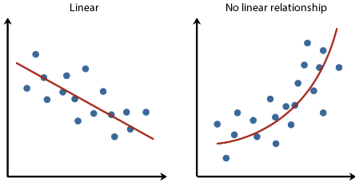
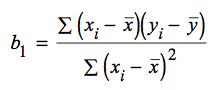
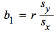
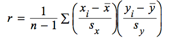

# Scatterplots

 
 
 

# Interpreting Scatterplots

  -  Direction: Positive or Negative

 

  -  Form: Linear or Non-linear

 

  -  Strength: Weak, Moderate or Strong

 

  -  Example

 

  -  Positive, linear, strong relationship between horsepower and
     weight in tons.

# Correlation Coefficient (r)

 

# Least Squares Regression Line

 

  -  A regression line is a line that describes **how y changes as x
     changes**

  -  Can be used to **predict** the value of y for a given value of x

  -  Called the **Least Squares** regression line because it make the
     **smallest sum of squares**

  -  LSRL will always run through the point (mean of x, mean of y)

  -  Formulas (hat =
 predicted)

 
 
 
 
 
 
 
 
 

  -  **Remember to note what x and y are**

  -  Calculation
    
      -  Input data

 

  -  STAT➡️CALC➡️ 4:LinReg(ax+b)

  -  LinReg(ax+b) L1, L2

 

  -  Catalog (2ND + 0) ➡️ DiagnosticOn

 

  -  Do LinReg again to display r

 

# Coefficient of Determination

  -  R^2=r^2

  -  Coefficient of Determination = (Correlation Coefficient)^2

  -  **Percent** of the **change in y** that is explained by the change
     by the **change in x** / **least squares regression line**

  -  From the previous example, 41.9% of the change in y can be
     explained by the change in x

# Residuals (≈error)

  -  Residuals = observed/actual y - predicted y

  -  Resid = y - y hat

  -  Resid < 0: Overpredicted

  -  Resid \> 0:
 Underpredicted

 

  -  Residual Plot

  -  no pattern = good fit

<!-- end list -->

  -  Example

| X         | 3     | 1      | 1.5  | 6      | 2      |
| --------- | ----- | ------ | ---- | ------ | ------ |
| Y         | 10    | 3      | 14   | 15     | 6      |
| Y hat     | 10.1  | 6.76   | 7.60 | 15.11  | 8.43   |
| Residuals | \-0.1 | \-3.76 | 6.4  | \-0.11 | \-2.43 |

  -  Calculator
    
      -  Type the regression equation in L3 (y hat)

 

  -  L4 = L2 - L3

 

  -  Graph L1, L4 (Residuals)

 

# Examples

  -  At the summer school, one of Sarah's teachers told her that you
     can determine air temperature from the number of cricket chirps

<!-- end list -->

1.   What is the explanatory variable, and what it the response
     variable
    
      -  Explanatory/independent variable: cricket chirps
    
      -  Response/dependent variable: air temperature

2.   To determine a formula, Sarah collected data on temperature and
     number of chirps per minute on 14 occasions. She entered the data
     into her calculator and did 2-Var Stats. Here are some results.
     Use this information to find the equation of the least-squares
     regression line

| Xbar | 165.8 |
| ---- | ----- |
| Sx   | 32.0  |
| Ybar | 76.83 |
| Sy   | 9.23  |
| r    | 0.361 |

  -  b= r \* Sy / Sx = 0.104

  -  Ybar = a + b\*Xbar

  -  a = Ybar - b\*Xbar = 59.57

  -  Yhat = 59.57 + 0.14 \* x

  -  Where y = air temperature, and x = cricket chirps

<!-- end list -->

1.   One of Sarah's data points was recorded on a particularly hot day
     (95F). She counted 2432 cricket chirps in one minute. What is the
     residual for this data point?
    
      -  Residual = Y - Yhat = 95 - (59.57 + 0.104 \* 2432) = -217.498