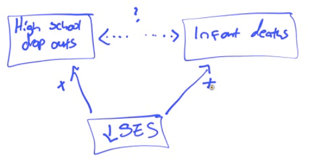

# Outliers and Influential Points

  -  An **outlier** is an observation that lies outside the overall
     pattern
    
      -  Outliers in the Y direction will lead to large residuals

  -  **Influential observations** are points that would greatly change
     the result if removed

  -  Points with high **leverage** have values far from the mean (of X
     or Y)

# Transformations to Achieve Linearity 

 
 
 

  -  Example

 

# Confounding

  -  Correlation does not prove causation

  -  A **Lurking Variables** is one that is not the explanatory (x) or
     response (y) variable in the study, but can influence how we
     interpret the relationship between them

  -  What looks like an association between x and y but is a **Common
     Response**

 

  -  Confounding
    
      -  The response is at least partially due to a third
 factor

 

  -  Comparison

 

  -  Example
    
      -  There is a positive association between the number of drowning
         and hot dog sales. Is the association between two variables
         most likely due to causation, cofounding, or common response?
         Justify your answer.
        
          -  Answer: Common Response

 

  -  According to the 19990 census, those states with an above-average
     number X of people who fail to complete high school tend to have
     an above average number Y of infant deaths. In other words, there
     is a positive association between X and Y. The most plausible
     explanation for this is?
    
      -  Answer: Common
 Response

 

  -  A drug company is testing a new cream to relieve skin rashes. They
     try it on 20 people and a placebo on 20 people and find that it
     works better. Later someone realizes that the new cream was tested
     on mostly all men and the placebo was tested on mostly all women.
     Is it possible the difference seen could have been due to
     confounding? What about common
 response?

 