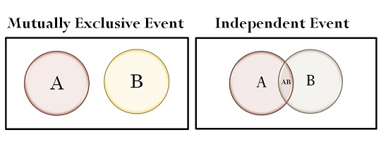

# Question 10

 

# Question 15

 

# Question 16

 ![Jason wants to determine how age and gender are rel\&d to political
 party preference in his town. Voter regis- tration lists are
 stratified by gender and age-group. Jason selects a simple random
 sample of 50 men from the 20 to 29 age-group and records their age,
 and pany registration (Democratic, Republican, neittrr). He also
 selects an simple random sample of women fmm the 40 to 49 age-group
 and the sanE Of the following, wtüch is the most important observation
 about Jason' s plan? (A) plan is well conceived and should serve the
 intended purpose. (B) His samples are too small. (C) He should have
 used equal sample sizes. should have randomly selected the two age
 groups instead of choosing them nonrandomly. ) will be unable to tell
 wlwttrr a difference in party affiliation is related to differences in
 age to the difference in gender. VO..QvvU-LD ](./media/image317.png)

# Question 17

  -  Residuals = observed/actual y - predicted y

  -  See Chi-square test statistic formula

# Question 18

 

# Question 19

 
 
 
 
 

# Question 23

 ![Events are mutually exclusive if the occurrence of one event
 excludes the occurrence of the other(s). Mutually exclusive events
 cannot happen at the same time. For example: when tossing a coin, the
 result can either be heads or tails but cannot be both. mutually
 exclusive A, B P(A) 1 - P(B) Events are independent if the occurrence
 of one event does not influence (and is not influenced by) the
 occurrence of the other(s). For example: when tossing two coins, the
 result of one flip does not affect the result of the other. U B) =
 P(A) + P(B) - independent A, B This of course means mutually exclusive
 events are not independent, and independent events cannot be mutually
 exclusive. (Events of measure zero excepted.) ](./media/image322.png)
 
 

# Question 24

 ![Important. Pr (observation I hypothesis) Pr (hypothesis I
 observation) The probability of observing a result given that some
 hypothesis is true IS not equivalent to the probability that a
 hypothesis is true given that some result has been observed. Using the
 p-value as a "score" is committing an egregious logical error: the
 transposed conditional fallacy. More likely observation Very un-likely
 observations p-val ue Very un-likely observations Observed data point
 Setof possible results A "-value (shaded green area) is the
 probability of an observed (or more extreme) result assuming that the
 null hypothesis is true. ](./media/image324.png)

# Question 34

 

# Question 35

 

# Question 37

 

# Question 40

 ![A student working on a history IYOject decided to find a 95 percent
 confidence interval for difference in mean age at the of to omce
 American Presidents versus former British Plin-z Ministers. TIE
 student found the ages at dle tillE of election to office fcx the
 members of tx\*h groups, which included all of the Anrrican Presidents
 and all of the British Ministers, arxi used a calculator to fuxi tbe
 95 percent confi\&nce interval based on the t-distribution. This
 procedure is not appropriate in this context becåuse the sample sizes
 for the two groups are not equal (B) entic was nrasured in both cases,
 so actual difference in means can be computed and a cohhdence interval
 should not be used fo (C) elections to office take place at different
 intervals in two countries, so the distribution of ages cann« be same
 (D) ages at the time of election to omce are likely to be skewed
 rather than bell-shapd, so the assumptions for using this confidence
 interval formula are not valid (E) ages at the time of election to
 office are to have a few large outliers, so the assumptions for using
 this confidence interval formula are not valid ](./media/image328.png)