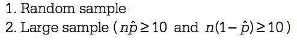

# Question 1 (a)

  -  Estimation for median

 ![The median is the value with half of the P-T ratios at or below it
 and half of the values at or above it. to find the position of the
 median in the ordered list of For n observations in a group, use 2
 observations. For states west of the Mississippi (n = 24) the median
 falls between the 12th and 13th value in the ordered list, and both
 the 12th and 13th values fall in the interval 15—16. For states east
 of the Mississippi (n = 26) the median falls between the 13th and 14th
 value in the ordered list, and both of these values also fall in the
 interval 15—16. From the histogram, cumulative frequencies for the two
 groups are shown in the table below. Interval 12-13 13-14 14-15 15-16
 West 1 1+4=5 1 4 + 6 = 11 1 6 = 14 East 2+4=6 10 2 11 = 21 Thus, the
 median P-T ratio for both groups is at least 15 students per teacher
 and at most 16 students per teacher. ](./media/image343.png)

# Question 1 (c)

 

  -  Mean, Median, and Skew

 

# Question 1 (a)

 

# Question 3 (a)

  -  Pay attention to the notation

 

# Question 3 (b)

 

  -  Binomial distribution

 
 
 
 
 

# Question 3 (c)

 ![Let X denote the number of upgrades Sam will receive in 104 flights.
 The random variable X follows a binomial distribution with n = 104
 independent trials and p = 0.1. Thus, p (x \> 20) = I-P(X 20)
 -1-0.9986 0.0014. Because this probability is so small, it is very
 unlikely that Sam would receive more than 20 upgrades in 104 flights
 if the airline's claim is correct. This would be expected to happen
 less than 1 percent of the time, indicating that one should be
 surprised if Sam receives more than 20 upgrades during the next year.
 ](./media/image349.png)

# Question 4 (b)

  -  Conditions for a chi-square inference procedure

 

# Question 4 (d)

 

  -  Type I error and Type II error

 

# Question 5 (a)

  -  Conditions for one-proportion Z interval

 

  -  Calculation for one-proportion Z
 interval

 
 
 

  -  Interpretation for one-proportion Z interval

 

# Question 5 (b)

 

  -  

  -  Calculating Required Sample Size to Estimate Population Mean

 
 
 

# Question 6 (b)

 
 
 

# Question 6 (c)

  -  Describe distribution: Mean & Standard deviation

 

# Question 6 (d)

 

  -  Confidence interval

 

# Question 6 (e)

 ![85 80 75 70 65 60 55 50 85 v? 80 65 60 55 50 6 7 8 9 10 11 12 13
 Width of Buffer Strip (feet) 6 7 8 9 10 11 12 13 Width of Buffer Strip
 (feet) If we think that the sample mean nitrogen removed at a
 particular buffer width might reasonably be a sample regression line
 will result from connecting any point in the interval above 6 to any
 point in the interval above 13. With this in mind, the dashed lines in
 the plots above represent extreme cases for possible sample reqression
 lines. From these plots, we can see that there is a wider range of
 possible slopes in the second plot (on the right) than in the first
 plot (on the left). Because of this, in the sampling distribution of
 b, the estimator for the slope of the regression line, will be smaller
 for the first studv Dlan (with four observations at 6 feet and four
 observations at 13 feet) than it would be for the second study plan
 (with four observations at 8 feet and four observations at 10 feet).
 Therefore, the first study plan (on the left) would provide a better
 estimator of the slope of the regression line than the second study
 plan (on the right). ](./media/image366.png)

# Question 6 (f)

 