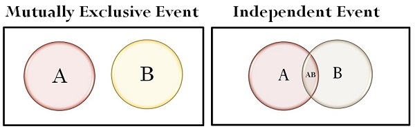
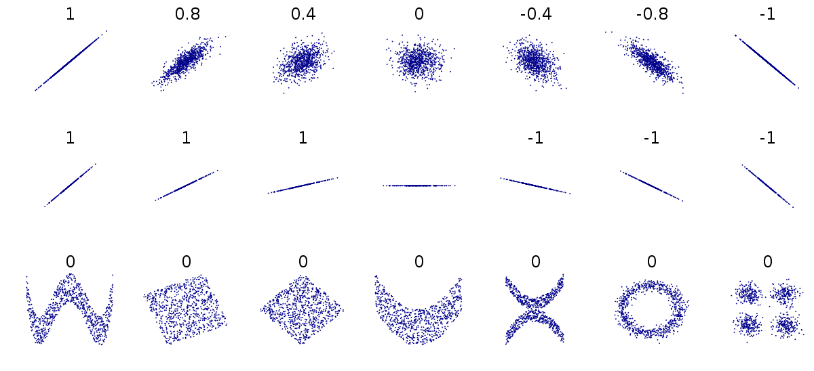

# Question 1 (a)

 ![No, it is not reasonable to believe that the distribution of 40-yard
 running times is approximately normal, because the minimum time is
 only 1.33 standard deviations below the mean 4.4—4.6 —1.33 . In a
 normal distribution, approximately of the z-scores are below 0.15
 —1.33. However there are no running times less than 4.4 seconds,
 which indicates that there are no running times with a z-score less
 than —1.33. Therefore, the distribution of 40-yard running times is
 not approximately normal. ](./media/image329.png)

# Question 1 (b)

  -  How to interpret the z-score

 

# Question 2 (b)

  -  Independence vs. Dependence
    
      -  A conditional probability is the probability of some event
         occurring, given that some other event has already occurred.
         The conditional probability of event X occurring, given that
         some other event Y has already occurred, is written as P(X|Y).
    
      -  For example, P(M|N) would be the probability of the occurrence
         of event M given that event N has already occurred. It would
         be read as “the probability of M, given N.”
    
      -  As stated earlier, two events are considered independent if
         the occurrence of one of the events does not change the
         probability of the other event from what it would have been
         had the first event not occurred. Thus, two events, X and Y,
         are independent if P(X|Y) = P(X) or P(Y|X) = P(Y)
    
      -  Actually, these two conditional relationships are related. If
         one is true, the other must be true. If one is false, the
         other must be false.
    
      -  If **P(X|Y) = P(X)**, then **P(Y|X) = P(Y)**, and the events
         are **independent**.
    
      -  If **P(X|Y) ≠ P(X),** then **P(Y|X) ≠ P(Y)**, and the events
         are **dependent**.

 

# Question 2 (c)

 ![The marginal proportions of voters registered for each of the three
 political parties (without regard to gender) are given below. 88
 =0.176 Party W: 500 244 = 0.488 Party X: 500 168 = 0.336 Party Y: 500
 Because party registration is indeoendent of aender in Lawrence
 Township, the proportions of males and females registered for each
 party must be identical to each other and also identical to the
 marginal proportion of voters registered for that party. Using the
 order Party W, Party X, and Party Y, the graph for Lawrence Township
 is displayed below. ](./media/image332.png)
 
 

# Question 3 (a)

  -  Process for randomly selecting 2 numbers from 1 to 9

 ![Step 1: Generate a random integer between 1 and 9, inclusive, using
 a calculator, a computer program, or a table of random digits. Select
 all four apartments on the floor corresponding to the selected
 integer. Step 2: Generate another random integer between 1 and 9,
 inclusive. If the generated integer is the same as the integer
 generated in step 1 , continue generatinq random inteqers between 1
 and 9 until a different integer appears. Again select all four
 apartments on the floor corresponding to the second selected integer.
 ](./media/image334.png)

# Question 3 (b)

 ![Because the amount of wear on the carpets in apartments
 with-GhiIdK.en-GQ.uld-he-diffeI.ent.ft.Q111 the wear on the carpets in
 apartments without children, it would be advantageous to have
 apartments with children represented in the sample. The cluster
 sampling procedure in part (a) could produce a sample with no children
 in the selected apartments; for example, a cluster sample of the
 apartments on the third and sixth floors would consist entirely of
 apartments with no children. Stratified random sampling, where the two
 strata are apartments with children and apartments without children,
 guarantees a sample that includes apartments with and without
 children, which, in turn, would yield sample data that are
 representative of both tvpes of apartments. ](./media/image335.png)

# Question 4

  -  Degrees of freedom for two-sample t-test.

 

  -  Graphs of both distributions must be produced and described to
     check the normality condition.

 ![The second condition is that the two populations are approximately
 normally distributed or the sample sizes are sufficiently large.
 Because of the small sample sizes (10 in each treatment group), we
 need to check whether it is reasonable to assume that the samples came
 from populations that are normally distributed. The following dotplots
 reveal slight skewness and a possible outlier for group B, but it
 appears reasonable to proceed with the two-sample t-test. Group A
 Group B -5 5 10 15 20 25 30 Cholesterol Reduction (in mg/dL)
 ](./media/image337.png)

# Question 5 (c)

  -  Correlation
 coefficient

 

  -  Coefficient of determination

 

# Question 5 (d)

  -  Explaining relationship

 
 
 
 
 

# Question 6 (a)

  -  Checking condition for one-sample z-interval
    
      -  Random
    
      -  Normal: Large sample size

 