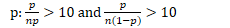

# Question 1 (a)

 

# Question 1 (b)

 ![The sewing machine that most affects the appropriateness of using a
 linear regression model is the one that costs about $2,200 and has a
 quality rating of about 65. Although the other four sewing machines
 costing more than $500 generally have higher quality ratings than
 those costing under $500, their prices and quality ratings follow a
 trend that suggests that quality ratings may not continue to increase
 with higher prices, but instead may approach a maximum possible
 quality rating. The $2,200 sewing machine is the most expensive of all
 but has a relatively low quality rating, which is consistent with a
 nonlinear model that approaches a maximum possible quality rating and
 then perhaps decreases. If a linear model were fit to all of the data,
 this one machine would substantially pull the regression line toward
 it, resulting in a poor overall fit of the line to the data.
 ](./media/image381.png)

# Question 3 (a)

 ![Household size tended to be larger in 1950 than in 2000. The
 histograms reveal a much larger proportion of small (1-, 2-, and
 a-person) households in 2000 than in 1950. Similarly, the histograms
 reveal a much smaller proportion of large (5-person and larger)
 households in 2000 than in 1950. Also, the median household sizes can
 be calculated to be 5 people per household in 1950 compared with 3 or
 4 people per household in 2000. The year 1950 displayed slightly in
 household sizes than the year 2000. Although the interquartile ranges
 for both years are the same (3 people), the standard deviation (1950:
 about 2.6 people; 2000: about 2.1 people) and the range (1950: 13
 people; 2000: 11 people) are larger for 1950 than for 2000. Both
 distributions of household size are skewed to the right. In both
 years, there are a few households with very large families, as large
 as 14 people in 1950 and 12 people in 2000. ](./media/image382.png)

  -  Summarizing Distribution (SOCS)
    
      -  Shape
        
          -  Skewed left/right
    
      -  Outlier
        
          -  Q1 - 1.5 \* IQR
        
          -  Q3 + 1.5 \* IQR
    
      -  Center
        
          -  Mean or Median
    
      -  Spread
        
          -  SD or IQR

# Question 3 (b)

 ![The conditions for applying a two-sample t-procedure are: 1. The
 data come from independent random samples or from random assignment to
 two groups; 2. The populations are normallv distributed, or both
 sample sizes are large; 3. The population sizes are at least 10 (or
 20) times the sample sizes. The first condition is satisfied because
 independent random samples were selected for the years 1950 and 2000.
 The second condition is satisfied because the sample sizes (500 in
 each group) are quite large, despite the right skewness of the
 distributions of household sizes in the sample data. The third
 condition is satisfied because the number of households in the large
 metropolitan area in both 1950 and 2000 would easily exceed 10 X 500 =
 5, 000. ](./media/image383.png)

  -  Conditions for Sampling Distribution (RIN)
    
      -  Random
        
          -  How the sample is selected
    
      -  Independent
        
          -  N≥10n
        
          -  N: population size
        
          -  n: sample size
    
      -  Normal
        
          -  For
                 means
            
              -  
            
              -  If the population is normally distributed, n can < 30
        
          -  For proportions:
            
              -  

# Question 4

  -  Hypothesis Test
    
      -  Using a Statistic to test a claim about a Parameter
    
      -  Steps (**W**hy **C**an't **C**at **P**lay **I**nstruments)
        
          -  **W**rite the hypothesis
            
              -  Null hypothesis (H0): Parameter = \_\_\_\_
            
              -  Alternative hypothesis (H1/Ha):
                 Parameter \> or < or ≠ \_\_\_\_\_\_
        
          -  **C**keck conditions (RIN)
            
              -  Random Sample
            
              -  Independent: N \>10n
            
              -  Normal:
                
                  -  μ:
                     n≥30
                
                  -  
        
          -  **C**alculate the test statistic

 

  -  Mean

 

  -  Proportion

 

  -  Look up the **P**-value (from Z table)
    
      -  Probability that the null hypothesis (H0) is true,
         given the sample data you collected

 

  -  **I**nterpret

| p < α  | Reject the null hypothesis         | do have evidence to support the claim     |
| ------ | ---------------------------------- | ----------------------------------------- |
| p \> α | Fail to reject the null hypothesis | do not have evidence to support the claim |

  -  Step 1

 

  -  Step 2

 ![Identifies a correct test procedure (by name or by formula) and
 checks appropriate conditions. The appropriate procedure is a
 two-sample z-test for comparing proportions. Because these are sample
 surveys, the first condition is that the data were gathered from inde
 endent random sam le from the two populations. This condition is met
 because we are told that the subjects were randomly selected in the
 two different years. Although we are not told whether the samples were
 selected independently, this is a reasonable assumption given that
 they are samples of different sizes selected in different years. The
 second condition is that relative to the proportions involved. This
 condition is satisfied because all sample counts (622 "yes" in 2007;
 1,020 — 622 = 398 "no" in 2007; 676 "yes" in 2008; 1,009 — 676 = 333
 "no" in 2008) are all at least 10 (or, are all at least 5). An
 additional condition may be checked: than 200 million adults in the
 United States) are much larger than 10 (or, 20) times the sample
 sizes. ](./media/image386.png)

  -  Step 3

 
 
 

  -  Step 4

 

# Question 5 (a)

 

  -  Type I: falsely think alternative hypothesis is true (1 false), DO
     reject the null hypothesis (1 word)

  -  Type II: falsely think alternative hypothesis is false (2 falses),
     DO NOT reject the null hypothesis (2 word)

 
 
 

# Question 5 (b)

 
 
 ![Essentially correct (E) if the response correctly completes the
 following three components: 1. 2. 3. Links the p-value to the
 conclusion by stating that the p-value is greater than a = 0.05 , OR
 by stating that OR by correctly interpreting the p-value. Uses context
 by referring to the(EEEof adult residents who are able to pass the
 test, OR by referring to the fundin of the program. Makes a correct
 onclusio that describes the lack of evidence for the alternative
 hypothesis (Ha : p < 0.35). ](./media/image393.png)

# Question 5 (c)

 

# Question 6 (a)

 

# Question 6 (c)

 

# Question 6 (d)

 ![The comparative dotplots from Rania's data reveal that the
 distribution of the number of soft drinks for females appears to be
 quite different from that of males. In particular, the centers of the
 distributions appear to be significantly different. Additionally, the
 variability of values around the center within gender in each of
 Rania's dotplots appears to be considerably less than the variability
 displayed in the dotplot of Peter's data. Rania's estimator takes
 advantage of the decreased variability within gender because her data
 were obtained by sampling the two genders separately. Peter's
 estimator has more variability because his data were obtained from a
 simple random sample of all the high school students.
 ](./media/image397.png)