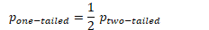
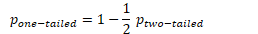

# Question 11

  -  Completely Randomized Design

 

  -  Randomized Block Design

 

# Question 12

 
 
 

  -  How to minimize response bias
    
      -  Use Clear Language
    
      -  Choose Words and Phrases With Care
    
      -  Know How To Frame Your Questions
    
      -  Provide Just the Right Amount of Options
    
      -  Plan a Neutral Survey Structure
    
      -  Keep Styling At a Minimum
    
      -  Be Honest

# Question 13

 ![13. For a sample of 42 rabbits, the mean weight is 5 pounds and the
 standard deviation of weights is 3 pounds. Which of the following is
 most likely true about the weights for the rabbits in this sample? (A)
 The distribution of weights is approximately normal because the sample
 size is 42, and therefore the central limit theorem applies. (B) The
 distribution of wei ts is ximatel normal because the standard
 deviation is less than the mean. (C) The distribution of weights is
 skewed to the right because the least possible weight is within 2
 standard deviations of the mean. (D) The distribution of weights is
 skewed to the left because the least possible weight is within 2
 standard deviations of the mean. (E) The distribution of weights has a
 median that is greater than the mean. ](./media/image372.png)

# Question 18

  -  Population size should be at least 10 times the sample size so
     that the degree of dependence among observations is negligible.

# Question 22

  -  Confidence Interval Interpretation

 
 
 ![Confidence intervals provide more information than point estimates.
 Confidence intervals for means are intervals constructed using a
 procedure (presented in the next section) that will contain the
 population mean a specified proportion of the time, typically either
 95% or 99% of the time. These intervals are referred to as 95% and 99%
 confidence intervals respectively. An example of a 95% confidence
 interval is shown below: 72.85 < p < 107.15 There is good reason to
 believe that the population mean lies between these two bounds of
 72.85 and 107.15 since 95% of the time confidence intervals contain
 the true mean. If repeated samples were taken and the 95% confidence
 interval computed for each sample, 95% of the intervals would contain
 the population mean. Naturally, 5% of the intervals would not contain
 the population mean. ](./media/image374.png)
 
 

# Question 28

 
 
 

  -  

  -  

# Question 32

  -  SE Coef = Standard Deviation of **Statistic** (not population)