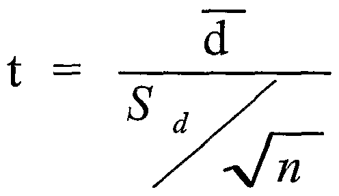

# Question 2 (a)

 

# Question 2 (c)

 

# Question 3 (c)

 

# Question 4 (a)

 

# Question 5

 ![Step 1 : States a correct pair of hypotheses. Let represent the
 population mean difference in purchase price (woman man) for
 identically equipped cars of the same model, sold to both men and
 women by the same dealer, in the county. The hypotheses to be tested
 are Ho : "diff = O versus Ha : "diff \> Step 2: Identifies a correct
 test procedure (by name or by formula) and checks appropriate
 conditions. The appropriate procedure is a paired t-test. The
 conditions for the paired t-test are: 1. The sample is randomly
 selected from the population. 2. The population of price differences
 (woman man) is pprmally distributed, or the sample size is jårge, The
 first condition is met because the car models and the individuals were
 randomly selected. The sample size ( n = 8 ) is not large, so we need
 to investigate whether it is reasonable to assume that the population
 of price differences is normally distributed. The dotplot of sample
 price differences reveals a fairly symmetric distribution, so we will
 consider the second condition to be met. Step 3: Correct mechanics,
 including the value of the test statistic andp-value (or rejection
 region). The test statistic is 530.71 The p-value, based on a
 t-distribution nhth — 1 = 7 degrees of freedom, is 0.008. Step 4:
 States a correct conclusion in the context of the study, using the
 result of the statistical test. Because the p-value is very small (for
 instance, smaller than a = 0.05 ), we reject the null hypothesis. The
 data provide convincing evidence that, on average, women pay more than
 men in the county for the same car model. ](./media/image417.png)

  -  Assumption in 2 sample independence T-test
    
      -  **Normality**: Assumes that the population distributions are
         normal. The t-test is quite robust over moderate violations of
         this assumption. It is especially robust if a two tailed test
         is used and if the sample sizes are not especially small.
         Check for normality by creating a histogram.
    
      -  **Independent Observations**: The observations within each
         treatment condition must be independent.
    
      -  **Equal Variances**: Assume that the population distributions
         have the same variance. This assumption is quite important (If
         it is violated, it makes the test’s averaging of the 2
         variances meaningless).
    
      -  If it is violated, then use a modification of the t-test
         procedures as needed.

  -  Paired Sample T test
    
      -  The matched-pair t-test (or paired t-test or paired samples
         t-test or dependent t-test) is used when the data from the two
         groups can be **presented in pairs**, For example where the
         same people are being measured in **before-and-after**
         comparison or when the group is given **two different tests at
         different times** (e.g. pleasantness of two different types of
         chocolate).

  -  Assumptions in paired sample t-test
    
      -  The first assumption in the paired sample t-test is that only
         the **matched pair** can be used to perform the paired sample
         t-test.
    
      -  In the paired sample t-test, **normal distributions** are
         assumed.
    
      -  Variance in paired sample t-test: in a paired sample t- test,
         it is assumed that the **variance** of two sample is **same**.
    
      -  The data is measurement data-interval/ratio
    
      -  **Independence** of observation in paired sample t-test: in a
         paired sample t-test, observations must be independent of each
         other.

  -  Paired t-test vs two-sample t-test

 
 
 

  -  Paired t-
 test

 

# Question 6 (b)

 

# Question 6 (c)

 

# Question 6 (d)

 