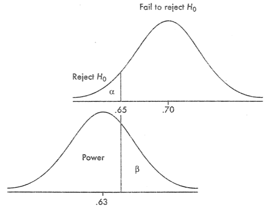

# Question 16

  -  Notice the condition

 ![Test For Population mean (V) Population mean (V) Population
 proportion (p) Difference of two means (VI — "2) Difference of two
 means (VI — "2) Mean difference (paired data) Difference of two
 proportions Null Hypothesis P P Test Statistic (f—go) po (I—po ) n 2
 01 02 2 2 (DI -D2 )-O p(l—p) Distribution z z z tdistribution with the
 smaller of n—l and z Use When Normal distribution or n \> 30; o known
 n < 30, and/or o unknown nD, 2 10 Both normal distributions, or 171,
 30; q, known 171, < 30; and/or q, g unknown n < 30 pairs of data
 and/or o d unknown nD, 10 for each group ](./media/image268.png)

# Question 18

  -  P-value for two-sided t-test = P-value for one-sided t-test \* 2

 

# Question 21

 ![A good sample is representative. This means that each sample point
 represents the attributes of a known number of population elements.
 Bias often occurs when the survey sample does not accurately represent
 the population. The bias that results from an unrepresentative sample
 is called selection bias. Some common examples of selection bias are
 described below. • Undercoverage. Undercoverage occurs when some
 members of the population are inadequately represented in the sample.
 A classic example of undercoverage is the Literary Digest voter
 survey, which predicted that Alfred Landon would beat Franklin
 Roosevelt in the 1936 presidential election. The survey sample
 suffered from undercoverage of low-income voters, who tended to be
 Democrats. How did this happen? The survey relied on a convenience
 sample, drawn from telephone directories and car registration lists.
 In 1936, people who owned cars and telephones tended to be more
 affluent. Undercoverage is often a problem with convenience samples. •
 Nonresponse bias. Sometimes, individuals chosen for the sample are
 unwilling or unable to participate in the survey. Nonresponse bias is
 the bias that results when respondents differ in meaningful ways from
 nonrespondents. The Literary Digest survey illustrates this problem.
 Respondents tended to be Landon supporters; and nonrespondents,
 Roosevelt supporters. Since only 25% of the sampled voters actually
 completed the mail-in survey, survey results overestimated voter
 support for Alfred Landon. The Literary Digest experience illustrates
 a common problem with mail surveys. Response rate is often low, making
 mail surveys vulnerable to nonresponse bias. • Voluntary response
 bias. Voluntary response bias occurs when sample members are self-
 selected volunteers, as in voluntary samples. An example would be
 call-in radio shows that solicit audience participation in surveys on
 controversial topics (abortion, affirmative action, gun control,
 etc.). The resulting sample tends to overrepresent individuals who
 have strong oplruons. ](./media/image407.png)
 
 ![Response bias refers to the bias that results from problems in the
 measurement process. Some examples of response bias are given below.
 Leading questions. The wording of the question may be loaded in some
 way to unduly favor one response over another. For example, a
 satisfaction survey may ask the respondent to indicate where she is
 satisfied, dissatisfied, or very dissatified. By giving the respondent
 one response option to express satisfaction and two response options
 to express dissatisfaction, this survey question is biased toward
 getting a dissatisfied response. Social desirability. Most people like
 to present themselves in a favorable light, so they will be reluctant
 to admit to unsavory attitudes or illegal activities in a survey,
 particularly if survey results are not confidential. Instead, their
 responses may be biased toward what they believe is socially
 desirable. ](./media/image408.png)

# Question 25

 

# Question 31

 
 
 

# Question 32

  -  H0: There is no association between A and B / Variables are
     independent

  -  H1: There is an association between A and B / Variables are
     dependent

  -  P \> α
    
      -  We fail to reject the null hypothesis and do not have evidence
         to support the claim that there is an association between A
         and B

  -  P < α
    
      -  We reject the null hypothesis and do have evidence to support
         the claim that there is an association between A and B

# Question 37

 ![The probability of making a type I error is called the significance
 level and is denoted by the Greek letter, (alpha). The significance
 level should be chosen before data is collected. The probability of
 making a type Il error is denoted by the Greek letter, ß (beta). The
 quantity is called the power of the test and represents the
 probability of rejecting the null hypothesis when it is actually
 false, in other words, making the correct decision by rejecting the
 null hypothesis. The power of the test is the probability on not
 making a type Il error. Any value of may be chosen, although
 statisticians usually choose small values. Common values for include =
 0.01 — willingness to make a type I error 1 % of the time = 0.05 —
 willingness to make a type I error 5% of the time = 0.10 — willingness
 to make a type I error 10% of the time The person performing the test
 chooses the significance level a. How much power you get from a test
 depends on the significance level. The value of is very difficult or
 impossible to calculate. The calculation of the value of ß is beyond
 the scope of the AP Statistics Test, but you need to know what it
 means. The power of a test (the probability of rejecting the null
 hypothesis when it is false) increases as the significance level also
 increases. A test performed at = 0.10 has more power than a test
 performed at a = 0.05. Increasing the signifi- cance level, a, to
 increase the power can be counterproductive, since it increases the
 risk of making a type I error. Decreasing also decreases the
 probability of rejecting the null hypothesis. This reduces the power
 of the test, which increases the probability of making a type Il
 error, ß. Choosing a properly requires finding a balance appropriate
 for the situation. Decision Fail to reject Ho Reject Ho Ho Is Actually
 True Correct decision Type I error, a Ho Is Actually False Type Il
 error, Correct decision, 1 — ](./media/image410.png)
 
 
 
 ![The following points should be emphasized: Power gives the
 probability of avoiding a Type Il error. • Power has a different value
 for different possible correct values of the population parameter;
 thus it is actually a function where the independent variable ranges
 over specific alternative hypotheses. Choosing a smaller a (that is, a
 tougher standard to reject Ho) results in a higher risk of Type Il
 error and a lower power—observe in the above graphs how mak- ing a
 smaller (in this case moving the critical cutoff value to the left)
 makes the power less and ß more\! The greater the difference between
 the null hypothesis A) and the true value p, the smaller the risk of a
 Type Il error and the greater the power—observe in the above picture
 how moving the lower graph to the left makes the power greater and ß
 less. (The difference between PO and p is sometimes called the
 effect—thus the greater the effect, the greater is the power to pick
 it up.) A larger sample size n will reduce the standard deviations,
 making both graphs narrower resulting in smaller smaller and larger
 power\! ](./media/image412.png)