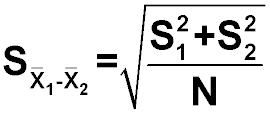

# Question 3

  -  Z-score will not be changed after conversion

 

# Question 13

  -  Standard deviation of the sample distribution

 

  -  Standard deviation of the sample proportion

 

# Question 20

 

# Question 20

 
 
 
 
 
 
 

# Question 23

 

# Question 24

  -  Standard error of the difference

 

# Question 28

 
 
 

# Question 32

  -  

# Question 37

 