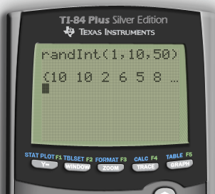
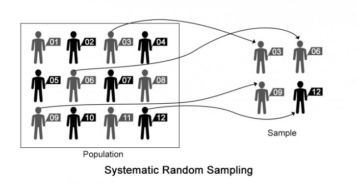

# Census vs. Survey

  -  A **parameter** is a numerical description of a **population**
     characteristic

  -  A **statistic** is a numerical description of a **sample**
     characteristic

 

| Census | Population | Parameter |
| ------ | ---------- | --------- |
| Survey | Sample     | Statistic |

# Characteristics of a Well-Designed and Well-Conducted Survey

  -  Representative sample
    
      -  Must represent the population that you want to **draw
         inference** about

  -  Random sample

  -  Does not introduce bias

# Bias

  -  What is
 it?

 

  -  How might it occur?
    
      -  Wording of the question
    
      -  Sample technique
        
          -  Under-coverage: miss a certain group of people
        
          -  Non-response: someone in your sample choose not to respond

# Random Sampling

  -  Simple Random Sample (SRS)
    
      -  Random digit table
    
      -  Calculator
        
          -  MATH ➡️ PRB ➡️ randInt(lower, upper, number of
             numbers)

 
 
  

  -  Stratified Random Sampling

  -  Cluster Sample

 

  -  Systematic Random Sample

  -  Comparison

 

  -  Example
    
    1.   If you wanted to select a sample of school children and you
         did this by selecting an SRS of **classrooms** this would be
         an example of what type of sampling?
        
          -  Cluster
    
    2.   If you wanted to select a sample of school children and you
         did this by randomly selecting 5 children from each **grade**
         this would be an example of what type of sampling?
        
          -  Stratified

# Non-Random Sampling

  -  Convenience Sample
    
      -  Selecting those that are easy of convenient

  -  Voluntary Response Sample