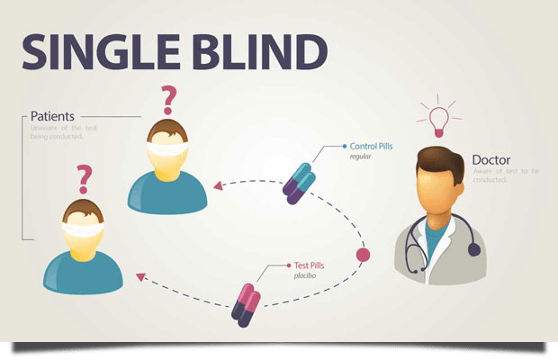
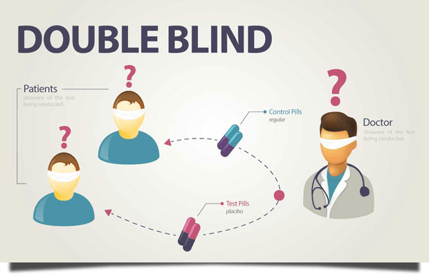
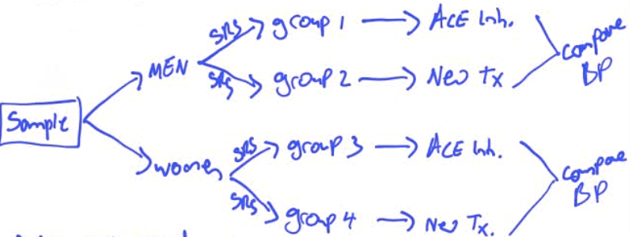

# Experiments vs. Observational Studies

  -  Ovservational Study
    
      -  Observe individuals
    
      -  Measure variables
    
      -  **Do NOT influence the response**
        
          -  Has global warming effected penguin mating behavior

  -  Experiment
    
      -  **Do something** to your individuals
    
      -  Observe/measure response
        
          -  Does housing penguins in warmer environments effect mating
             behavior?

# Placebo Effect

  -  The phenomenon where **patients get better** because they
     **expect** the treatment to work.

  -  Many statistical studies involve testing the effectiveness of
     drugs. A placebo looks identical to the actual drug but contains
     no active ingredient and so has no real physical effect.

  -  Humans want to be helped by the medication that is administered to
     them. If they think they are receiving a drug to help their
     condition, they tend to improve even if it turns out that the drug
     is a placebo.

# Characteristics of a Well-Designed and Well-Conducted Experiment

  -  Control
    
      -  The effect of **lurking variables**, most often by comparing
         treatments
    
      -  Example: a "Control group" in a drug study to eliminate the
         "confounding effects" of environment or the placebo effect

  -  Replicate
    
      -  Each treatment on many units to **reduce chance variation**
    
      -  Example: do the mouse study many times

  -  Randomize
    
      -  Use probability (chance) to assign experimental units to
         treatments
    
      -  May be the most **important**\!\!
    
      -  Because it allows us to say the different treatment groups
         **start out similar**

# Completely Randomized Design

  -  If all the experimental units (subjects of the experiment) are
     **randomly** assigned to either the **control group** or to the
     **treatment group**, then the experiment has a completely
     randomized design.

 

  -  Randomize by assigning each subject a number and then generating
     it to choose treatment groups

# Block Randomization

  -  Placing subjects into **groups of similar individuals**. The
     random assignments into treatment groups is carried out separately
     within each block (think stratified random sample)

 

# Matched Pairs Design

  -  Subjects are **matched into pairs** and get **different
     treatments**

  -  Matched pairs are **more similar** than random **unmatched
     subjects**

  -  Randomizing the **rest of the experiment** is still
     important\!\!\!

 

# Experimental Set Up

  -  Treatment Imposed = Independent Variable = Factors

  -  Experimental Units = Subjects

  -  Response Variable Observed = Dependent Variable

 

# Double-Blind Experiment

 
 
 

  -  In a double-blind experiment, neither the subjects nor the
     researchers know to which group, treatment, or control, subjects
     have been assigned. If a researcher knows that a subject is in the
     control group, they do not expect a treatment effect, and their
     measurement of a response might be understated. If a researcher
     knows that a subject is in the treatment group, they might
     overstate a response simply because they expect it.

  -  An experiment might also be single-blind. In this case, only one
     of the participants, either the subjects or the researchers, knows
     to which group the subjects have been assigned.

  -  **Avoids unconscious bias**

# Generalizability of Results

  -  To determine if our data is "statically significant"
    
      -  i.e. is an observed effect so large that it would rarely occur
         by chance

  -  If we designed and conducted our experiment well, we can
     generalize these results to the population\!

# Practice Questions

  -  Control groups are used in experiments in order to
    
    1.   Control the effects of outside variables on the outcome
    
    2.   Control the subjects of a study to ensure that all participate
         equally
    
    3.   Guarantee that someone other than the investigators, who have
         a vested interest in the outcome, controls how the experiment
         is conducted
    
    4.   Achieve a proper and uniform level of randomization

 Answer: a

  -  Angiotensin-converting enzyme (ACE) inhibitors are used to treat
     high blood pressure. We want to conduct an experiment to see if a
     new blood pressure drug works even better than ACE inhibitors.
     Design a completely randomized experiment to test this.

 

  -  In conducting an experiment to see if a new blood pressure drug
     works even better than ACE inhibitors. We learn that men and women
     may react differently to common cardiovascular drug treatments.
     Design a randomized experiment to test this with your new
     information on gender.
    
      -  We will conduct a randomized blocked experiment, blocking on
         gender.

 

  -  The Community Intervention Trial for Smoking Cessation (COMMIT)
     asked whether a community-wide advertising campaign would reduce
     smoking. The researchers located 11 **pairs** of communities that
     were **similar** in location, size, economic status, and so on.
     One community in each pair participated in the advertising
     campaign and the other did not. This is
    
    1.   an observational study
    
    2.   a matched pairs experiment
    
    3.   a completely randomized experiment
    
    4.   a block design

 Answer: b

  -  A study of cell phones and the risk of brain cancer looked at a
     group of 469 people who have brain cancer. The investigators
     matched each cancer patient with a person of the same sex, age,
     and race who did not have brain cancer, then asked about the use
     of cell phones. This is
    
    1.   an observational study
    
    2.   an uncontrolled experiment
    
    3.   a randomized comparative experiment
    
    4.   a matched pairs experiment
    
    5.   a survey

 Answer: a

  -  A fitness instructor wants to test the effectiveness of a
     performance-enhancing herbal supplement. Design an experiment to
     test this supplement
    
      -  Double blind, (placebo controlled), matched pairs experiment:
    
      -  Match subjects based on performance in a fitness test and
         gender
    
      -  Randomize who in the pair gets the new supplement and who gets
         the old supplement / placebo.
    
      -  Give both in the same packaging, making sure the subject
         doesn't know the group and person measuring fitness doesn't
         know the group either.

  -  A researcher believes that students may do better on a test when
     taken in the same classroom where the material was learned. To
     test this theory she plans to present a lecture and then give
     students a multiple choice quiz on the material. She knows there
     is a lot of variability in the students' academic ability. Design
     a study to test her hypothesis.
    
      -  Block on academic
 ability

 