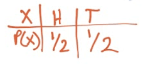
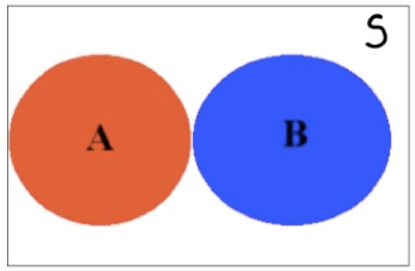
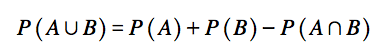
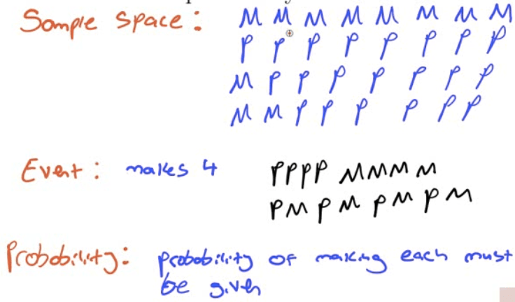
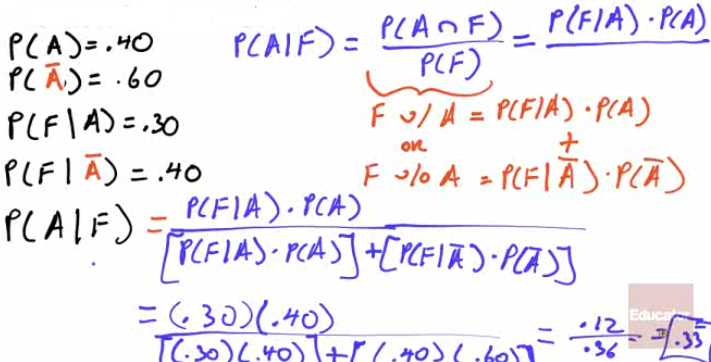

# Probability Model

  -  A mathematical description of a random phenomenon.

  -  The Probability Model consists of
    
      -  **Sample Space** (S) = the set of all possible outcomes
    
      -  **Event** within the sample space = an outcome or set of
         outcomes in S
    
      -  **Probabilities** associated with each
 event

 

# Disjoint Events (aka Mutually Exclusive)

  -  Disjoint / mutually exclusive
 example

 

  -  Not disjoint / not mutually exclusive example

 
 
 

# Independence vs. Dependence

  -  A conditional probability is the probability of some event
     occurring, given that some other event has already occurred. The
     conditional probability of event X occurring, given that some
     other event Y has already occurred, is written as P(X|Y).

  -  For example, P(M|N) would be the probability of the occurrence of
     event M given that event N has already occurred. It would be read
     as “the probability of M, given N.”

  -  As stated earlier, two events are considered independent if the
     occurrence of one of the events does not change the probability of
     the other event from what it would have been had the first event
     not occurred. Thus, two events, X and Y, are independent if P(X|Y)
     = P(X) or P(Y|X) = P(Y)

  -  Actually, these two conditional relationships are related. If one
     is true, the other must be true. If one is false, the other must
     be false.

  -  If **P(X|Y) = P(X)**, then **P(Y|X) = P(Y)**, and the events are
     **independent**.

  -  If **P(X|Y) ≠ P(X),** then **P(Y|X) ≠ P(Y)**, and the events are
     **dependent**.

# Probability Rules

  -  Notation

 

  -  Rules

 

 

# Overview

# Bayes Rule

 
 
 
 
 

# Simulations

  -  Imitating a real world process

  -  Follow a few steps
    
    1.   **Describe** the possible outcomes
    
    2.   **Determine** the **probability** of each outcome
    
    3.   **Link** each outcome to one or more **random numbers**
    
    4.   **Choose** a random number for each "trial"
    
    5.   Based on the random number, note the "simulated" outcome
    
    6.   Repeat step 4 and 5 for each "simulation"

# Practice Questions

  -  A basketball player shoots 8 free throws during a game. We are
     interested in the probability that she makes 4.
    
      -  Describe the probability model in this
 case

 

  -  Let A be the event that a victim of violent death was a woman and
     B the event that the death was a suicide. The proportion of
     suicides among violent deaths of woman is expressed in probability
     notation as
    
    1.   0.5
    
    2.   0.126
    
    3.   P(A and B)
    
    4.   P(A|B)
    
    5.   P(B|A)

 Answer: e

  -  Suppose that for a group of consumers, the probability of eating
     pretzels is 0.65 and that the probability of drinking Coke is
     0.75. The probability of eating pretzels and drinking Coke is
     0.45. Determine if those two events are independent.
    
      -  P(P)=0.65
    
      -  P(C)=0.75
    
      -  P(P and C)=0.45
    
      -  P(P and C)≠P(P)\*P(C)
    
      -  So P and C are not independent

  -  What is the probability that the students is either a female of at
     least 35 years old?

 

  -  Generally speaking, 1% of college football players use steroids,
     but your friend on the football team has tested positive for
     steroid use. The blood test the league uses correctly comes up
     positive for 95% of steroid users, but mistakenly comes up
     positive for 1% of non-users. Given that your friend tested
     positive, how likely is it that he has been using steroids?

 

  -  Of all the soda drinkers in a particular district, 40% prefer
     brand A and 60% prefer brand B. Of those drinkers who prefer brand
     A, 30% are females, and of those who prefer brand B, 40% are
     female. What is the probability that a randomly selected soda
     drinker prefers brand A, given that the person selected is a
     female

 