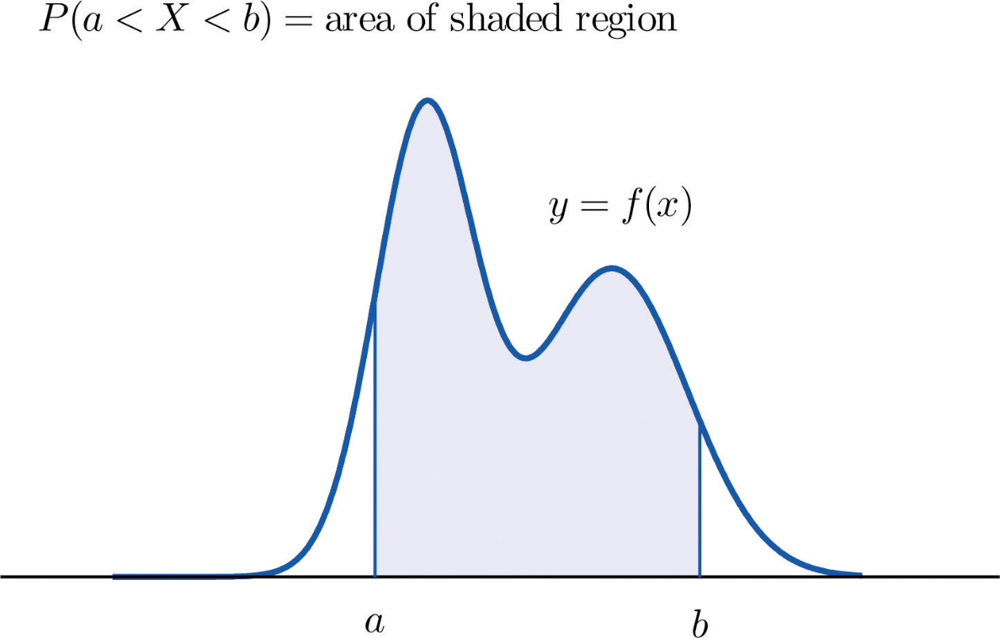
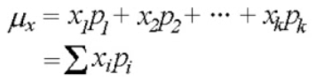
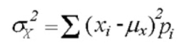
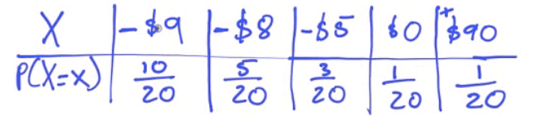
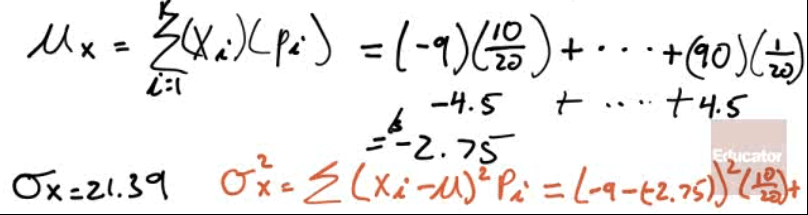
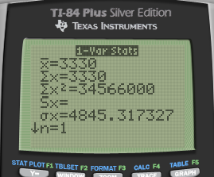

# Discrete vs. Continuous RVs (Random Variables)

  -  A discrete RV has a countable number of possible outcomes
    
      -  number of students present
    
      -  number of red marbles in a jar
    
      -  number of heads when flipping three coins
    
      -  students' grade level

  -  A continuous RV can take any values in an interval of numbers
    
      -  height of students in class
    
      -  weight of students in class
    
      -  time it takes to get to school
    
      -  distance traveled between classes

 

# Probability Distribution

  -  The probability distribution of a discrete RV(X) list all the
     values possible and their probabilities

 

  -  The probabilities must:
    
      -  All be a number between 0 and 1
    
      -  Together add up to 1

# Mean = Expected Value

  -  Formula

 

  -  Calculator
    
      -  Type in X in L1 and P in L2

 

  -  1-Var Stats L1, L2

 

# Variance = Standard Deviation

  -  Formula

 

  -  Calculator

 

# Practice Questions

  -  A bin contains ten $1 bills, five $2 bills, three $5 bills, one
     $10 bill, and one $100 bill. A person is charged $10 to select one
     bill. Let the random variable (X) be the amount someone wins by
     playing.
    
      -  Construct a probability distribution for these data.

 

  -  What is the mean and standard deviation of the amount of money
     someone can expect to
 win?

 

  -  You work for a company and are tasked with evaluating a proposed
     venture. The venture stands to make a profit of $10,000 with
     probability 4/20, to make a profit of $5200 with probability 8/20,
     to break even with probability 1/4, and to lose $5000 with
     probability 3/20. The expected profit in dollars is? Would you
     recommend this venture?

 
 
 

  -  Answer: The expected profit is $3330. Recommend, because the
     standard deviation is not so large
