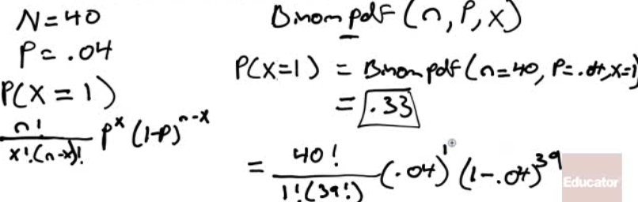
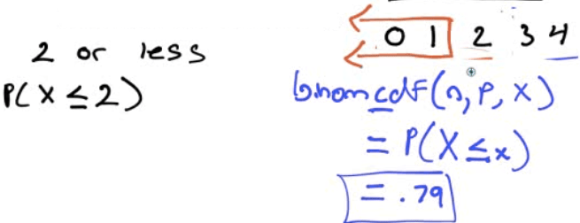

# Binomial Distribution

  -  BINP
    
      -  B = Binary process = 2 process
    
      -  I = Independent event
    
      -  N = Number of trials
    
      -  P = Probability of success

  -  Binomial Probability
    
      -  binompdf(n, p, x)
    
      -  n=trials
    
      -  p=probability
    
      -  x=value

 

  -  Calculator
    
      -  2ND + VARS (DISTR)

 

  -  A: binompdf / B: binomcdf

 

  -  binompdf vs binomcdf

 
 
 

# Practice Questions for Binomial Distribution

  -  A manufacturer produces a large number of toasters. From past
     experience, the manufacturer knows that approximately 4% are
     defective. In a quality control procedure, we randomly select 40
     toasters for testing.
    
      -  Determine the probability that exactly one of the toasters is
         defective

 

  -  Find the probability that at most two of the toasters are
     defective

 

  -  Find the probability that more than three toasters are defective

 

# Geometric Distribution

  -  BI~~N~~P
    
      -  Not given the number of trials

  -  Question Format
    
      -  How many trials until a success

  -  Geometric Probability
    
      -  geometpdf(p,x)
    
      -  geometcdf(p,x)
    
      -  p=probability of success
    
      -  x=number of trials until 1 success

 

# Practice Questions for Geometric Distribution

  -  There is a probability of 0.09 that a vaccine will cause a certain
     side effect. Suppose that a number of patients are inoculated with
     the vaccine. We are interested in the number of patients
     vaccinated until the first side effect is observed
    
      -  Find the probability that exactly 4 patients must be
         vaccinated in order to observe the first side effect.

 
 
 

  -  What is the probability that the number of patients vaccinated
     until the first side effect is observed at most
 5?

 

# Mean and Standard Deviation

 