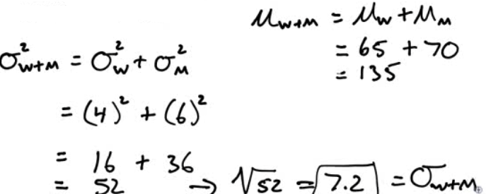

# Mean and SD of Two Random Variables

  -  Mean

 

  -  Variance

 

# Transforming Random Variables (Linear Transformations)

  -  Mean

 

  -  Variance

 

# Practice Questions

  -  You have a sample of male/female couples. The mean height of all
     the woman is 65 inches, with a standard deviation of 4 inches. The
     mean height of all the men is 70 inches, with a standard deviation
     of 6 inches.
    
      -  What is the average combined height of the couples? What is
         the standard deviation of the combined height?

 

  -  What is the average difference in the height of the couples? What
     is the standard deviation of the difference

 

  -  A report of the National Center for Health Statistics says that
     the height of 20-year-old men have mean 176.8 cm and standard
     deviation 7.2 cm. There are 2.54 cm in an inch. What are the mean
     and standard deviation in
 inches?

 
 
 

  -  The number of calories in a one-ounce serving of a breakfast
     cereal is a random variable with mean 110. The number of calories
     in a full cup of whole milk is a random variable with mean 140.
     For breakfast you eat one ounce of the cereal with 1/2 cup of
     whole milk. Let Z be the random variable that represents the total
     number of calories in this breakfast. What is the mean and SD of
     Z?

 
 
 

  -  Your school has the best men's swimming team in the region. The
     400-meter freestyle relay team is undefeated this year. In the
     400-meter relay, each swimmer swims 100 meters. The times, in
     seconds, for the four swimmers this season are approximately
     Normally distributed with means and standard deviations as shown

|       | Mean | SD  |
| ----- | ---- | --- |
| John  | 55.2 | 2.8 |
| Jerry | 58   | 3   |
| Jim   | 56.3 | 2.6 |
| Joe   | 54.7 | 2.7 |

  -  Find the mean and standard deviation for the total team time in
     the 400-meter freestyle relay.
    
      -  Mean = 55.2+58+56.3+54.7 = 224.2
    
      -  Variance = 2.8^2+3^2+2.6^2+2.7^2 = 30.89
    
      -  SD = 5.6

  -  Find the mean and standard deviation for the average time of a
     single swimmer
    
      -  Mean = 224.2/4 = 56.05
    
      -  Variance = 30.89/4^2 = 1.9306
    
      -  SD = 1.39