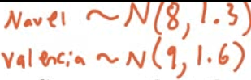
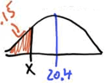

# The Empirical Rule

 

# Z Scores (Standardized Score)

  -  How many standard deviations away from the mean your value x is

 

# Using the Normal Table

![Probability Table entry for z is the probability lying below z. T able
A Standard normal probabilities -3.4 -3.3 -3.2 -3.1 -3.0 -2.9 -2.8 -2.7
-2.6 -2.5 -2.4 -2.3 -2.2 -2.1 -2.0 -1.9 -1.8 -1.7 —1.6 -1.5 -1.4 -1.3
-1.2 -1.1 -1.0 -0.9 -0.8 -0.7 —0.6 -0.5 -0.4 -0.3 -0.2 -0.1 -0.0 .00
0010 .0013 .0019 .0035 .0047 .0062 .0082 .0107 .0139 .0179 .0228 .0287
.0359 .0548 .0808 .1151 .1357 .1587 .1841 .2119 .2420 .2743 .3085 .3821
.4207 .4602 .01 .0003 .0005 .0013 .0018 .0025 .0045 .0104 .0136 .0174
.0222 .0281 .0351 .0436 .0537 .0655 .0793 .0951 .1131 .1335 .1562 .1814
.2090 .2389 .2709 .3050 .3409 .3783 .4168 .4562 .496() .02 .0003 .0005
.0013 .0018 .0024 .0033 .0059 .0078 .0102 .0132 .0170 .0217 .0274 .0427
.0526 .0643 .0778 .0934 .1112 .1314 .1539 .1788 .2061 .2358 .2676 .3015
.3372 .3745 .4129 .4522 .4920 .03 0003 0006 0009 0012 0017 0032 0057
0075 0099 .0129 .0166 0212 0336 0418 .0516 0630 .0764 0918 .1093 .1292
.1515 .1762 .2033 .2327 .2981 .3336 .3707 .4090 .4483 .4880 .04 .0012
.0016 .0023 .0031 .0041 .0055 .0073 .0125 .0162 .0207 .0262 .0329 .0505
.0618 .0749 .0901 .1075 .1271 .1492 .1736 .2005 .2296 .2611 .2946 .3300
.3669 .4052 .4443 .4840 .05 .0011 .0016 .0030 .0054 .0071 .0122 .0158
.0202 .0256 .0322 0401 .0495 .0606 .0735 .0885 .1056 .1251 .1469 .1711
.1977 .2266 .2578 .2912 .3264 .3632 .4013 .4801 .06 .0003 .00(M .0006
.0008 .0011 .0015 .0021 .0029 .0039 .0052 .0069 .0091 .0119 .0154 .0197
.0250 .0314 .0392 .0485 .0594 .0721 .0869 .1038 .1230 .1446 .1685 .1949
.2236 .2877 .3228 .3594 .3974 .4364 .4761 .07 .0003 .0005 .0008 .00\]1
.0015 .0021 .0028 .0038 .0051 .0068 .0089 .0116 .0150 .0192 .0244 .0307
.0384 .0475 .0582 .0708 .0853 .1020 .1210 .1423 .1660 .1922 .2514 .2843
.3192 .3557 .3936 .4325 .4721 .08 .0003 .0004 .0005 .0007 .0010 0014
0020 0027 0037 0049 .0066 .0087 .0113 .0146 .0188 0239 0301 0375 0465
0571 .0694 .0838 .1003 .1 190 .1401 .1635 .1894 .2177 .2483 .2810 .3156
.3520 .3897 .4286 .4681 .09 .0002 .0003 .0005 .0007 .0010 .0014 .0019
.0026 .0036 .0048 .0064 .0084 .0110 .0143 .0183 .0233 .0294 .0367 .0455
.0559 .0681 .0823 .0985 .1170 .1379 .1611 .1867 .2148 .2451 .2776 .3121
.3483 .3859 .4247 .4641 ](./media/image141.png)

![Table entry for z is the probability lying below z. T able A
(Continued) 0.0 0.1 0.2 0.3 0.4 0.5 0.7 0.8 0.9 1.0 1.1 1.2 1.3 1.4 1.5
1.6 1.7 1.8 1.9 2.0 2.1 2.2 2.3 2.4 2.5 2.6 2.7 2.8 2.9 3.0 3.1 3.2 3.3
3.4 .00 .5000 .5398 .5793 .6179 .6554 .6915 .7580 .7881 .8159 .8413
.8643 .8849 .9032 .9192 .9332 .9452 .9554 .9641 .9713 .9772 .9821 .9861
.9893 .9918 .9938 .9953 .9965 .9974 .9981 .9987 .9990 .9993 .9995 .9997
.01 .5040 .5438 .5832 .6217 .6591 .6950 .7291 .7611 .7910 .8186 .8438
.8665 .8869 .9049 .9207 .9345 .9564 .9649 9719 .9778 .9826 .9864 .9896
.9920 .9955 .9966 .9975 .9982 .9987 .9991 .9993 .9995 .9997 .02 .5080
.5478 .5871 .6255 .6628 .6985 .7324 .7642 .7939 .8212 .8461 -8686 .8888
.9066 .9222 .9357 .9474 .9573 .9656 .9726 .9783 .9830 .9868 .9898 .9922
.9941 .9956 .9967 .9976 .9982 .9987 .9991 .9994 .9995 .9997 .03 .5120
.5517 .5910 .6293 .7019 .7357 .7673 .7967 .8238 .8485 .8708 .8907 .9082
.9236 .9370 .9484 .9582 .9664 .9732 .9788 .9834 .9871 .9901 .9925 .9943
.9957 .9968 .9983 .9988 .9991 .9996 Probability .04 .5160 .5557 .5948
.6331 .6700 .7054 .7389 .7704 .7995 .8508 .8729 .8925 .9099 .9251 .9382
.9495 .9591 .9671 .9738 .9793 .9838 .9875 .9927 .9945 .9959 .9969 .9977
.9984 .9988 .9992 .9994 .9996 .9997 .05 .5199 .5596 .5987 .6368 .6736
.7088 .7422 .7734 .8023 .8289 .8531 .8749 .8944 .9115 .9265 .9394 .9505
.9599 .9678 .9744 .9798 .9842 .9878 .9929 .9970 .9978 .9984 .9989 .9997
.06 .5239 .5636 .6026 .6772 .7123 .7454 .7764 .8051 .8315 .8554 .8770
.8962 .9131 .9406 .9515 .9608 .9686 .9750 .9846 .9881 .9909 .9931 .9948
.9961 .9971 .9979 .9985 .9989 .9992 .9994 .9996 .9997 .07 .5279 .5675
6443 .6808 .7157 .7486 .7794 .8078 .8340 .8577 .8790 .8980 .9147 .9292
.9418 .9525 .9616 .9693 .9756 .9808 .9850 .9884 .9911 .9932 .9949 .9962
.9972 .9979 .9985 .9989 .9992 .9995 .9996 .9997 .08 .5319 .5714 .6103
.6480 .6844 .7190 .7517 .7823 .8106 .8365 .8599 .8810 .8997 .9162 .9306
.9429 .9535 .9625 .9699 .9761 .9812 .9854 .9887 .9913 .9934 .9951 .9963
.9973 .9980 .9986 .9990 .9993 .9995 g 996 g 997 .09 .5359 .5753 .6141
.6517 .6879 .7224 .7549 .7852 .8133 .8389 .8621 .8830 .9015 .9177 .9319
.9441 .9545 .9633 .9706 .9767 .9817 .9857 .9890 .9916 .9936 .9952 .9964
.9974 .9981 .9986 .9990 .9993 .9995 g 997 .9998 ](./media/image142.png)

# Practice Questions

1.   A study of college freshmen's study habits found that the time (in
     hours) that college freshmen use to study each week follows a
     normal distribution with a mean of 7.2 hours and a standard
     deviation of 5.3 hours

<!-- end list -->

  -  How many hours do the students who study in the top 15% spend
     studying?

  -  The middle 68%?
    
      -  Top 15%: 12.5 hours
    
      -  Middle 68%: 1.9 hours to 12.5 hours

 

1.   Suppose that the weight of navel oranges is normally distributed
     with mean of 8 ounces, and standard deviation of 1.3 ounces. And
     the weights of Valencia oranges is normally distributed with mean
     of 9 ounces, and standard deviation of 1.6 ounces

<!-- end list -->

  -  You grow a navel orange that weighs 9.5 ounces and a Valencia
     orange that weight 10.5 ounces, which should you enter in the
     giant fruit
 contest?

 

  -  Z score for navel orange = (9.5-8)/1.3 = 1.1538

  -  Z score for Valencia orange = (10.5-9)/1.6 = 0.9375

<!-- end list -->

  -  The weights of newborn children in the United States vary
     according to the Normal Distribution with mean 7.5 pounds and
     standard deviation 1.25 pounds.

  -  What is the probability that a baby chosen at random weighs less
     than 5.5 pounds at birth?
    
    1.   Draw a
 sketch

 

1.   Calculate Z score

 

1.   Look up probability on the normal table

 

1.   The composite score of students on the ACT college entrance
     examination in a recent year had a Normal distribution with mean
     of 20.4 and standard deviation of 5.8

<!-- end list -->

  -  What is the probability that a randomly chosen students scored 24
     or higher on the
 ACT?
    
    1.   Sketch

 

1.   2ND + VARS (DISTR) ➡️ 2: normalcdf

 

1.   Normalcdf(lower, upper, mean, standard deviation)

 

  -  What is the probability that a randomly chosen student scored
     between a 19 and a 24 on the ACT?

 

  -  What score would someone in the 15th percentile have
 scored?
    
    1.   Sketch

 

1.   Find the z value on the normal table

 ![3.4 3.3 3.2 3.1 3.0 2.9 2.8 2.7 2.6 2.5 2.4 2.3 2.2 2.1 2.0 1.9 1.8
 1.7 1.6 1.5 1.3 1.2 -1.0 -0.8 .00 .0003 .0005 .0007 .0010 .0013 .0019
 .0026 .0035 .0047 .0062 .0082 .0107 .0139 .0179 .0228 .0287 .0359
 .0446 .0548 .0668 .0808 .0968 .1151 .1357 .1587 .1841 .2119 .01 .0013
 .0018 .0025 .0034 .0060 .0080 .0104 .0136 .0174 .0222 .0281 .0351
 .0436 .0537 .0655 .0793 .0951 .1131 .1335 .1562 .1814 .2090 .02 .0003
 .0005 .0013 .0018 .0033 .0059 .0078 .0102 .0132 .0170 .0217 .0274
 .0344 .0427 .0526 .0643 .0778 .0934 .11 12 .1314 .1539 .1788 .2061 .03
 .0004 .0006 .0009 .0012 .0017 .0023 .0032 .0057 .0075 .0099 .0129
 .0166 .0212 .0268 .0336 .0418 .0516 .0630 .0764 .0918 .1093 .1515
 .2033 .04 .0004 .0006 .0008 .0012 .0016 .0023 .0031 .0041 .0055 .0073
 .0096 .0125 .0162 .0207 .0262 .0329 .0409 .0505 .0618 .0749 .0901
 .1075 .1492 .2005 .05 .0003 .0008 .0011 .0016 .0022 .0030 .0071 .0122
 .0158 .0256 .0322 .0401 .0495 .0606 .0735 .0885 .1056 .1251 .1469
 .1711 .1977 ](./media/image153.png)
 
 Z≈-1.035

1.   Solve for
 x

 
 
 

1.   Calculator: invNorm(area, mean, standard deviation)

 
 
 

1.   Suppose that the mean height of men is 70 inches with a standard
     deviation of 3 inches. And suppose that the mean height for women
     is 65 inches with a standard deviation of 2.5 inches

<!-- end list -->

  -  If the heights of men and women are Normally distributed, find the
     probability that a randomly selected woman is taller than a
     randomly selected
 man.
    
    1.   Sketch

 

1.   Find the necessary information

|       | Mean       | SD                    |
| ----- | ---------- | --------------------- |
| Men   | 70         | 3                     |
| Women | 65         | 2.5                   |
| W-M   | 65-70 = -5 | Sqrt(3^2+2.5^2) = 3.9 |

1.   Calculate Z score

 

1.   Find the probability on the table and subtract that from 1

 1-0.9015 = 0.0985 = 9.85%

  -  Suppose that the height (X) in inches, of adult men is a normal
     random variable with mean of 70 inches. If P (X\>79) = 0.025

  -  What is the standard deviation of this random normal
 variable?
    
    1.   Sketch

 

1.   Find the z score on the calculator: invNorm(area)

 

1.   Solve for
 SD

 
 
 
