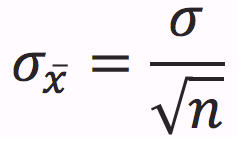

# Parameter vs. Statistic

 

# Sampling Distribution

  -  The "sampling distribution" is the values taken by the statistic
     in all possible samples of the same size from that population

  -  The "sampling distribution" is always referring to the
     distribution of the sample

 

# Central Limit Theorem

  -  The sampling distribution of the sample mean is normally
     distributed

 

# Conditions (RIN)

  -  Random
    
      -  How the sample is selected

  -  Independent
    
      -  N≥10n
    
      -  N: population size
    
      -  n: sample size

  -  Normal
    
      -  For
             means
        
          -  
        
          -  If the population is normally distributed, n can \< 30
    
      -  For proportions:
        
          -  

# Sampling Distribution of a Sample Mean

  -  

  -  

# Sampling Distribution of a Sample Proportion

  -  

# Review

# Practice Questions

1.   Assume graph X represents the actual distribution select which
     graph the sampling distribution of the sample mean look like, for
     a sample size of n =
 50?

 

  -  Answer: E

<!-- end list -->

1.   The weight of the eggs produced by a certain species of chicken is
     Normally distributed with mean 65 g and standard deviation 5 g.

<!-- end list -->

  -  If a farmer selects a random sample of 10 every morning to check
     the health of his laying hens, what is the mean and SD of the
     sampling distribution of the weight of the eggs?

 

  -  Calculate the probability that a randomly selected egg weighs
     between 61g and 69g

 

  -  Calculate the probability that the mean weight of the farmers 10
     eggs falls between 61g and
 69g.

 
 
  
 
 

1.   A survey asks a random sample of 500 adults in California if they
     support an increase in the state sales tax of 1%. Suppose that 40%
     of all adults in California support the increase.

<!-- end list -->

  -  If p hat is the proportion of the sample who are in favor of the
     increase, what is the mean of the sampling distribution of p hat?
     The
 SD?

 
 
 

  -  How large a sample would be needed to guarantee that the standard
     deviation of it is no more than
 0.02?

 
 
 

  -  Find the probability that p hat is between 0.36 and 0.42

 