# What is a CI?

  -  Using a Statistic to estimate a Parameter

  -  It is NOT a probability

  -  It is an interval that will cover the true parameter X% of the
     time

 

  -  So we can interpret a CI as
    
      -  "We are X% confident that the true population parameter lies
         within A and B"

# General Math Behind a CI

  -  Formula
    
      -  Point Estimate ± Margin of Error
    
      -  Point Estimate ± Critical Value \* Standard Error

 

  -  Point Estimate

 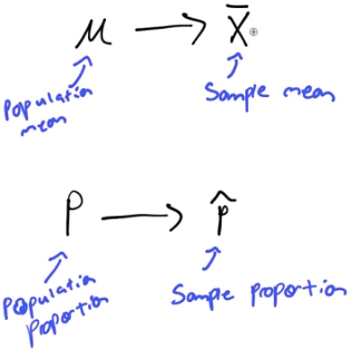

  -  Critical Value

 
 
 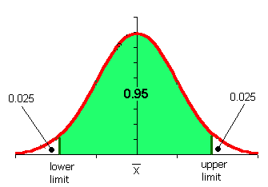

  -  Standard Error

 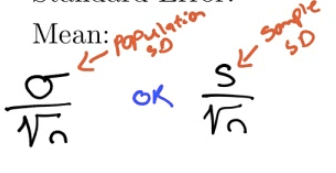
 
 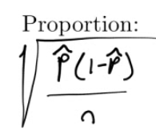

  -  Confidence Interval

 

# Steps to Calculating a CI

  -  Read the problem and outline the STASTICS

  -  Check your CONDITIONS
    
      -  Random
    
      -  Independent: N≥10n
    
      -  Normal: n\>30

  -  CALCULATE
    
      -  Point Estimate ± Critical Value \* Standard Error

  -  INTERPRET

  -  **S**ome **C**an **C**alculate **I**ntervals

# Practice Questions

1.   The effect of drugs and alcohol on the nervous system have been
     the subject of considerable research. Suppose a neurologist is
     testing the effect of a drug on response time by injecting 50 rats
     with a dose, subjecting each to a stimulus, and recording the
     response time. The average response time for the 50 injected rats
     was 1.26s. Assuming the mean response time for a rat that has not
     been injected with the drug is 1.4s with standard deviation of
     0.45, construct a 90% confidence interval to determine if the drug
     has an effect on response time.
    
      -  Statistics
        
          -  Mean = 1.26
        
          -  Population SD = 0.45
        
          -  n = 50
        
          -  CL = 90%
    
      -  Conditions
        
          -  Random: Assume rats are a random sample
        
          -  Independent: N \> 10n
        
          -  Normal: n \>
 50
    
      -  Calculate

 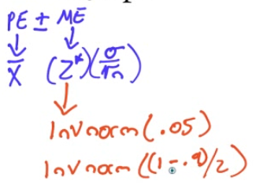
 
 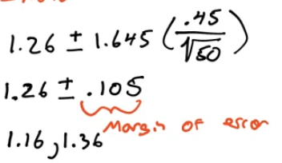

  -  Calculate by calculator

 
 
 
 
 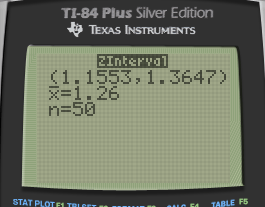

  -  Calculated using Z test

<!-- end list -->

  -  Interpret
    
      -  We are 90% confident that the true mean response time for rats
         given the new drug is between 1.16s and 1.36s.
    
      -  1.4s is not in the interval, so we have evidence the new drug
         make rats faster

<!-- end list -->

1.   There are two fire stations in a town, one in the northern half
     and one the southern half. The one in the northern part is known
     to respond to calls within 4 min. The council members in the town
     are worried that the southern fire station isn’t as good so they
     hire a statistician. The statistician collects a random sample of
     50 call/responses from the southern fire station. The mean
     response time is 5.3 min with a standard deviation of 3.1.
     Construct a 95% confidence interval to determine if the council
     members have cause to worry about the southern station
    
      -  Statistics
        
          -  Mean = 3.5
        
          -  Sample SD = 3.1
        
          -  n = 50
        
          -  CL = 95%
    
      -  Conditions
        
          -  Random: Yes
        
          -  Independent: N \> 10n = 500
        
          -  Normal: n \> 30
    
      -  Calculate

 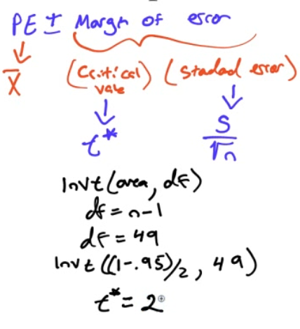
 
 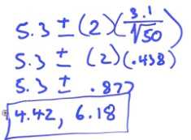

  -  Calculate by calculator

 
 
 
 
 

  -  Interoperate
    
      -  We are 95% confident that the true population mean response
         time for the southern fire station is between 4.42 and 6.18
         mins
    
      -  4 is not in the interval, so we do have reason to be
         concerned.

<!-- end list -->

1.   The US Department of Transportation reported that 75% of all
     fatally injured automobile drivers were intoxicated. A random
     sample of 32 records in Carson County, Colorado, showed that 16
     involved a drunk driver. Use a 99% confidence interval to
     determine whether or not there is evidence that indicates the
     population proportion of driver fatalities related to alcohol is
     different than 75%
    
      -  Statistics
        
          -  P hat = x / n = 16/32 = 0.5
        
          -  n = 32
        
          -  CL = 99%
    
      -  Conditions
        
          -  Random: Yes
        
          -  Independent: N \> 10n = 320
        
          -  Normal: n \* p hat \> 10 and n \* (1-p hat)
 \>10
    
      -  Calculate

 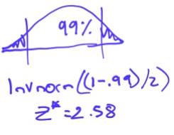
 
 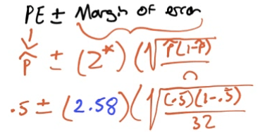

  -  Calculate by calculator

 
 
 
 
 

  -  Interperate
    
      -  We are 99% confident that the true population proportion of
         driver fatalties in Carson County is between 27.2% and 72.8%
    
      -  75% is not in our interval, so it appears that Carson County
         is lower in the US