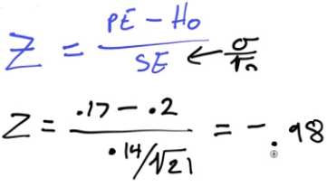
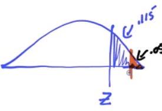

# Hypothesis Test

  -  Using a Statistic to test a claim about a Parameter

  -  Steps (**W**hy **C**an't **C**at **P**lay **I**nstruments)
    
      -  **W**rite the hypothesis
        
          -  Null hypothesis (H0): Parameter = \_\_\_\_
        
          -  Alternative hypothesis (H1/Ha):
             Parameter \> or \< or ≠ \_\_\_\_\_\_
    
      -  **C**keck conditions (RIN)
        
          -  Random Sample
        
          -  Independent: N \>10n
        
          -  Normal:
            
              -  μ:
                 n≥30
            
              -  
    
      -  **C**alculate the test statistic

 

  -  Mean

 

  -  Proportion

 

  -  Look up the **P**-value (from Z table)
    
      -  Probability that the null hypothesis (H0) is true,
         given the sample data you collected

 

  -  **I**nterpret

| p \< α | Reject the null hypothesis         | do have evidence to support the claim     |
| ------ | ---------------------------------- | ----------------------------------------- |
| p \> α | Fail to reject the null hypothesis | do not have evidence to support the claim |

 

# Confidence Interval vs α

 

# Practice Question 1

 DDT is an insectcide. It is believed that DDT causes birds' eggshells
 to be thinner and weaker than normal and makes the eggs more prone to
 breakage.
 
 An experiment was conducted where 21 hawks were fed a food mixture 14
 ppm DDT. The first egg laid by each bird was measured. The mean shell
 thickness was found to be 0.17 mm. The standard deviation of birdshell
 eggs is known to be 0.14 mm. A "normal" eggshell has a mean thickness
 of 0.2 mm.
 
 Are the eggs with DDT the same as normal eggs?

  -  Data
    
      -  n = 21
    
      -  Mean = 0.17
    
      -  Population SD = 0.14
    
      -  Normal μ= 0.2

  -  Write the hypothesis
    
      -  Null hypothesis (H0): μ = 0.2
    
      -  Alternative hypothesis (H1/Ha): μ ≠ 0.2

  -  Check conditions
    
      -  Random: Assume random sampling
    
      -  Independent: N \> 10n = 210
    
      -  Normal: sample size is not larger than 30. So, proceed with
         caution for interpreting results

  -  Calculate the test
 statistic

 
 
 
 
 
 
 

  -  Look up the P-value

 

  -  Interpret

 

  -  Because our p-value = 0.327 is larger than α = 0.05, we fail to
     reject H0, which means we do not have evidence to support the
     alternative/claim that the egg shells are different than normal

# Practice Question 2

 An opinion poll asks a simple random sample of 100 college seniors how
 they view their job prospects. In all, 56 say "good."
 
 Does the pool give reason to conclude that more than half of all
 seniors think their job prospects are good.

  -  Hypothesis
    
      -  H0: p = 0.5
    
      -  H1: p \> 0.5

  -  Conditions
    
      -  Random: given, SRS
    
      -  Independent: N \> 10n = 1000
    
      -  Normal:
        
          -  N\*p0 = 100 \* 0.5 = 50 \> 10
        
          -  N\*(1-p0) = 100 \* 0.5 = 50 \> 10

  -  Calculate

 
 
 
 
 
 
 

  -  Look up the P-value

 

  -  Interpret
    
      -  Because p-value =0.1151 \> α = 0.05, we fail to reject
         H0.
    
      -  This means that we do not have evidence the claim that the
         true population proportion of college seniors with "good"
         prospect is above
 0.5

 

# Practice Question 3

 When the manufacturing process is working properly, the light bulbs
 have lifetimes that follow a right-skewed distribution with µ = 10
 hours and SD = 1 hours.
 
 A quality control statistician selects a simple random sample of n=100
 light bulbs every hour and measures the lifetime of all light bulbs
 produced that hour is less than 10 hours at the 5% significance level,
 then all those light bulbs are discarded.
 
 The current sample of 100 has a mean of 8.5, should this batch be
 discarded?

  -  Write the hypothesis
    
      -  H0: µ = 10
    
      -  H1: µ \< 10

  -  Check conditions
    
      -  Random: given, random sample
    
      -  Independent: N \> 10n = 1000
    
      -  Normal: n = 100 \> 30

  -  Calculate

 
 
 
 
 

  -  P-value
    
      -  P \< 0.0002

  -  Interpret
    
      -  P \< 0.0002 \< α = 0.05
    
      -  We reject the null hypothesis test.
    
      -  We do have evidence to support the claim that the mean life of
         light bulbs is less than 10 hours, so we should discard this
         batch

# Practice Question 4

 The US Department of Transportation reported that 75% of all fatally
 injured automobile drivers were intoxicated. A random sample of 32
 records in Carson County, Colorado, showed that 16 involved a drunk
 driver. Use a 99% confidence interval to determine whether or not
 there is evidence that indicates the population proportion of driver
 fatalities related to alcohol is different than 75%.

  -  Write the hypothesis
    
      -  H0: p = 0.75
    
      -  H1: p ≠ 0.75

  -  Conditions
    
      -  Random: given
    
      -  Independent: N \> 10n = 320
    
      -  Normal:
        
          -  n\*p = 32 \* 0.75 = 24 \> 10
        
          -  n\*(1-p) = 32 \* 0.25 = 8 \< 10
        
          -  May not be normal, proceed with interpret with caution

  -  Calculate

 

  -  P-value

 
 
 

  -  Interpret
    
      -  Because p = 0.001 \< α, we reject H0 and do have
         evidence to support the claim that the population proportion
         of driver fatalities related to alcohol is different than 75%