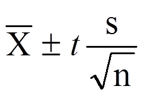
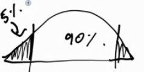
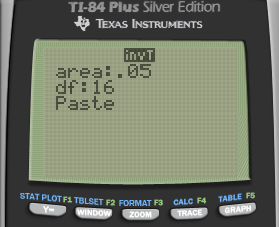
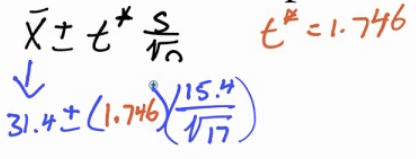
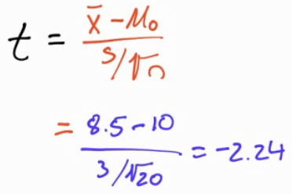
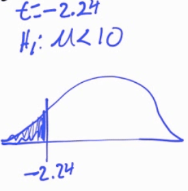
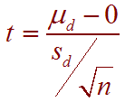
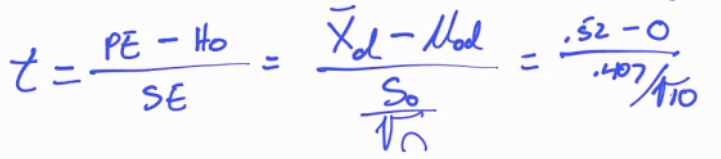
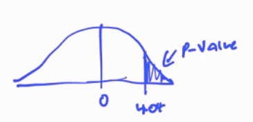

# T Distribution

  -  When do we use the T distribution
    
      -  Know the mean
    
      -  Do not know the population SD

 

  -  Formula

 

  -  Degrees of freedom (df)
    
      -  df = n-1

# Confidence Interval Example

 The super Corporation manufactures a device they claim "may increase
 gas mileage by 23%"
 
 Here are the percent changes in gas mileage for 17 identical vehicles,
 as presented in one of the company's advertisements

| 48.3 | 46.9 | 46.8 | 44.6 | 40.2 | 38.5 |
| ---- | ---- | ---- | ---- | ---- | ---- |
| 34.6 | 33.7 | 28.7 | 28.7 | 24.8 | 10.8 |
| 6.9  | 12.4 | 21.2 | 25.2 |      |      |

 Construct and interpret a 90% confidence interval to estimate the mean
 fuel savings in the population of all such vehicles.

  -  Type in the data

 

  -  1-Var Stats for the sample

 

  -  Looking for t

 
 
 
 
 

  -  Calculate

 

  -  Calculate by calculator

 

  -  Interpret
    
      -  We are 90% confident that the mean percent change in gas
         mileage is between 24.68% and 38.16%
    
      -  Since 23% is in the interval, it appears that the machine does
         even better than 23% savings

# Hypothesis Test Example

When the manufacturing process is working properly, the batteries have
lifetimes that follow a right-skewed distribution with µ = 10 hours. A
quality control statistician selects a simple random sample of n = 20
batteries every hour and measures the lifetime of each.

If she is convinced that the mean lifetime of all batteries produced
that hour is less than 10 hours at the 5% significance level, then all
those batteries are discarded.

The current sample of 20 has a mean of 8.5 and a SD of 3, should this
batch be discarded?

  -  Hypothesis
    
      -  H0: µ = 10
    
      -  H1: µ \< 10

  -  Conditions
    
      -  Random: given
    
      -  Independent: N \> 10n = 200
    
      -  Normal: not larger than 30, but still ok since we are using a
         T distribution

  -  Calculate

 
 
 

  -  Calculate by calculator

 
 
 

  -  P-value

 

  -  df = n - 1 = 19

<!-- end list -->

  -  Interpret
    
      -  Because p \< α, we reject the null hypothesis. Thus, we do
         have evidence to support the claim that the mean battery life
         in this whole batch is less than 10 hours and so should be
         discarded

# Matched Pairs T-Test

The average weekly loss of study hours due to consuming too much alcohol
on the weekend is studied on 10 students before and after a certain
alcohol aware ness program is put into operation. Do the data provide
evidence that the program was effective?

 

  -  Formula

 

  -  Data
    
      -  N=10
    
      -  Difference of mean = 0.52
    
      -  Difference of SD = 0.407

  -  Hypothesis (d = before - after)
    
      -  H0: µd = 0
    
      -  H1: µd \> 0

  -  Conditions
    
      -  Random: assume random selection
    
      -  Independence: N \> 10n = 100
    
      -  Normal: t-distribution

  -  Calculate

 

  -  Calculate by calculator

 
 
 

  -  P-value
    
      -  df = 10-1 =
 9

 

  -  Interpret
    
      -  P \< α, Reject, do have evidence