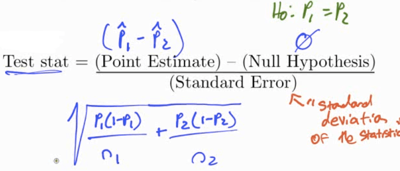
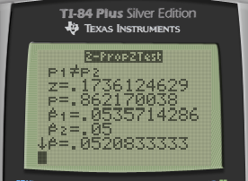
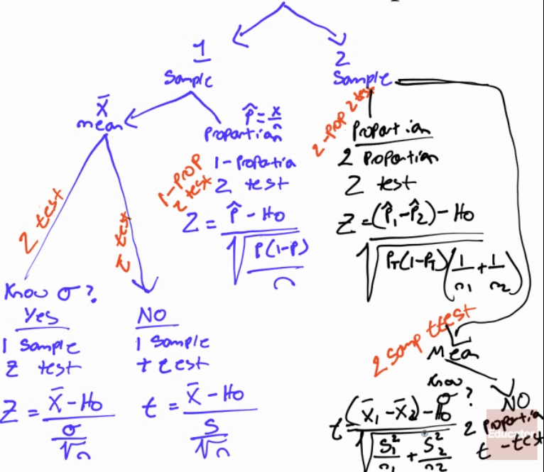

# Two Samples

  -  Hypothesis

 

# Practice Question 1

 In a test of the reliability of products produced by two machines,
 machine A produced 15 defective parts in a run of 280, while machine B
 produced 10 defective parts in a run of 200.
 
 Do results imply a difference in the reliability of these two
 machines?

  -  Data
    
      -  P1 = 15/280 = 0.0536
    
      -  P2 = 10/200 = 0.05
    
      -  1: Machine A
    
      -  2: Machine B

  -  Hypothesis
    
      -  H0: P1 = P2
    
      -  H1: P1 ≠ P2

  -  Conditions
    
      -  Random: assumed
    
      -  Independent: Each part produced is independent
    
      -  Normal: n1\*p1 \> 10, n1\*(1-p1) \> 10, n2\*p2 \> 10,
         n2\*(1-p2) \> 10

  -  Calculate

 

  -  Calculate by calculator

 
 
 

  -  Interpret
    
      -  P \> α, so we fail to reject the null hypothesis. We do not
         have evidence to support the claim that two machines have
         different reliabilities

# Practice Question 2

 The use of helmets among recreational alpine skiers and snowboarders
 are generally low. A study wanted to examine if helmet use reduces the
 risk of head injury.
 
 In the study, they compared the ski/board related injury costs for
 those who wore helmets and those who did not wear helmets. The helmet
 wearers had a mean injury cost of $10,200 per person (SD = $25,000)
 and the non-helmet wearers had a mean injury cost of $45,500 (SD =
 $10,000).
 
 Are ski/board injuries less severe among those who wear helmets?

  -  Hypothesis
    
      -  H0: µ1 = µ2
    
      -  H1: µ1 \< µ2

  -  Conditions
    
      -  Random: assume SRS
    
      -  Independent: assume each person independent
    
      -  Normal: n1 \> 30, n2 \> 30

  -  Calculate

 
 
 

  -  df = smaller n - 1

<!-- end list -->

  -  Calculate by calculator

 
 
 
 
 

  -  Interpret
    
      -  P \< α
    
      -  So we reject the null hypothesis and have evidence to support
         the claim that the injury cost of group 1 (helmet wearers) is
         less than group 2 (non-helmet wearers)

# Practice Question 3

 A pharmaceutical company claims its new drug will relieve headaches
 faster than any other drug on the market. To determine whether this
 claim is valid, the new drug is given to each of the 30 randomly
 selected persons and a standard drug is given to another 30 randomly
 selected persons.
 
 The number of minutes required for each to recover from the headache
 is recorded. The sample results are:
 
 

  -  Hypothesis
    
      -  H0: µ1 = µ2
    
      -  H1: µ1 \< µ2

  -  Conditions
    
      -  Random: given
    
      -  Independent: assumed
    
      -  Normal: n =
 30

  -  Calculate

 
 
 

  -  Interpret
    
      -  P \> α
    
      -  We fail to reject H0, so we do not have evidence to support
         the claim that the new drug works better

# Practice Question 4

 In a large university in the year 2000 an SRS of 100 entering freshmen
 found that 20 finished in the bottom third of their high school class.
 Admission standards at the university have become more stringent and
 in 2015 and a new SRS of 100 entering freshmen found that 12 finished
 in the bottom third of their high school class.
 
 Does it appear that t he admission standards have actually become more
 stringent?

  -  Data
    
      -  P1 = x1 / n1 = 20/100 = 0.2
    
      -  P2 = x2 / n2 = 12/100 = 0.12

  -  Hypothesis
    
      -  H0: P1 = P2
    
      -  H1: P1 \> P2

  -  Conditions
    
      -  Random: given, SRS
    
      -  Independent: assumed
    
      -  Normal: n1\*p1 \> 10, n2\*p2 \> 10, n1\*(1-p1) \> 10,
         n2\*(1-p2) \> 10

  -  Calculate

 
 
 
 
 

  -  Interpret
    
      -  P \> α
    
      -  So we fail to reject the null hypothesis and do not have
         evidence to support the claim that acceptance is more
         stringent

# "Pick Your Test" Map

 
 
 ![Test For Population mean (V) Population mean (V) Population
 proportion (p) Difference of two means (VI — "2) Difference of two
 means (VI — "2) Mean difference (paired data) Difference of two
 proportions Null Hypothesis P P Test Statistic (f—go) po (I—po ) n 2
 01 02 2 2 (DI -D2 )-O p(l—p) Distribution z z z tdistribution with the
 smaller of n—l and z Use When Normal distribution or n \> 30; o known
 n \< 30, and/or o unknown nD, 2 10 Both normal distributions, or 171,
 30; q, known 171, \< 30; and/or q, g unknown n \< 30 pairs of data
 and/or o d unknown nD, 10 for each group ](./media/image268.png)

# Confidence Interval Practice Question

 In a test of the reliability of products produced by two machines,
 machine A produced 15 defective parts in a run of 280, while machine B
 produced 10 defective parts in a run of 200.
 
 Do results imply a difference in the reliability of these two
 machines?
 
 
 
 
 
 

  -  0 is in the interval so there does not appear to be difference