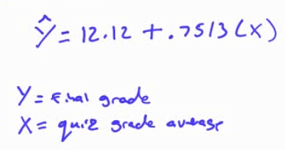

# Tests for the Regression Line

  -  Is there a correlation?

| H0 | r=0 | b=0 |
| -- | --- | --- |
| H1 | r≠0 | b≠0 |

  -  Is the y intercept = 0
    
      -  H0: a = 0
    
      -  H1: a ≠ 0

# Conditions for Hypothesis Testing

  -  Linearity
    
      -  Linear relationship between x and y

  -  Constant Variability (homoscedasticity)

  -  Normality
    
      -  The residuals should be normally distributed (from Histogram
         and QQ plot)

 

  -  Independence
    
      -  All the Y are independent

# Hypothesis Testing

 

# Practice Question 1

 A teacher asked her students to record the total amount Of time they
 spent studying for a particular test.
 
 The amounts of study time x (in hours) and the resulting test grades y
 are given below

| x | 2  | 1  | 1.5 | 0.5 | 1  | 3  |
| - | -- | -- | --- | --- | -- | -- |
| y | 92 | 81 | 84  | 68  | 85 | 96 |

1.   Obtain the equation of the least-squares regression line and the
     correlation.

 
 
 

  -  y = 69.7 + 9.75x

  -  r = 0.896 (strong correlation)

  -  r2 = 0.803 (80.3% of the change in grade can be
     explained by the study time)

<!-- end list -->

1.   Explain in words what the slope b of the least-squares line says
     about hours studied a nd grade awarded.
    
      -  For every 1 hour increase in study time, the grade is expected
         to go up by 9.75 points

2.   Test the hypothesis that the amount of study time is correlated to
     the test grade
    
      -  Data

| L1 | L2 | L3    | L4       |
| -- | -- | ----- | -------- |
| x  | y  | y hat | Residual |

  -  Hypothesis

 

  -  Conditions
    
      -  Linearity

 
 
 

  -  Constant Variance

 
 
 

  -  Normal Residuals

 
 
 

  -  Independence: each observation is
 independent

<!-- end list -->

  -  Calculate

 

  -  Interpret
    
      -  So we reject the null hypothesis and have evidence to support
         the claim that the slope is not equal to zero. There is a
         correlation between study time and test grades

<!-- end list -->

1.   What is the 95% confidence interval of the slope?
    
      -  Equation

 

  -  Calculate

 
 
 
 
 

  -  Interpret
    
      -  We are 95% confident that on average, for every 1 hour
         increase in study time, the final grade will go up between
         3.05 and 16.45 points

# Interpreting Computer Output

 
 
 

# Practice Question 2

 An economics professor wishes to analyze whether a person's income can
 predict the cost of their car
 
 

  -  What's the least-squares regression equation
    
      -  y hat = 438.535 + 0.511 \* x
    
      -  y = cost of car
    
      -  x = income

  -  What is the standard error about the line (aka the standard
     deviation of the regression model)? Interpret this value in
     context
    
      -  On average, we expect our prediction of cost is off by 12.22.

  -  Interpret the slope of the least-squares regression line in the
     context of this problem
    
      -  For every $1 increase in income, car cost increases, on
         average, $0.51

  -  What are the null and alternative hypotheses to test if there is
     an association between income and car cost?
    
      -  

  -  What is the value of the test statistic for testing the hypotheses
    
      -  

  -  What is the P-value for the test
    
      -  P < 0.001

  -  Is income useful for predicting the cost of a person's car? Use a
     significance level of 0.01. Explain briefly
    
      -  

# Practice Question 3

 Test if the number of beers is associated with the BAC
 
 
 
 