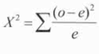

# Chi-Squared Goodness of Fit Test

  -  One categorical variable with counts (or proportion) in each
     category

  -  We have seen: products are produced by two machines, machine A
     produced 15 defective parts in a run of 280, while machine B
     produced 10 defective parts in a run of 200. Is there a difference
     in the reliability of these two machines?

  -  New question type: products are produced by three machines,
     machine A produced 15 defective parts in a run of 280, while
     machine B produced 10 defective parts in a run of 200. Is there a
     difference in the reliability of these machines?

# Practice Question 1

 In the past, for a large introductory statistics course, the
 proportions of students that received grades of A, B, C, D, or F have
 been, respectively, 0.15, 0.35, 0.30, 0.10, and 0.10
 
 This year, there were 200 students in the class, and following grades
 were given:

| Grade  | A  | B  | C  | D | F |
| ------ | -- | -- | -- | - | - |
| Number | 51 | 79 | 61 | 8 | 1 |

 Test to see whether the distribution of grades this year was different
 from the distribution in the past?

  -  Hypothesis
    
      -  H0: PA = 0.15, PB = 0.35, PC = 0.30, PD = 0.10, PF = 0.10
    
      -  H1: at least one p does not fit the distribution

  -  Calculate expected values

| Grade    | A  | B  | C  | D  | F  |
| -------- | -- | -- | -- | -- | -- |
| Observed | 51 | 79 | 61 | 8  | 1  |
| Expected | 30 | 70 | 60 | 20 | 20 |

  -  Conditions
    
      -  Random
    
      -  Independent
    
      -  Count: At least 80% of the expected counts are greater than 5
         and none are less than
 1

  -  Calculate

 
 
 
 
 

  -  Calculate by calculator

 
 
 

  -  P-value

 df = k - 1 (k: number of categories)
 
 

  -  Interpret
    
      -  P \< α
    
      -  So we reject the null hypothesis and have evidence to support
         the claim that at least one grade proportion does not fit the
         expected distribution

# Chi-Squared Test of Homogeneity or Independence/Association

  -  Two categorical variables

  -  Homogeneity
    
      -  Do two or more sub-groups of a population share the same
         distribution of a categorical variable (each group has its own
         sample)
    
      -  Do people of different races have the same proportion of
         smokers to non-smokers.
    
      -  Do different education levels have different proportions of
         Democrats, Republicans, and Independent

  -  Independence/Association
    
      -  Determining whether two categorical variables are associated
         (variables from a single SRS)
    
      -  Is there an association between race and smoking status
    
      -  Is there an association between education and voting
         preference

# Practice Question 2

 Girls and boys at an elementary school were sampled and asked about
 their favorite subject

1.   Does favorite subject differ by gender?

| Favorite subject | Boys | Girls | Total |
| ---------------- | ---- | ----- | ----- |
| Math             | 96   | 295   | 391   |
| English          | 32   | 45    | 77    |
| Social Studies   | 94   | 40    | 134   |
| Total            | 222  | 380   | 602   |

  -  Hypothesis
    
      -  H0: favorite subject does not differ by gender
    
      -  H1: favorite subject does differ by gender

  -  Expected
    
      -  Row Total \* Colum Total / Total

  -  Conditions
    
      -  For each sub group, the sample is a SRS
    
      -  NO expected cell counts are \<
 5

  -  Calculate

 

  -  Calculate by calculator

 
 
 
 
 

  -  P-value
    
      -  df = (r-1)\*(c-1)

  -  Interpret
    
      -  P \< α
    
      -  So we reject the null hypothesis and have evidence to support
         the claim that favourite subject is different between boys and
         girls

<!-- end list -->

1.   Is favourite subject associated with gender?

<!-- end list -->

  -  H0: There is no association between favorite subject and gender

  -  H1: There is an association between favorite subject and gender

# Practice Question 3

 You are playing a dice game with a friend. They brought a 6 sided die
 that you think may not be fair. You conduct an experiment to determine
 if it is fair. You roll the die 100 times and get following:

| Side      | 1  | 2  | 3  | 4  | 5  | 6  |
| --------- | -- | -- | -- | -- | -- | -- |
| Frequency | 17 | 24 | 15 | 22 | 12 | 10 |

  -  Hypothesis
    
      -  H0: P1 = P2 = P3 = P4 = P5 = P6
    
      -  H1: at least one is not equal

  -  Expected
    
      -  1/6 = 0.1667

  -  Conditions
    
      -  Random
    
      -  Independent
    
      -  Expected counts are greater than
 5

  -  Calculate

 

  -  Calculate by calculator

 

  -  Interpret
    
      -  P \> α
    
      -  So we fail to reject the null hypothesis and do not have
         evidence to support the claim that the die is unfair
