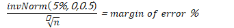
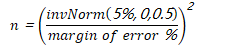
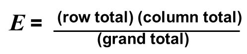
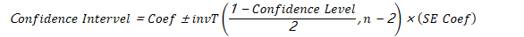
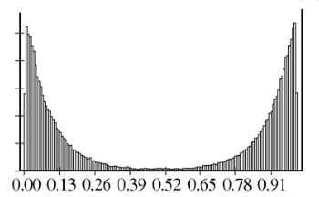
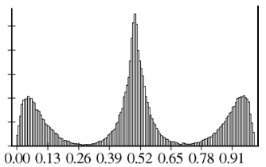

# Question 12

 
 
 
 
 ![Type I error, also known as a "false positive": the error of
 rejecting a null hypothesis when it is actually frue. In other words,
 this is the error of accepting an alternative hypothesis (the real
 hypothesis of interest) when the results can be attributed to chance.
 Plainly speaking, it occurs when we are observing a difference when in
 truth there is none (or more specifically - no statistically
 significant difference). So the probability of making a type I error
 in a test with rejection region R is P(R I Ho is true) . Type Il
 error, also known as a "false negative": the error of not rejecting a
 null hypothesis when the alternative hypothesis is the true state of
 nature. In other words, this is the error of failing to accept an
 alternative hypothesis when you don't have adequate power. Plainly
 speaking, it occurs when we are failing to observe a difference when
 in truth there is one. So the probability of making a type Il error in
 a test with rejection region R is 1 — P(R I Ha is true). The power of
 the test can be P(R IHa is true) . ](./media/image459.png)

# Question 15

 

# Question 22

 

# Question 23

  -  95% confidence interval of a sampling

 

  -  Margin of error vs. sample size at different confidence level

 

  -  Equation
    
      -  
    
      -  

# Question 25

 

# Question 26

  -  

# Question 27

 
 
 ![One rainy Saturday morning, Adam woke up to hear his mom complaining
 about the house being dirty. "Mom is always grouchy when it rains,"
 Adam's brother said to him. So Adam decided to figure out if this
 statement was actually true- For the next year, he charted every time
 it rained and every time his mom was grouchy. What he found was very
 interesting - rainy days and his mom being grouchy were entirely
 independent events\_ Some of his data are shown in the table below.
 Fill in the missing values from the frequency table. Grouchy Not
 grouchy Column total Raining 35 Not reining 26 H 330 Row total 73 292
 365 muc.Åv ](./media/image469.png)

# Question 30

 

# Question 33

 

  -  

# Question 38

 

# Question 40

  -  Original data

 

  -  Sampling distribution of the sample mean with sample size = 2

 
