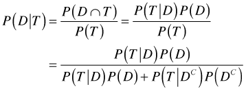
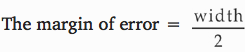

# Question 10

  -  The type I error is the error of rejecting the null hypothesis
     when the null hypothesis is true.

 

# Question 13

 

  -  The right-tailed test is used. So there is a 5 percent area in the
     rejection region in the right tail of the sampling distribution.
     If we construct a 90 percent confidence interval, then the upper
     confidence limit will match the critical value. If the test of
     hypothesis is rejected at a 5 percent level of significance, then
     the test statistic fell in the rejection region. In other words,
     the hypothesized value of mean did not belong to the 90 percent
     confidence interval.

# Question 18

  -  A binomial model counts the number of successes out a fixed number
     of attempts at a task when each attempt has a constant probability
     of success

 
 
 

# Question 20

 

# Question 25

  -  The population of interest is the population you are trying to
     draw an inference about from the collected data sets.

# Question 31

  -  Response variable is about each sample, not the whole samples

 

# Question 33

  -  

  -  Notice the difference between sample mean and sample proportion

 

# Question 37

  -  Equality of standard deviations is not necessary for a t-test to
     be valid. One of the conditions of a t-test is that the underlying
     populations must be normally distributed.