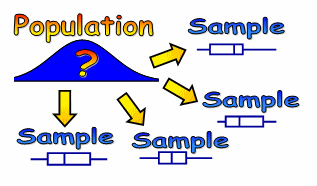

# Question 2

 

  -  We cannot use a binomial model unless we know that the probability
     of drawing a woman for the pool is nearly constant.

  -  However, since we are drawing 12 jurors without replacement, this
     is not necessarily true unless the jury pool is very large (at
     least 120)

 ![Requirements to be Binomial- B.I.N.S A binomial setting arises when
 we preform several independent trials of the same chance process and
 record the number of times that a particular outcome occurs. The four
 conditions for a binomial setting are: Binary? The possible outcomes
 of each trial can be classified as "success" or "failure" •
 Independent? Trials must be independent; that is, knowing the result
 of one trial must not have any effect on the result of any other trial
 Number? The number of trials n of the chance process must be fixed in
 advance. Success? On each trial, the probability p of success must be
 the same. ](./media/image481.png)

# Question 11

  -  A discrete variable takes only a countable number of values. The
     number of test questions a student guesses the answers to is a
     random variable with possible values 0, 1, 2,…n, where n is the
     number of questions on the test.

 
 
 

# Question 29

  -  If we take different samples from the same population, the
     estimates from the different samples will be different. The
     difference in percentages may be entirely due to sampling
     variation.

 

# Question 30

 ![In a clinical trial, 30 sickle cell anemia patients are randomly
 assigned to two groups. One group receives the currently mar- keted
 medicine, and the other group receives an experimental medicine. Each
 week, patients report to the clinic where blood tests are conducted.
 The lab technician is unaware of the kind of medicine the patient is
 taking. This design can be described as (A) a completely randomized
 design, with the currently mar- keted medicine and the experimental
 medicine as two treatments (B) a matched-pairs design, with the
 currently marketed medi- cine and the experimental medicine forming a
 pair (C) a randomized block design, with the currently marketed
 medicine and the experimental medicine as two blocks (D) a randomized
 block design, with the currently marketed medicine and the
 experimental medicine as two treatments (E) a stratified design with
 two strata, patients with sickle cell disease. forming one stratum and
 those without sickle cell disence forming the other stratum
 ](./media/image485.png)

  -  This experiment consists of two treatments, the currently marketed
     medicine and the experimental medicine. Patients are not matched,
     and no blocks are formed. Only patients with sickle cell disease
     are involved in the experiment.

# Question 31

  -  Confidence intervals are constructed as Statistic ± Margin of
     Error.

  -  Therefore, the statistic is always right in the center of the
     confidence interval.