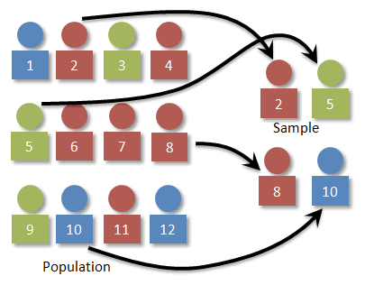
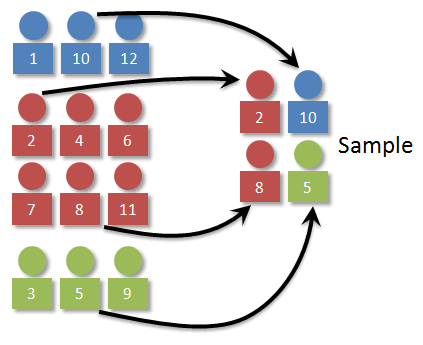
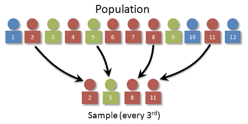

# Question 2

  -  Simple Random Sampling

 

  -  Stratified
 Sampling

 

  -  Systematic Sampling

 

  -  Cluster Sampling

 

# Question 6

 ![Two-tail Two-Tailed P-value = P (Z < —IzolorZ \> Izol) = 2P(Z \>
 Izol) P-VaIue Approach Assume that the null hypothesis is true. The
 P-Value is the probability of observing a sample mean that is as or
 more extreme than the observed. How to compute the P-Value for each
 type of test: x—go Step 1: Compute the test statistic zo I Zol Right
 Tail Right-Tailed P-value = \> zo) The area right of zo is the P-value
 The sum of the area in the tails is the P-value l: 01 The sum of the
 area in the tails is the P-value Left Tail Left-Tailed P-value = <
 zo) The area left of is the P-value ](./media/image311.png)

# Question 14

  -  \-1 < r < 1

 

# Question 15

  -  The power of a test is affected by sample size (bigger sample,
     more power) and alpha level (larger alpha, i.e. .05 compared to
     .01, more power)

 ![SIGNIF CANCE LEVEL There is a trade-off between the significance
 level and power: the more stringent (lower) the significance level,
 the lower the power. Figure 3 shows that power is lower for the 0.01
 level than it is for the 0.05 level. Naturally, the stronger the
 evidence needed to reject the null hypothesis, the lower the chance
 that the null hypothesis will be rejected. 1.00 0.80 0.60 0 40 0.20
 0.00 a = 0.05 a = 0.01 Figure 3. The relationship between significance
 level and power with one-tailed tests: u = 75, real u = 80, and o =
 1.  ](./media/image313.png)

# Question 18

 ![the width of a confidence interval is dependent on the z (or t)\*
 and the standard deviation of the statistic. Assuming the z\* is
 unchanged, the question is which is the smaller standard deviation
 sqrt(.7\* .3/50) is approximately 00648 while
 sqrt(\[37/60\*23/60\]/60) is approximately 0.0628 so the confidence
 interval based on 37 out of 60 will be slightly narrower than the
 confidence Interval based on 35 out of 50 ](./media/image314.png)